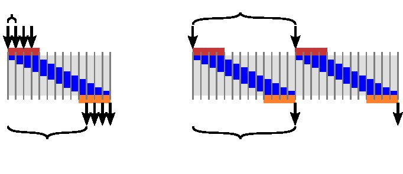
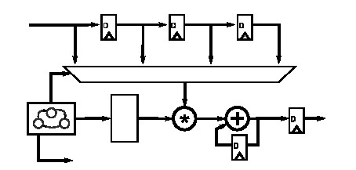

# 第一章 介绍

## 1.1 高层次综合（HLS)

硬件设计与处理近几年来发展迅速。 过去我们的电路相对简单，硬件设计师们可以很方便的画出每一个晶体管，规划他们的连接方式，甚至他们的板上位置。可以说所有工作都是人工完成的。但随着越来越多晶体管的设计需要，硬件工程师也越来越需要依赖自动化设计工具来帮助他们完成设计，而这些设计工具也相对应的变得越来越精密。工程师在这些设计工具的协助下也更具效率。他们不再具体操作每一个晶体管，而只需要设计数字电路，电子设计自动化工具（EDA）把这些抽象而概括的电路自动转换成实际的部件构造版图。

米德和康威（Mead&Conway）的方法[[50](./BIBLIOGRAPHY.md#50)]，也就是使用一种硬件语言描述语言（Verilog, VHDL），并把其编译成片上设计的方法在上世纪80年代开始广为使用。但这之后硬件的复杂度还在以指数函数的增长速度发展，硬件工程师们只好寻求更加概括而高层的编程语言，RTL应运而生。在RTL里，设计师不需要考虑怎么构造一个寄存器或怎样安置这些寄存器，而只需要考虑这些寄存器在设计中起到怎样的作用。EDA工具可以先把RTL转化成数电模型，再由模型转换成一个设备上的具体电路实施方案。所谓“方案”其实就是编译出的文件，这些文件可以用于规定某个自定义设备，也可以用于编程一些现有的设备，比如FPGA。如我们现在所见，新的设计方法确实帮助工程师们的设计思路变得更加清晰。更多关于这方面的探讨参考注释[[42](./BIBLIOGRAPHY.md#42)].

HLS则是在这基础上更高层的一种方法，设计师们在HLS下需要更多的考虑大的架构而非某个单独部件或逐周期运行。设计师在HLS下需要注重的是系统的运行模式，HLS工具会负责产生具体的RTL微结构。最早大多数HLS工具是基于Verilog的，用户需要使用Verilog语言进行描述，工具也通过Verilog产生RTL。现如今很多HLS工具开始使用C/C++作为设计师端的语言。当然，选择HLS工具最重要的还是看它能否综合我们需要的程序，而不是它使用什么语言。

总体来说，HLS可以自动完成以下曾经需要手动完成的工作：
*  HLS自动分析并利用一个算法中潜在的并发性
*  HLS自动在需要的路径上插入寄存器，并自动选择最理想的时钟
* HLS自动产生控制数据在一个路径上出入方向的逻辑
* HLS自动完成设计的部分与系统中其他部分的接口
* HLS自动映射数据到储存单位以平衡资源使用与带宽
* HLS自动将程序中计算的部分对应到逻辑单位，在实现等效计算的前提下自动选取最有效的实施方式

HLS的目标是根据用户提供的输入和限制自动替用户做出很多决定。每个HLS工具在实际施行的效率上相差甚远，这其中我们有一些非常不错的选择，例如赛灵思Vivado HLS, LegUp, Mentor Catapult HLS。他们出众的特性在于可以支持更多更广泛的程序转换。我们在本书中将使用Vivado HLS作为演示软件，但是设计的思路与技巧在各个软件中应当是通用的，读者只需要在各自的软件中对语法进行稍微的调整。

大多数HLS工具需要用户提供功能的规范，交互的描述，一个对接的计算设备，和目标优化方向。而对于Vivado HLS来说，用户需要：
*  一个用C/C++/System C编写的函数
*  一个测试平台用于验证结果
*  一个FPGA开发版
*  期望的时钟周期
*  一个简单的实施指导

HLS工具没有强大到可以处理任何代码。很多我们平时在软件编程中常用的概念在硬件实施中很难实现，所以硬件描述语言对于具体实施会更加灵活。通常这些HLS工具需要用户提供一些附加信息（通过suggestion或#pagma）来帮助完善程序，因此我们说HLS工具会同时“限制”又“加强”了一门语言。举例而言，HLS工具一般无法处理动态内存分配，大部分工具对标准库的支持也非常有限。用户也应当避免系统调用和递归以尽量降低复杂程度。除去这些设计限制之外，HLS工具的处理范围非常的广（包括直接内存访问，流，片上内存），优化效率也很高。

根据Vivado HLS的使用指南，我们将对我们的输入程序作出以下规范：
*  不使用动态内存分配（不使用malloc(),free(),new和delete()）
*  减少使用指针对指针的操作
*  不使用系统调用（例如abort(),exit(),printf()），我们可以在其他代码例如测试平台上使用这些指令，但是综合的时候这些指令会被无视（或直接删掉）
*  减少使用其他标准库里的内容（支持math.h里常用的内容，但还是有一些不兼容）
*  减少使用C++中的函数指针和虚拟函数
*  不使用递归方程
*  精准的表达我们的交互接口

当RTL级的设计可用时，大多数HLS工具会进行标准RTL设计流。而在赛灵思Xilinx Vivado设计套装里进行的是逻辑综合，将RTL级设计转换成一个FPGA逻辑部件的连线表，这份连线表不仅包含需要的逻辑部件还包含他们的连接方式。Vivado之后将连线表和目标设备中的可用资源相关联，这个过程被称作布局及布线（PAR）。产出的FPGA配置被附在比特流（bitstream）上，用户可以将比特流上传到FPGA以实现想要的功能。比特流实质上是用二进制表示FPGA上每一个可用资源的配置，包括逻辑部件的使用，连线的方式，和片上的内存。大型FPGA例如赛灵思UltraScale FPGA拥有超过十亿个可配置比特，较小的FPGA上也至少有几亿个可配置比特。

## 1.2 FPGA构造

了解HLS的第一步是熟悉FPGA的构造，因为很多HLS的优化都是和这些构造特点息息相关的。过去几十年来，FPGA变得越发大而复杂，也加入了片上内存、自定义数据路径，高速I/O，和多核处理器等等精密结构。在这一节，我们只讨论FPGA中与HLS相关的结构特点，其他无关内容不会被详细描述。了解FPGA的现代结构后再学习HLS会有助于读者对于其理解。

FPGA由一个可编程逻辑模块的矩阵和与之相连的内存组成，通常这些模块是以查找表（LUT）的形式存在，也就是说把地址信号输入进去，对应内存位置的内容会直接被输出出来。一个N位查找表可以以一个N位输入真值表的方式来表示。


上图中的a部分是一个2位输入查找表，共有${2}^{2}$个配置比特。使用者通过编写程序来控制这些比特以实现某种功能。b部分是一个2位输入AND门的真值表，通过对应4个可能的结果产出（out一列），我们可以把a中的2位查找表编写成b中的AND门，即四个查找表输入依次对应b中的00，01，10，11。按照这个模式编写查找表，我们可以轻松的改变它的功能，让它充当我们需要的部件。对于小的布尔逻辑（Boolean），这样的编写方式更加的灵活高效。实际中的FPGA大多使用4-6位输入的查找表作为运算基础，一些大型FPGA内甚至有几百万个这一级别的查找表。



怎样将图片1.1中的查找表编写成一个XOR门呢？一个OR门？我们需要一个几位输入的查找表？




一个2位输入的查找表最多可以被编写出多少种形态？一个n位输入的查找表呢？



触发器（FF）是FPGA最基本的内存单位，通常触发器是配有查找表的，这样是为方便查找表之间的复制与组合。在这基础上再加入一个规定它们的函数（例如全加器），就可以创建一个更为复杂的逻辑单位，称为可配置逻辑块（CLB）或逻辑矩阵块（LAB）。有些设计工具中还会把它称作片（Slice）。为避免歧义，我们将在下文中用slice作描述，这样读者可以对在Vivado设计工具中出现的Slice更加熟悉。一个slice是几个查找表，触发器，和多路复用器（MUX）组合到一起而形成的更强大的可编程逻辑单位。每个slice需要的小部件数视FPGA的架构而变，但总体来说每个slice真的只包含不多的几个部件。图片1.1中的c部分就是由1个三位输入查找表和1个触发器组成的slice。slice可以变得更加复杂一点，比如常见的全加器。FPGA内部通常有一些定义好的全加器slice，这看起来有点违背FPGA的“可编写性”。但实际上使用全加器在硬件设计中太过于常见，把所有的全加器每次重新编写成一个slice会降低效率。灵活性和高效综合考虑，一些被配置好的slice是一个对整个系统有益的设计。


可编写的互联是FPGA最关键的特性之一，它能提供一个slice之间更灵活的连线网络。slice的输入与输出全都与连线通道相连，连线通道也是通过配置比特来决定每个slice的输入输出通向哪里，而通道本身则与开关盒相连。开关盒由很多传输晶体管充当的开关所组成，它的工作便是连接通道与通道。

图片1.2展示了一个slice，连线通道和开关盒之间的连接方式。slice的每个输入输出都应与通道中的一条路线相连。所谓路线，我们可以简单的把它想成一跟比特层级的跳线，在物理层级上这条线路是由传输晶体管构成的，同样具有可编写性。

开关盒像是一个连接矩阵，沟通不同连接通道中的各个路线。FPGA一般有一个2D的形式，能给使用者一个大概的2D计算模型，我们称之为岛状结构。在岛状结构里，每个slice都是一个逻辑岛，岛与岛之间通过连线通道和开关盒相连。在这里每个开关盒在上下左右四个方向连接了四个连线通道。


连线通道和开关盒中的所有开关都通过使用者的编写控制着逻辑部件之间的联系。现如今业界对于电路层级的FPGA架构已经了解的很深了，连线通道的数量，开关盒的连接方式，slice的结构等等都有很详尽的资料。我们在注释中附上了一些书籍[[12](./BIBLIOGRAPHY.md#12), [10](./BIBLIOGRAPHY.md#10), [30](./BIBLIOGRAPHY.md#30)]，有兴趣的读者可以参考一下。当然使用HLS工具不需要了解那么多细节的资料，这方面更多的知识是作为理解HLS优化工作的辅助。


图片1.3提供的是一个更概括性的结构互联，可以比较清楚的看到各部分之间的物理连接方式。FPGA的逻辑部分通过一些IO模块与外部设备相联系，像微控制器（通过AXI接口连接片上ARM处理器 ），传感器（通过A/D接口连接天线），作动器（通过D/A接口连接电机）都是可以实现的。近来发展的FPGA又集成了自定义片上I/O处理器，像内存控制，无线收发，模拟与数字转换器这类的装置。


我们说到FPGA上要承载的晶体管变得越来越多，这也是FPGA上多了很多预配好的资源的原因。这部分硬件用于完成特定工作。很多设计都需要大量的加法和乘法，因此FPGA厂商把这部分的内容预配好以直接使用。像DSP48数据路径已经被用一种高效的方法预配好，添加了乘法、加法、乘积、逻辑操作等一系列算数。对于DSP48这样的模块来说，它们依旧保留了一定的可编写性，但不想其他可编程逻辑那样完全灵活。这样综合而言，用户在DSP48这样的模块上进行乘法这样的操作会比重新编写高效的多。所以我们说灵活性和效率有时候是此消彼长的。现代FPGA会含有成百上千个DSP48模块，如图1.4所示。



比较自搭乘积和DSP48基础上乘积的性能，两种情况下可获得的最高频率分别是多少？FPGA资源利用上有什么变化吗？



块RAM（BRAM）是另一个预配好的模块。BRAM是一个支持多种内存形式和接口的可配置随机储存器，可以储存字节，对字，全字，双字等等等。BRAM还可以把这些数据传给本地片上总线（与可编程逻辑交流）或处理器总线（与片上处理器交流）等等接口。总体来说它有两个功能，一是芯片上各部分的数据转移，二是储存大一些的数据集。slice经过编写也可以储存数据（通过触发器），但这样做会增加额外消耗。


|          | 外部内存 | BRAM   | 触发器     |
| -------- | -------- | ------ | ---------- |
| 数量     | 1-4      | 几千   | 几百万     |
| 单个大小 | GB级     | KB级   | 比特级     |
| 总量     | GB级     | MB级   | 几百KB     |
| 宽度     | 8-64     | 1-16   | 1          |
| 总带宽   | GB每秒   | TB每秒 | 几百TB每秒 |

表格1.5:三种形式内存存储比较。外部内存存储密度最高但带宽有限，触发器拥有最好的带宽但储存容量太小，BRAM则像是两者之间的中间值。

一块BRAM通常有大约32000比特的储存容量，可以以32000 x 1比特，16000 x 2比特，8000 x 4比特等等形式存在。串联在一起可以拥有更大的容量，Vivado工具可以完成这方面的配置，而Vivado HLS的优势也在于这里，设计者不再需要考虑这一层级的细节。通常BRAM和DSP48放置在一起，对于HLS设计来说，我们可以直接把BRAM想成一个寄存器堆，它可以直接输出到一个自定义的数据路径（DSP48），可以与处理器交流，也可以像可编程逻辑上的数据路径传输数据。


思考怎样把一个很大的数组存在BRAM和可编程逻辑里。它的性能如何变化？资源使用呢？


表格1.5是一个不同内存形式比较的表格。如表格所示，所有触发器最后可以形成一个几百KB的储存，它们每个周期都可以被读写所以总带宽非常的大，但很显然他们的储存容量不尽如人意。BRAM在不牺牲很大带宽的前提下，提供了更大的储存密度。带宽的牺牲主要在于每个周期BRAM只有1-2个入口可以被接通。外部内存对于带宽的牺牲更大，但提供了最大的容量。把应用数据放在哪里是非常关键的一个设计决定，我们会在整本书里经常提到。Vivado HLS工具也允许设计者清楚指明到底要将这段数据放在哪里。

片上晶管的繁多也丰富了我们的预配资源，片上的处理器其实就是一个很好的代表。现如今的高端FPGA会含有4个甚至更多的微处理器（比如ARM核心），小型的FPGA上附有一个处理器也变得很常见。处理器使芯片有了运行操作系统（比如Linux）的能力，它可以通过驱动和外部设备交流，可以运行更大的软件包比如OpenCV，可以运行更高级的语言（比如python）并以更快的速度运行。处理器经常成为了整个系统的控制者，协调了各方之间的数据转移，也协调了各个IP核心（包括用HLS自定义的IP核和第三方IP核）和板上资源的关系。

## 1.3 FPGA设计与处理


由于FPGA大小和复杂度的不断提升，设计师更倾向于从高层建造自己的设计。这样一来，FPGA设计更多是由一个个大组件，或IP核组建而成，如图1.6。在整个设计的外围临近I/O引脚的地方通常是一些少量的逻辑，它们一般用来完成关键时序和协议，比如内存控制模块，视频接口核心或模拟数字转换器。这部分逻辑我们称之为**I/O接口核**，通常以RTL的形式构架并需要加上其他的时序限制。时序限制的目的是阐明信号本身与信号变化规则之间的时序关系。设置限制的时候必须要考虑信号蔓延到电路板和连接装置的影响。使用I/O引脚附近逻辑的考虑是为了高速接口的实施需要，这些逻辑更适合在“高速”前提下实现数据的序列化和反序列化，时钟的恢复与分布，和精准延迟某些信号以不断从寄存器获取数据。I/O接口核心在不同的FPGA架构上差别比较大，FPGA供应商一般会有设计参考或成品部件，因此我们不会展开太多细节。

除了I/O引脚，FPGA一般会有**标准核**，处理器核心，片上内存核连接开关都属于标准核。标准核另外还包括原生的函数处理部件比如滤波器，FFT，编解码器等等。这些核心的参数和接入方式在不同的设计中相差很大，但它们并不是在设计中真正造成差异的部件，相反他们是相对“水平的”技术部分，可以被插入到各类不同的应用领域。FPGA厂商同样也提供这些模块，但设计师其实很少情况下接触到它们。不像IO接口核心，标准核心主要是同步电路，它除了时钟时序限制之外不大有限制。这些特点让标准核更容易在不同FPGA中兼容，当然，被转移到另一种FPGA结构中时还是需要一定优化的。

最后一种核心是针对应用的**加速器核**，同标准核一样，加速核通常是由时钟限制而规定的同步电路，但这些核却是系统设计师们在具体应用中不可避免要接触的部分。如果把一个设计的系统比做一道菜，那加速器核就像是秘制配方，它是让每个人的菜肴各有风味的关键。最理想的情况是设计师又快又轻松地设计出了这样的高性能核然后把它们以很快的速度集成到整个系统里，这也是我们这本书的主要目标，用HLS设计出快而高效的核。

图片1.6中的系统通过两种方法可以实现。第一种方法是把HLS产生的加速器核当作一个普通的核。用HLS创造出这种核之后把他们与IO接口核和标准核组合到一起（可以通过Vivado IP Inegrator这样的软件），这样我们就得到了完整的设计。这个方法叫做**以核为基础的设计方法**，与使用HLS之前的FPGA设计方法十分相似。第二种方法则着重于设计样板或平台，称为**平台为基础的设计方法**，这种方法下设计师先用IO接口核和标准核组合出一个样板，然后再用HLS通过**壳**（shell）的接口将各式算法或**对象**组合进去。只要壳支持双边的接口，加速器核在平台与平台之间的移动也非常容易。

## 1.4 设计优化

### 1.4.1 性能特点

在开始讨论怎么去优化之前，我们先要讨论一下判断一个设计特点的标准。计算时间就是一个衡量设计好坏的重要标准。很多人把时钟周期数作为一个同步电路性能的指标，但实际上对于两个使用不同时针的电路这是不得当的，而时针不同又是HLS下的绝大多数情况。比如说，我们现在已经规定好了Vivado HLS的输入时钟限制，那么工具根据时钟的不同会从同一段代码中产生不同的结构，所以这不是一个很恰当的比较方式。秒数是一个更好的对应比较指标。Vivado HLS工具会提供一个周期数和周期频率的报告，用户可以用此得出某段代码的操作时间。



改变时钟频率有时候可以优化设计。Vivado HLS工具把时钟频率作为一个输入，所以改变一个输入可以导致产出的结构完全不同。我们会在后文继续讨论。书中章节2.4描述了根据时钟周期决定限制。书中章节2.5讨论了改变时钟周期如何通过操作链提升产力。



我们用任务（task）这个术语来表示一个行为的基本单位，用户可以在Vivado HLS中发现与之对应的是调用函数。任务延迟就是任务开始到任务完成中间的这段时间。任务间隔则是任务开始到下一个任务开始之间的这段时间。所有的任务输入，输出和计算的时间都被算在任务延迟里，但是任务的开始并不等同于读取输入，同样任务的结束也不等同于写出输出。在很多设计中，数据率是一个很重要的东西，它同时取决于任务间隔和函数参数的多少。



图片1.7表示的是两种设计的实施设想，横向轴是时间轴（从左到右增大），纵向是设计中不同的函数单位。红色表示的是输入有关的操作，橙色表示的是输出有关的操作，正在活跃的运算符用深蓝表示，不活跃的则用浅蓝表示。每一个进入的箭头表示的是一个任务的开始，而出去的箭头表示任务的完成。左侧的图表示的是一个每个周期都执行新任务的结构设计。与之对应的是完全流水（fully-pipelined）结构。右侧表示的则是一个完全不一样的结构，系统每次读取四段输入，处理数据，然后再合成一个4段数据的输出。这种结构的任务延迟和任务间隔是一样的（13个周期），并且每一周期内只有一个任务在执行。这个结构和左边的流水形成了鲜明对比，左边的结构在同一周期内显然有多个任务在执行。HLS中的流水和处理器中的流水概念相似，但是不再使用处理器中操作分5个阶段并把结果写入寄存器堆的方法，Vivado HLS工具构造的是一个只适用于特定板子，可以完成特定程序的电路，所以它能更好的调整流水的阶段数量，初始间隔（连续两组数据提供给流水之间的间隔），函数单位的数量和种类，还有所有部件之间的互联。

Vivado HLS工具通过计算一个任务输出到输入之间这个过程需要的寄存器数来决定周期。因此，0周期的任务延迟是可以实现的，也就是组合逻辑下路径上没有任何寄存器。另一个常用的工作是计算输入输出并把结果存到寄存器里，通过这些数据找到路径上的寄存器数。这样的计算有花费很多的周期。



很多工具把任务间隔称为生产力（throughput）。这个词语听起来和间隔没什么关系。一个任务间隔的变长不可避免的会减少一段固定时间内能完成的任务数，也就是“生产的力度”。还有一些工具用延迟来描述读输入和写输出的关系。非常不幸的是，在一些复杂的设计中，任务的特点很难仅仅用输入输出来分析，比如有时候一个任务需要读很多次数据。



### 1.4.2 面积和产力的取舍

为了更深入的讨论使用HLS工具过程中的问题，我们需要分析一个简单但很常见的硬件函数——有限脉冲响应（FIR）滤波器。FIR会对输入做固定系数下的卷积，它可以被用作充当各式滤波器（高通，低通，带通），最简单的FIR可能就是一个移动平均滤波器。有关FIR的具体内容会在第二章展开，在这里我们从高层简要的谈一下。

```c
#include "stdio.h"

#define NUM_TAPS 4
void fir(int input, int *output, int taps[NUM_TAPS]);

const int SIZE = 256;

int main() {
	int taps[] = {1, 2, 0, -3, 0, 4, -5, 0, 1, -2, 0, -3, 0, 4, -5, 0};
	int out = 0;
	for (int i = 0; i < SIZE; i++) {
		fir(i, &out, taps);
	}
	printf("result = %d\n", out);
	if (out == -1452) {
		return 0;
	} else {
		return 1;
	}
}
```
（代码样例）图片1.8:四抽头FIR滤波器的代码.

图片1.8中的C代码可以作为一个HLS的任务描述。这段代码可以直接作为Vivado HLS工具的输入，工具会自动分析并产生一个等效的RTL电路。这个过程具体细节比较复杂，我们暂时不做深究，只需要把它当作一个编译器去理解，像是gcc，只不过这个编译器输出的是RTL硬件描述。编译器的复杂性是它非常关键的原因之一，因为它不需要用户理解每一个细节。但理解编译器如何工作其实有助于设计师写出更高效的代码，这点对于HLS尤其重要，因为综合电路的构建方式有很多种，只理解它软件流是不够的。比如HLS设计师需要考虑流水，内存排布，I/O接口这些软件设计师不需要考虑的内容。

回到编译器，理解它的关键问题在于：这段代码中产生的是什么电路？这个问题的答案分多钟，还和你所用的HLS工具有关。那么通常工具有以下几种合成方式：

第一种可能的产出电路是按照顺序执行每行代码产出的电路，这时候工具就像一个简单的RISC处理器。下面的图片1.9中的代码是图片1.8中的代码在赛灵思Microblaze处理器下的汇编代码版本。虽然已经经过了优化，但还是有很多指令用来执行计算数组索引（array index）和控制循环。这样的指令我们假设它每个循环都要执行一次，那么我们在49个循环之后才能得到滤波器得出的结果。我们可以很明了的得到一个结果，那就是一个周期内执行的指令数是影响性能的一个重要的壁垒。有时候对于一个架构的提升就是让它处理的指令变得更复杂，让同一个指令能做的事情变得更多。HLS的一个特点就是在决定结构上的一些此消彼长的设计时，不再需要考虑让它适用于指令集的结构限制。在HLS设计中，设计出一个在同周期内执行成百上千个RISC级指令外加几百个周期程度流水的系统是非常常见的。

```asm
fir:
        .frame  r1,0,r15                # vars= 0, regs= 0, args= 0
        .mask   0x00000000
        addik   r3,r0,delay_line.1450
        lwi     r4,r3,8           # Unrolled loop to shift the delay line
        swi     r4,r3,12
        lwi     r4,r3,4
        swi     r4,r3,8
        lwi     r4,r3,0
        swi     r4,r3,4
        swi     r5,r3,0           # Store the new input sample into the delay line
        addik   r5,r0,4 	  # Initialize the loop counter
        addk    r8,r0,r0          # Initialize accumulator to zero
        addk    r4,r8,r0          # Initialize index expression to zero
$L2:
        muli    r3,r4,4           # Compute a byte offset into the delay_line array
        addik   r9,r3,delay_line.1450
        lw      r3,r3,r7          # Load filter tap
        lwi     r9,r9,0           # Load value from delay line
        mul     r3,r3,r9	  # Filter Multiply
        addk    r8,r8,r3	  # Filter Accumulate
        addik   r5,r5,-1          # update the loop counter
        bneid   r5,$L2
        addik   r4,r4,1           # branch delay slot, update index expression

        rtsd    r15, 8
        swi     r8,r6,0		  # branch delay slot, store the output
        .end    fir

```


这是Vivado HLS默认下产出的是非常顺序化的结构。所谓顺序化的结构，是指循环和分支都被写作控制逻辑以控制寄存器、功能单元等部件。这其实和RISC处理器的概念相同，除了我们提到过产出的结果是RTL结构下的状态机。这种结构更倾向于限制那些使用资源去并行的功能单元。顺序化结构可以从大多数程序中生成，无需对原代码做太多的修改和优化，所以对HLS初学者非常的简单。但它同样存在一些缺陷。顺序化的结构很难解析码流，主要出于控制逻辑的复杂度。另外，控制逻辑负责规定任务延迟和任务间隔。顺序化结构的性能有时取决于处理的数据。

Vivado HLS可以产出更加流水，平行，性能上也更好的结构。其中之一叫做**函数流水**。函数流水结构是把函数内所有的代码都当作计算数据路径的一部分，再加上少量的控制逻辑。循环和分支被转换成无限制的结构。这种结构特点分明，容易分析，一般用于处理连续而简单的高码率数据。函数流水结构可以在更大的设计中充当组件，因为它的行为比较简单，方便共享资源，但这种结构的缺点在于适用范围相对较小，不是所有代码都可以被设计成平行结构。

用户可以通过在代码中添加**#pagma HLS pipeline**来指导Vivado HLS工具产生函数流水结构。这段指令需要一个参数来规划流水的起始间隔，也就是一个函数流水的任务间隔。图片1.10展示了一个可行的设计——每周期一抽头的架构。任务用到了一个乘法器和一个加法器完成滤波器。这种设计的任务间隔和任务延迟都是4个周期。图片1.11展示的是一个每周期一样本的结构，它使用了4个乘法器和3个加法器。这种设计的任务延迟和任务间隔都是1个周期，所以它每个周期都接受一个新的输入。当然这两种之外还有很多可行的设计，比如每周期两抽头设计，或每周期两样本设计，在一些特定应用中各自有各自的优势，我们将在第二章中讨论更多优化。




实际应用中，复杂的设计在顺序化和并行化的结构之间会有很多取舍的考虑。这些取舍在Vivado HLS中很大程度上取决于设计者的决定和代码内容。


### 1.4.3 处理速率的限制

我们看到了很多改变架构会改变任务间隔的例子，这样做通常来讲可以提升处理速率。但是读者需要意识到任何结构的任务间隔都是有一定的限度的。最关键的限制来自于递归和反馈循环，还有一些其他的例如资源限制也很重要。

**递归**（recurrence），这里是指某个部件的计算需要这个部件之前一轮计算的结果， 递归是限制产力的重要因素，即使在流水结构中也是如此[[56](./BIBLIOGRAPHY.md#56)，[43](./BIBLIOGRAPHY.md#43)]。分析算法中的递归并产出正确的硬件设计是非常关键的一步，同样，选择一个尽量避免很多递归的算法也是设计中非常关键的一步。

递归在很多代码结构中都会出现，比如静态变量（图片1.8），顺序的循环（图片1.10）。它存在于很多顺序化结构中，也有很多会随着改编成流水结构而消失。对于顺序化结构递归有时候不影响处理速率，但是在流水结构中是一个很不理想的状况。

另一个影响速率的关键因素就是**资源限制**，其中一种形式是设计边缘的跳线，因为一个同步电路中的每根跳线在每周期只能传送抓取1个比特的数据。因此，如果 int32_t f(int32_t x)这样形式的函数作为一个单独模块在100MHZ的频率和1的任务间隔下运行，它最大的数据处理量就是3.2G比特。另一种资源限制来自于内存，因为大多数内存每周期只支持一定次数的访问。还有一种资源限制来自于用户所给的限制，如果用户规定了在综合中可用的操作数，这其实是给处理率添加了限制条件。

```c
#define NUM_TAPS 4

void block_fir(int input[256], int output[256], int taps[NUM_TAPS],
							 int delay_line[NUM_TAPS]) {
	int i, j;
	for (j = 0; j < 256; j++) {
		int result = 0;
		for (i = NUM_TAPS - 1; i > 0; i--) {
#pragma HLS unroll
			delay_line[i] = delay_line[i - 1];
		}
		delay_line[0] = input;

		for (i = 0; i < NUM_TAPS; i++) {
#pragma HLS pipeline
			result += delay_line[i] * taps[i];
		}
		output[j] = result;
	}
}

```
（代码样例）图片1.12：另一种FIR滤波器代码

### 1.4.4 代码风格

每个工程师在设计时都该问自己：我写的这段代码有最好的利用算法吗？在很多情况下，我们追求的不是结果质量达到极致，而是代码更易于更改更灵活。虽然这其实是个因人而异的风格问题，但有些代码风格确实会限制HLS工具产出的结构的质量。

举例而言，在不同的工具中输入图片1.8的代码，图片1.10和图片1.11都是可能的产出结果。但是加入了图片1.12中的那些指令之后就会一定产出特定的一种结果。这个情况下延迟线被展开，乘积的for循环都被用流水的方式实施，产出的结构会于图片1.11中的结构相似。



本章介绍了很多不同处理率的方法，其中最快的甚至到了每周期一样本的结构。但是，还有很多的应用需要更高的处理率，比如每周期多个样本。这样的设计需要怎样的代码呢？以设计一个每周期四样本的FIR滤波器为例，这样的设计需要多少资源（加法器和乘法器的数量）？与每周期一样本相比哪个资源使用更多？



我们将会在第二章具体讨论每种优化怎样影响性能和资源使用。

## 1.5 重建代码

写出一个非常优化的HLS代码不是一两步就可以完成的工作，设计者必须对程序的应用有很深的理解，才能让HLS工具利用指令产生最高效的结构。

在这本书接下来内容里，我们会以应用为主题，讨论几个常见应用的综合的过程，包括数字信号处理，排序，矩阵操作，视频处理。理解算法是非常重要的一步，因为对代码的调整经常不止于加几句指令，有时候还需要重写整段。

**重建代码**，对于工具链来说经常变成很难读懂的行为，需要与硬件对应好关系，所以它不仅要求对算法的理解还要求对硬件微结构有比较深的理解。一般来说现成的算法原代码产出的结构比普通的CPU程序还低效，即使使用流水，展开等方法也没起到太大的作用。所以最好的方法还是自己写出一个等效但适合高层次综合的算法。

重建代码与它原来的软件版本通常区别很大。一些研究指明重建是提升效率的非常重要的一步[[46](./BIBLIOGRAPHY.md#46),[47](./BIBLIOGRAPHY.md#47),[15](./BIBLIOGRAPHY.md#15),[14](./BIBLIOGRAPHY.md#14),[39](./BIBLIOGRAPHY.md#39)]。用户在写重建代码时一定要时刻分析潜在的硬件设计。

在本书接下来的内容里，我们会展示之前提到的几个应用程序用于产出硬件结构的代码，具体包括FIR，离散傅里叶变换（DFT），快速傅里叶变换（FFT），稀疏矩阵乘矢量（SpMV)，矩阵相乘，排序，哈夫曼编码。我们会讨论重建代码对最终硬件结构的影响，具体来说，针对每一章我们计划：
1. 强调重建代码对于高质量设计的重要性，比如在高性能和低使用面积上。
2. 对常见的内容提供重建的代码
3. 讨论重建对于硬件的影响
4. 使用必要的HLS指令以实现最好的设计

整本书来说，我们的示例会引导读者从最基础的设计到更有效的设计，因为我们相信理解来自于对示例的研究。每一章会采用不一样的优化策略，包括流水，数据流，循环优化，数组分离，带宽优化等等。另外，我们也会提供对于重建代码必要的洞察训练和知识。

## 1.6 本书结构

就像我们之前所说的，这本书的宗旨是以示例教学。每章将展示一个应用，逐步构建HLS，并一层层的优化。每章都只会用到一小部分优化策略，每章内容的难度也是逐步增加的。第二章我们会分析相对简单的FIR滤波器，而到了第九章我们会分析复杂的视频处理系统。

我们这样的教学方法当然也是会有弊有利，我们认为好处主要体现在 ： 1）读者可以清晰的看到优化是如何具体实施的 2）每一章都会展示怎么具体的写HLS代码 3） 有些应用解释起来比较简单，但实际实施却是另外一回事，简单不完整的示例经常不够读者学习。

相对的，缺点主要在于：1）大多数应用还是要求读者对计算和背景有一定的理解，而真正理解计算部分又有时需要比较深的数学背景。例如，FFT的最好结构需要读者深入理解DFT和FFT的数学背景。出于这个原因，有一些章节（比如第四章DFT第五章FFT）以一些数学介绍为开头。有些读者认为这些数学知识对于具体实施HLS没什么帮助，但我们认为这部分内容对于代码重建是非常必需的。 2）有时候一件没那么具体的示例其实能更好的概括代码，具体示例中细枝末节反而会让读者很疑惑。

每章的结构大致相同，一般会以一些必要的背景介绍开始。对于大多数章节程序的背景介绍没有程序本身听上去那么复杂，比如第七章矩阵相乘，但是还是有例如第四章DFT这样的章节我们会介绍大量的数学知识。介绍之后我们会提供一个基准方法——一个不经过任何优化但是结果正确的HLS构建方法。然后我们就会开始介绍不同的优化。每章内容包含的优化内容也有多有少，像第三章只比较强调带宽，第二章就描述了很多优化方法。一些非常关键的优化策略会贯穿全书被多次提到。

我们建议读者按顺序阅读本书。像我们在第二章会介绍后面出现的大多数优化策略，然后在后续的章节才会对其中的一些策略深入讲解。还有应用的难度也是逐渐增长的。但其实从各应用本身的内容上来说，各章交叉不大，所以如果读者已经是一个比较有经验的HLS设计师，那么完全可以根据需要只读某几章某一章。比如说第十章排序，读者如果已经有一定的HLS基础就不需要从头开始读这本书。

下面的表格1.1提供了一个各优化的总览表，读者可以看到每章使用了哪些优化，其中第二章除了各种对于FIR滤波器的优化之外，还简单的介绍了一下HLS的设计过程。总体来说后面的章节会更注重某几个优化并详细介绍。


| 章节     | FIR | CORDIC | DFT | FFT | SpMV | 矩阵 | 直方图 | 视频 | 排序 | 哈夫曼 |
| -------- | --- | ------ | --- | --- | ---- | ---- | ------ | ---- | ---- | ------ |
| 展开循环 | x   |        | x   | x   | x    |      | x      |      | x    |        |
| 循环流水 | x   |        | x   | x   | x    |      | x      | x    | x    | x      |
| 带宽优化 | x   | x      |     |     |      |      |        |      |      | x      |
| 函数内嵌 | x   |        |     |     |      |      |        |      |      | x      |
| 分层     | x   |        |     | x   |      |      | x      | x    | x    | x      |
| 数组优化 |     |        | x   | x   | x    | x    | x      | x    | x    | x      |
| 任务流水 |     |        |     | x   |      |      | x      | x    | x    | x      |
| 测试平台 |     |        |     |     | x    | x    |        |      | x    | x      |
| 一同仿真 |     |        |     |     | x    |      |        |      |      |        |
| 实时计算 |     |        |     |     |      | x    |        | x    | x    |        |
| 接口交互 |     |        |     |     |      |      |        | x    |      |        |


表格1.1:一个优化策略和章节的对照表

第三章到第五章可以算作一个系列，这个系列着重于建造数字信号处理模块（CORDIC，DFT，FFT）。这些章节都侧重于某一个优化策略，比如第三章的带宽优化，第四章的数组优化，第五章的数组优化和任务流水。以第四章DFT为例，第四章介绍了数组优化，特别介绍了怎样利用数组分离来提升片上内存带宽。这一章也提到了展开循环和循环流水，并且讲述了让这些优化共存的方法。

第五章描述了快速傅立叶变换的优化，它其实本身就是DFT的一个重构代码。FFT本身就是一个阶段化很明显的算法，所以非常适合任务流水。最终版优化代码需要一些其他优化包括循环流水，展开，数组优化等。每一章其实都在附录中的项目有所关联，他们最终的集成到一起可以组成一个无线交流系统。

第六章到第十一章对更多的应用做出了讲解。第六章讲述了如何使用测试平台和RTL同仿真，还讨论了一下数组和循环的优化。这些基本的优化策略很常见，在大多数程序中都有使用。第七章介绍了数据流的实时计算这个策略。第八章展示了两种应用（前缀和，直方图），这两个应用本身相对简单，但重建他们的代码需要很小心的实行优化。第九章会用很大篇幅讲述不同接口与交互的使用，比如视频直播需要某种特定的总线与内存接口。除此之外还需要一些数组和循环的优化。第十章介绍了几种排序算法，所以自然需要很大量的优化。最后一章则是建立了一个复杂的数据压缩结构，会包含大量复杂的模块。
