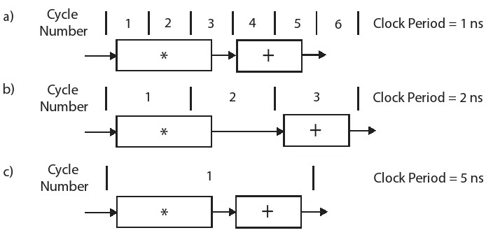
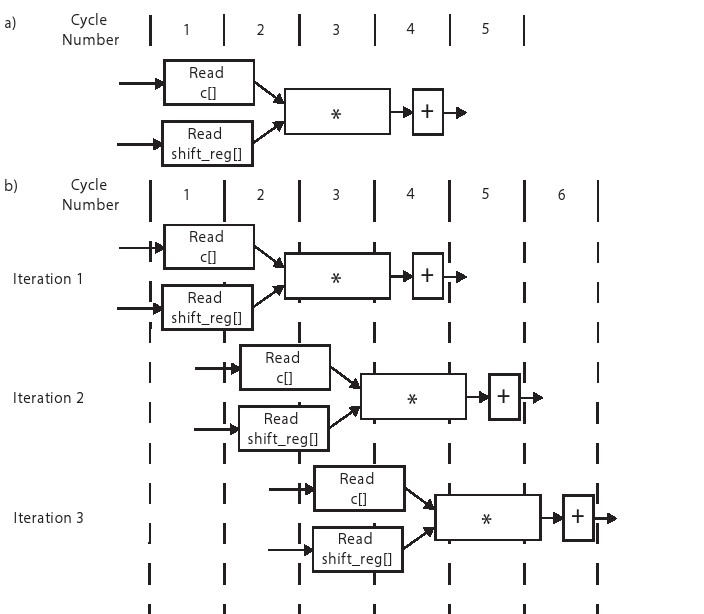
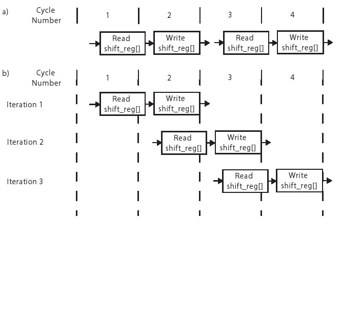
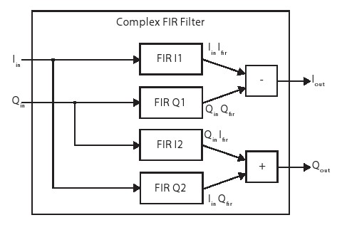

# 第二章

<<<<<<< HEAD
# 有限脉冲响应(FIR)滤波器 
=======
# 有限脉冲响应(FIR)滤波器
>>>>>>> pr/1

## 2.1 概述

​	有限脉冲响应(FIR)滤波器在数字信号处理(DSP)领域中很常用——它们可能是这个领域应用最广泛的运算。因为它们可以采用高度优化的体系结构，所以它们非常适合于硬件实现。它有一个关键特性即对连续信号元素进行线性变换 。这个特性可以很好的映射成一种数据结构（例如，FIFOs或者抽头延时线），这些数据结构可以在硬件中高效实现。一般来说，流处理很适合在FPGA中映射实现，例如，在本书中介绍的大多数例子都包含某种形式的流处理。

<<<<<<< HEAD
​	 滤波器的两个基本应用是信号重建和信号分离。信号分离更常用到:将输入信号分离到不同部分。通常，我们认为它们是频率范围不同的信号，例如，我们可能设计低通滤波器，用来去除不需要的高频信号。或者，我们为了解调某特定信号，设计一个带通滤波器来筛选该特定信号频率，例如，在频移键控解调过程中隔离频率。信号重建是指滤除可能混入有用信号的噪声和其他失真，例如，通过无线信道传输数据，信号重建包括平滑信号和移除直流分量。

​	数字FIR滤波器经常处理由采样连续信号产生的离散信号。最熟悉的是在时间上抽样，即，在离散信号下进行处理。这些处理都是在固定采样间隔的条件下进行的。例如，我们用模数转换器以固定时间间隔采样天线的电压。或者，也可以通过采样光电二极管电流来测量光的强度。或者，在空间中采样。例如，我们可以采样一个由光电二极管组成的图像传感器不同位置的值，来创建一个数字图像。在文档[ [41](#41) ]中可以找到对信号和采样更深入的描述。
=======
​	 滤波器的两个基本应用是信号重建和信号分离。信号分离更常用到:将输入信号分离到不同部分。通常，我们认为它们是频率范围不同的信号，例如，我们可能设计低通滤波器，用来去除不感兴趣的高频信号。或者，我们为了解调某特定信号，设计一个带通滤波器来筛选该特定信号频率，例如，在频移键控解调过程中隔离频率。信号重建是指滤除可能混入有用信号的噪声和其他失真，例如，通过无线信道传输数据，信号重建包括平滑信号和移除直流分量。

​	数字FIR滤波器经常处理由采样连续信号产生的离散信号。最熟悉的是在时间上抽样，即，在离散信号下进行处理。这些处理都是在固定采样间隔的条件下进行的。例如，我们用模数转换器以固定时间间隔采样天线的电压。或者，也可以通过采样光电二极管电流来测量光的强度。或者，在空间中采样。例如，我们可以采样一个由光电二极管组成的图像传感器不同位置的值，来创建一个数字图像。在文档[[41](./BIBLIOGRAPHY.md#41)]中可以找到对信号和采样更深入的描述。
>>>>>>> pr/1

​	采样数据格式取决于应用场景。数字通信领域通常使用复数(in-phase和quadrature或I/Q值)来表示一个采样数据。在本章后续，我们将设计一个复数FIR滤波器来处理这样的数据。在图像处理领域，我们经常把每个像素看作一个样本。一个像素可以有多个字段，例如红色、绿色和蓝色(RGB)颜色通道。我们希望根据应用以不同的方式对这些通道进行滤波。

​	本章目的是提供一个从选用算法到应用高级语言综合进行算法硬件实现的基本流程。这个流程的第一步是对算法本身有深刻的理解。这使我们做代码重构和设计优化更加容易。下一节介绍FIR滤波器的理论和计算。本章的其余部分介绍对FIR滤波器进行各种基于HLS的优化。这是为了让读者对这些优化方式的有全面的认识。在后续章节中，每种优化方式都将进行详细介绍。

## 2.2 背景

<<<<<<< HEAD
​	对滤波器输入脉冲信号得到的输出信号为该滤波器的 *脉冲响应* 。线性时不变滤波器的脉冲响应可以表征滤波器的所有特性。顾名思义，FIR滤波器（严格的线性时不变系统）的脉冲响应是有限的======。在已知滤波器脉冲响应的前提下，我们可以通过*卷积*的方法算出该滤波器任意输入的输出响应。这个运算过程结合滤波器脉冲响应（又可称为系数或阶)和输入信号用来计算输出信号。滤波器的输出也可以通过其他方式进行计算(例如，通过频域计算)，在本章中，我们关注时域计算。

​	 N-阶FIR滤波器的系数h[]与输入信号x[]的卷积可由差分方程表示：

$$\begin{aligned}  y[i]=\sum_{j=0}^{N-1}h[j]\cdot x[i-j]\end{aligned} \quad(2.1)$$                                                                                 
=======
​	对滤波器输入脉冲信号得到的输出信号为该滤波器的 *脉冲响应* 。线性时不变滤波器的脉冲响应包含关于滤波器的完整信息。顾名思义，FIR滤波器（严格的线性时不变系统）的脉冲响应是有限的。在已知滤波器脉冲响应的前提下，我们可以通过*卷积*的方法算出该滤波器任意输入的输出响应。这个运算过程结合滤波器脉冲响应（又可称为系数或阶)和输入信号用来计算输出信号。滤波器的输出也可以通过其他方式进行计算(例如，通过频域计算)，在本章中，我们关注时域计算。

​	 N-阶FIR滤波器的系数h[]与输入信号x[]的卷积可由差分方程表示：

$$y[i]=\sum_{j=0}^{N-1}h[j]\cdot x[i-j]$$                                                                                   (2.1)
>>>>>>> pr/1

注意，要计算一个N-阶滤波器的输出值，需要N个乘法和N-1个加法。

​	 *滑动均值滤波器* 是低通FIR滤波器的一种简单形式，其所有系数都是相同的且和为1。例如3点滑动滤波器，其系数h =[1/3, 1/3, 1/3]。同时由于它卷积核的形状特点，它也被称为矩形滤波器。或者你可以想象一个滑动均值滤波器，它将输入信号的几个相邻样本相加并求平均值。在上面卷积方程中，用1/N代替h[j]并对公式重新排布整理，达到对N个元素求平均值相似的效果:

<<<<<<< HEAD
 $$\begin{aligned} y[i]=\frac{1}{N}\sum_{j=0}^{N-1}x[i-j]\end{aligned} \quad(2.2)$$       										

​	每个输出信号可以按照上面公式计算，上面公式总共使用N−1次加法和一次乘数为1 / N的乘法。很多时候最后的乘法也可以被其它运算操作重新组合并合并。因此滑动均值滤波器比常规FIR滤波器更简单。例如，当N = 3时，我们这样运算来计算y[12]:

$\begin{aligned} y[12]=\frac{1}{3}\cdot (x[12]+x[11]+x[10])\end{aligned} \quad(2.3)$								
=======
 $$y[i]=\frac{1}{N}\sum_{j=0}^{N-1}x[i-j]$$       										(2.2)

​	每个输出信号可以按照上面公式计算，上面公式总共使用N−1次加法和一次乘数为1 / N的乘法。很多时候最后的乘法也可以被其它运算操作重新组合并合并。因此滑动均值滤波器比常规FIR滤波器更简单。例如，当N = 3时，我们这样运算来计算y[12]:

$y[12]=\frac{1}{3}\cdot (x[12]+x[11]+x[10])$									(2.3)
>>>>>>> pr/1

​	这个过滤器是因果系统，这意味着输出数据与当前输入值及以前的数据有关。系统的因果特性是可以改变的，例如以当前样本为数据中心时刻的处理，即y[12] = 13·(x[11] + x[12] + x[13])。虽然从根本上来说因果特性是系统分析的一个重要属性，但是对于硬件实现来说它没有那么重要，一个有限非因果滤波器可以通过数据缓冲或者重排列来实现转因果系统的转换。

​	滑动均值滤波器可以用来平滑信号，例如去除随机(大部分是高频)噪声。随着N的阶数越高，我们会平均更多的样本，相应的我们必须进行更多的计算。对于滑动均值滤波器，N值的增大等效于减小输出信号带宽。根本上讲，它就像一个低通滤波器(虽然不是非常理想)。直觉上，这样解释是有意义的。当我们对越来越多的样本进行平均时，我们消除了输入信号中更高的频率分量。也就是说，“平滑”等同于降低高频分量。滑动滤波器是最优的减少白噪声同时保持最陡峭阶跃响应的滤波器，即高给定边缘锐度的情况下把噪声压到最低。

<<<<<<< HEAD
​	注意通常来说，滤波器系数可以用来精确地创建许多不同类型的滤波器:低通滤波器, 高通滤波器，带通滤波器等等。一般来说，设计滤波器时，阶数越大提供的自由度越多，设计滤波器的性能越好。有大量的文献致力于为特定应用需求设计滤波器系数。在实现滤波器时，这些系数数值基本上是无关的，我们可以忽略系数本身是如何求得。但是，正如我们看到的滑动均值滤波器，滤波器的结构和特定系数对实现该滤波器需要执行的操作数产生很大影响。例如，对称滤波器有多个相同系数，我们可以将系数分组来减少乘法次数。在其他情况下，可以将固定滤波系数转换为移位和加法运算[ [34](#34) ]。在这种情况下，滤波器系数可以极大改变滤波器实现性能和所消耗资源[ [52](#52) ]。但是我们要暂时忽略这一点，重点关注设计具有固定系数的滤波器结构特点，而不是单纯利用固定系数滤波器运算。  

## 2.3 FIR结构基础 
=======
​	注意通常来说，滤波器系数可以用来精确地创建许多不同类型的滤波器:低通滤波器, 高通滤波器，带通滤波器等等。一般来说，设计滤波器时，阶数越大提供的自由度越多，设计滤波器的性能越好。有大量的文献致力于为特定应用需求设计滤波器系数。在实现滤波器时，这些系数数值基本上是无关的，我们可以忽略系数本身是如何求得。但是，正如我们看到的滑动均值滤波器，滤波器的结构和特定系数对实现该滤波器需要执行的操作数产生很大影响。例如，对称滤波器有多个相同系数，我们可以将系数分组来减少乘法次数。在其他情况下，可以将固定滤波系数转换为移位和加法运算[[34](./BIBLIOGRAPHY.md#34)]。在这种情况下，滤波器系数可以极大改变滤波器实现性能和所消耗资源[[52](./BIBLIOGRAPHY.md#52)]。但是我们要暂时忽略这一点，重点关注设计具有固定系数的滤波器结构特点，而不是单纯利用固定系数滤波器运算。  

## 2.3 FIR结构基础
>>>>>>> pr/1

​	编程实现11阶FIR滤波器代码如图2.1。这个函数有两个输入端口，一个端口是输入数据x和另一个端口是输出结果y。由于每次执行该函数会提供一个函数输入数据并接收一个函数输出数据，多次调用这个函数后，完成整个输出信号的计算。因为我们在获取更多信号时这段代码可以根据需求调用很多次，所以这段代码可以方便地用流模式架构进行建模。

​	滤波器系数存储在函数内部声明的数组c[]中，定义为静态常数。注意系数是对称的。即它们以中心值c[5] = 500为镜像对称。许多FIR滤波器具有这种对称性。我们可以利用这个特点来减少数组c[]所需的存储容量。

​	代码对不同变量类型使用**typedef**。虽然这不是必需的，但是可以方便地更改数据类型。正如我们后续要讨论的位宽优化——特别是针对每个变量设定整数和分数位数——其在性能和资源方面优化显著。

<<<<<<< HEAD
 

​	写代码利用滤波器系数的对称性，也就是说优化C[]，使它含有6个因素(C[0]到C[5])，代码的其余部分还有那些改变？这些改变对资源有什么影响？它如何改变性能？ 
=======
​	 重写代码利用滤波器系数的对称性，也就是说优化C[]，使它含有6个因素(C[0]到C[5])，代码的其余部分还有那些改变？这些改变对资源有什么影响？它如何改变性能？
>>>>>>> pr/1

```c++
#define N 11
#include "ap_int.h"  

typedef int coef_t;
typedef int data_t;
typedef int acc_t;

void fir(data_t *y,data_t x){
    coef_t[N] = {
        53,0,-91,0,313,500,313,0,-91,0,53
    };
    static
    data_t shift_reg[N];
    acc_t acc;
    int i;
<<<<<<< HEAD
    
=======

>>>>>>> pr/1
    acc = 0;
    Shift_Accum_Loop:
    for(i = N - 1;i >= 0;i--){
        if(i == 0){
            acc += x * C[0];
            shift_reg[0] = X;
        }else {
            shift_reg[i] = shift_reg[i - 1];
            acc += shift_reg[i] * C[i];
        }
    }
    *y = acc;
}
```

图2.1：11阶FIR滤波器代码，该代码功能正确但完全没有优化。

​	该代码设计为流函数。它一次只接收一个数据，因此它必须存储以前的数据。由于这是一个11阶滤波器，我们必须存储之前的10个数据。 这是shift_reg[]矩阵的作用。因为矩阵数据在函数中被多次调用，所以该矩阵声明为静态类型。

​	每次**for**循环有两个基本运算。首先，它对输入数据执行乘累加操作(当前输入数据x和存储在shift_reg[]中之前输入的数据)。每次循环执行一个常量与一个输入数据的乘法，并将求和结果存储在变量acc中。同时该循环通过shift_array来实现数值移动，它的操作行为像FIFO。它存储输入数据x到shift_reg[0]中，并通过shift_reg将之前的元素“向前”移动:

``` c++
shift_array[10] = shift_array[9]
shift_array[9] = shift_array[8]
shift_array[8] = shift_array[7]
...
shift_array[2] = shift_array[1]
shift_array[1] = shift_array[0]
shift_array[0] = x
```

<<<<<<< HEAD


Shift_Accum_Loop的标签不是必需的，但是它对调试很有帮助。$Vivado^®HLS$工具将这些标签添加到代码视图中。


=======
Shift_Accum_Loop的标签不是必需的，但是它对调试很有帮助。Vivado HLS工具将这些标签添加到代码视图中。
>>>>>>> pr/1

​	在for循环完成后，acc变量是所有输入数据和FIR系数卷积运算的结果。最后的结果赋值到FIR滤波器函数输出端口y。这就完成了按照流处理流程计算得到的FIR滤波器的一个输出结果。

​	这个函数没有高效地实现FIR滤波器。它是串行执行的，并且使用了大量不必要的控制逻辑。后续部分提供一些优化手段来提高它的性能。

## 2.4 计算性能

​	在我们进行优化之前，有必要定义精确的度量。当评价设计性能时，必须仔细地说明度量。例如，有许多不同的方法来说明设计运行的“快速”。例如，你可以说运算速度为X 位/秒。或者它可以执行Y 操作/秒。 针对FIR滤波器运行速度的度量方法为滤波操作数/秒。然而，另一种度量方法是乘累加操作:MACs/秒。在某种程度上说每种度量方法都是相互关联的，但是当比较不同的实现方法时同类比较就变得很重要。例如，将一个采用位/秒度量方法的设计与另一个使用滤波操作数/秒的设计直接进行比较，很可能会产生误导;充分了解不同设计的相对优势，需要我们使用相同的度量方法来比较它们，而这可能需要额外的信息，例如从滤波操作数/秒等效成位/秒，需要了解关于输入和输出数据位宽的信息。

​	前面提到的所有指标单位都是秒。高级语言综合工具以时钟周期数和时钟频率为评价单位。频率与时钟周期成反比。应用它们统计1秒内运算数量。时钟周期数和频率都很重要:一个工作频率很低只需要一个时钟周期的设计，不一定比工作频率很高但需要10个时钟周期的设计更好。

<<<<<<< HEAD
​	优化时钟周期的同时还要对时钟频率进行优化，这是$Vivado^®$HLS工具一个复杂的功能。注意可以使用TCL指令为为Vivado HLS工具指定目标运行频率。例如,creat_clock -period 5 指令设置代码运行时钟周期5ns即时钟频率200 MHz。请注意这只是一个目标时钟频率，它主要影响工具优化代码为多少个运算操作。在生成RTL之后，Vivado HLS工具在这个时钟频率进行目标初始时序估计。然而电路性能还有一些不确定性存在，只有当设计在全部布局布线之后电路性能才能确定。
=======
​	优化时钟周期的同时还要对时钟频率进行优化，这是Vivado HLS工具一个复杂的功能。注意可以使用TCL指令为为Vivado HLS工具指定目标运行频率。例如,creat_clock -period 5 指令设置代码运行时钟周期5ns即时钟频率200 MHz。请注意这只是一个目标时钟频率，它主要影响工具优化代码为多少个运算操作。在生成RTL之后，Vivado HLS工具在这个时钟频率进行目标初始时序估计。然而电路性能还有一些不确定性存在，只有当设计在全部布局布线之后电路性能才能确定。
>>>>>>> pr/1

​	虽然更高频率在通常情况下是能达到更高性能的关键，但对于整个系统来说提高时钟频率并不一定是在整个系统中最优的优化方式。较低的时钟频率为工具在单个周期中组合多个相关操作提供了更多的时间余量，这个过程叫做*操作链接*。在这个过程中有些情况下可以通过提高逻辑综合优化效果和增加适配器件的代码规模来提高性能。改进的操作链接可以提高(或者降低)流水处理数据输入间隔。一般来说，提供一个频率约束但该频率值不超过实际运行时钟频率。将时钟周期约束在5−10ns的范围内通常是一个好的开始。一旦你开始优化设计，你可以改变时钟周期并观察优化结果。我们将在下一节中详细介绍操作链接。

​	因为Vivado HLS处理的是时钟频率估计值，在估计中它确实包含了一些可能使估算出错的余量。这个余量是保证在生成RTL电路时有足够的时序余量可以成功完成布局布线。这个余量可以使用set_clock_uncertainty 的TCL脚本进行直接设置。注意此指令只影响HLS生成RTL，与RTL级时序约束中时钟不确定性不同。由Vivado HLS生成的对RTL实现流程的时序约束完全是基于目标时钟周期的约束。

​	把你的任务需求和计算性能度量结合起来是很有必要的。在我们示例中，fir滤波器每次执行都会有一个数据输出。但是对于每一次fir运算我们执行的是N = 11次乘累加操作。因此如果你的度量指标单位是 乘累加/秒，你应该计算fir运算延迟秒数，然后除以11，得到一次乘累加操作需要的时间。

​	当我们进行流水线和其他优化时，性能统计变得更加复杂。在这种情况下，理解处理间隔和处理延迟之间的区别是很重要的。现在是更新你对这两个性能指标理解的好时机。关于这两个指标我们已经在1.4章中讨论过。后续我们将继续讨论不同优化策略如何对不同性能指标产生影响。

## 2.5 操作链接

<<<<<<< HEAD
​	 *操作链接*是Vivado HLS为了优化最终设计而进行地一项重要优化。尽管设计人员没有太多控制权，但设计人员要明白它的工作原理尤其是在性能方面的影响，这是尤为重要的。考虑FIR滤波器在各阶运算中做的是乘法累加操作。假设加法运算需要2个ns，乘法运算需要3个ns。如果我们把时钟周期设为1ns（或者等效时钟频率1Ghz），那么它要花费5个时钟周期来完成乘累加操作。如图2.2 a所示。乘法操作需要3个周期，加法操作需要两个周期。乘累加操作总时间为5个时钟周期×1ns = 5ns。因此我们处理性能为1/5ns = 2亿次乘累加/秒。 


=======
​	 *操作链接*是Vivado HLS为了优化最终设计而进行地一项重要优化。尽管设计人员没有太多控制权，但设计人员要明白它的工作原理尤其是在性能方面的影响，这是尤为重要的。考虑FIR滤波器在各阶运算中做的是乘法累加操作。假设加法运算需要2个ns，乘法运算需要3个ns。如果我们把时钟周期设为1ns（或者等效时钟频率1Ghz），那么它要花费5个时钟周期来完成乘累加操作。如图2.2 a所示。乘法操作需要3个周期，加法操作需要两个周期。乘累加操作总时间为5个时钟周期×1ns = 5ns。因此我们处理性能为1/5ns = 2亿次乘累加/秒。


图2.2:随着时钟周期的延长，乘累加操作的性能也会发生变化。假设乘法运算需要3个ns，加法运算需要2个ns。图a)时钟周期为1ns时，一个乘累加操作需要5个周期，因此处理性能是2亿次乘累加/秒。图b)时钟周期为2ns，乘累加运算需要3个时钟周期，因此处理性能约1.67亿次乘累加/秒。图c)时钟周期个5ns。通过使用操作链接，乘累加操作需要一个时钟周期，因此处理性能是2亿次乘累加/秒。
>>>>>>> pr/1

​	如果我们将时钟周期增加到2ns，乘法运算用时将超过两个周期，那么加法操作必须等到第3周期才开始，它可以在一个周期内完成。因此乘累加操作需要3个周期，所以总共需要6ns。这时处理性能大约为1.67次乘累加操作 /秒。这个结果比之前1ns时钟周期的要低。这个可以用第2个时钟周期中没有执行任何操作的“死时间”来解释。

​	然而增加时钟周期并不是在所有情况下都会导致更糟糕的结果。例如，如果我们将时钟周期设为5ns，我们可以使用操作链接将乘法和加法在同一个时钟周期内执行。如图2.2 c所示，因此乘累加操作在5ns的时钟周期下只需要1个时钟周期，因此我们可以执行2亿次乘累加 /秒。这与图2.2 a时钟周期更快（1ns）的处理性能相同。

​	到目前为止，我们可以在一个时钟周期内只执行两个操作。可以在一个时钟周期内链接多个操作。例如如果时钟周期是10ns，我们可以按顺序执行5个加法操作，或者我们可以实现两个连续乘累加操作。

​	显而易见，时钟周期在Vivado HLS优化设计的过程中起着重要作用。时钟周期与Vivado HLS其他优化方式一起使用，使时钟周期对设计优化的影响变得更加复杂。完全理解Vivado HLS整个优化过程并不重要，这个观点是很明确的，因为每个新版本都在不断改进提升这个工具的性能。然而，重要的是要了解这个工具是如何工作的。这更有利于你更好地理解优化结果，甚至使你编写的代码更加优化。

 ```c++
Shift_Accum_Loop:
for(i = N-1;i > 0;i--){
    shift_reg[i] = shift_reg[i-1];
    acc += shift_reg[i] * c[i];
}

acc += x * c[0];
shift_reg[0] = x;
 ```

<<<<<<< HEAD
图2.3:将for循环中条件语句删除，可以实现更有效的硬件结构。 

​	由于Vivado HLS对不同的时钟频率可以生成不同的硬件结构。因此整体性能的优化和最佳目标时钟周期的确认仍然需要用户的创造力。在大多数情况下，我们建议坚持在小范围时钟周期内进行优化。例如在本章项目中，我们建议将时钟周期设为10ns，并将重点放在理解不同优化手段(例如流水处理)如何用于创建不同的处理架构。100Mhz时钟频率是相对容易实现的，而且它提供了良好的初始结果。当然可以创建更快时钟频率的设计。200Mhz以及更快的频率是有可能设计的，但这时经常需要在时钟频率和其他优化策略之间进行更好的权衡。你可以通过更改时钟周期来观察处理性能上的差异。不幸的是，这里没有好的准则来选择最佳频率。

	

​	将基本FIR架构的时钟周期(图2.1)从10ns改为1ns。哪个时钟会提供最好的性能?哪个时钟会是面积优化最优?你为什么会这样认为?你理解趋势了吗?



## 2.6 代码提升

​	for循环内部的if/else语句效率很低。在代码中每个控制结构，Vivado HLS会生成硬件逻辑电路来检查条件是否满足，这个检查在每个循环中都执行。此外这种条件结构限制了if或else分支中语句的执行;这些语句只有在解决了if条件语句之后才能执行。 
=======
图2.3:将for循环中条件语句删除，可以实现更有效的硬件结构。

​	由于Vivado HLS对不同的时钟频率可以生成不同的硬件结构。因此整体性能的优化和最佳目标时钟周期的确认仍然需要用户的创造力。在大多数情况下，我们建议坚持在小范围时钟周期内进行优化。例如在本章项目中，我们建议将时钟周期设为10ns，并将重点放在理解不同优化手段(例如流水处理)如何用于创建不同的处理架构。100Mhz时钟频率是相对容易实现的，而且它提供了良好的初始结果。当然可以创建更快时钟频率的设计。200Mhz以及更快的频率是有可能设计的，但这时经常需要在时钟频率和其他优化策略之间进行更好的权衡。你可以通过更改时钟周期来观察处理性能上的差异。不幸的是，这里没有好的准则来选择最佳频率。

​	将基本FIR架构的时钟周期(图2.1)从10ns改为1ns。哪个时钟会提供最好的性能?哪个时钟会是面积优化最优?你为什么会这样认为?你理解趋势了吗?

## 2.6 代码提升

​	for循环内部的if/else语句效率很低。在代码中每个控制结构，Vivado HLS会生成硬件逻辑电路来检查条件是否满足，这个检查在每个循环中都执行。此外这种条件结构限制了if或else分支中语句的执行;这些语句只有在解决了if条件语句之后才能执行。
>>>>>>> pr/1

​	当x==0时if语句进行检查，这个只发生在最后一次迭代中。因此if分支中的语句可以从循环中“升起”。也就是说，我们可以在循环结束后执行这些语句，然后在循环中删除if/else控制流。最后我们必须改变执行“第0次”迭代的循环边界。这个转换如图2.3所示。这显示了for循环所需要的更改。

 	最终结果是实现一个更加紧凑的结构，适合进一步的循环优化，例如，展开和流水线。我们稍后讨论这些优化。

<<<<<<< HEAD


​	对比删除if/else之前和之后的实现结果。它们有哪些性能不同？它们的资源变化了多少？



=======
​	对比删除if/else之前和之后的实现结果。它们有哪些性能不同？它们的资源变化了多少？

>>>>>>> pr/1
```c++
TDL:
for(i = N - 1;i > 0;i--){
    shift_reg[i] = shift_reg[i - 1];
}
shift_reg[0] = x;

acc = 0;
MAC:
for(i = N-1;i >= 0;i++)
{
    acc += shift_reg[i] * c[i];
}
```

<<<<<<< HEAD
图2.4:将for循环分解为两个独立循环的代码片段。 

```

有变化？

```
=======
图2.4:将for循环分解为两个独立循环的代码片段。
>>>>>>> pr/1

## 2.7 循环拆分

​	我们在for循环中执行两个基本操作。第一个是通过shift_reg数组进行数据移位。第二个是进行乘累加运算来计算输出样本。循环分裂是分别在两个循环中实现各自操作。虽然这样做看起来不像是一个好主意，但是这样做允许我们在每个循环上分别进行优化。这可能是有利的，尤其是在对不同循环进行不同优化策略的情况下。

​	图2.4中代码显示了手动循环拆分优化结果。代码片段将图2.3的循环分割成两个循环。注意两个循环的标签名称，第一个是TDL 第二个是MAC。延时线(TDL)是数字信号处理中FIFO操作的术语;MAC是“乘累加”的缩写。

<<<<<<< HEAD


​	比较循环拆分前后，实现性能上有什么不同?资源使用情况如何变化?



=======
​	比较循环拆分前后，实现性能上有什么不同?资源使用情况如何变化?

>>>>>>> pr/1
​	每个循环单独拆分往往不能提高硬件实现效率。但是它可以实现每个循环独立地进行优化，这可能比优化原始的整体for循环更可能得到好结果。反之亦然;将两个(或多个)循环合并到一个循环中可能会产生最好的结果。这高度依赖于大多数优化都是正确的应用场景。一般来说对于如何优化代码没有“最优法则”。优化思路不一样导致优化过程也会有差异。因此重要的是要有很多可以使用的技巧，更好的是对优化工作原理有深入的了解。只有这样，你才能是得到最好的硬件算法实现。让我们继续学习一些额外的技巧……

```c++
TDL:
for(i = N - 1;i > 1;i = i - 2){
    shift_reg[i] = shift_reg[i - 1];
    shift_reg[i - 1] = shift_reg[i - 2];   
}
if(i == 1){
    shift_reg[1] = shift_reg[0];
}
shift_reg[0] = x;
```

图2.5:手动展开fir11函数中TDL循环。

## 2.8 循环展开

​	默认情况下Vivado HLS 将循环综合成顺序执行方式。该工具创建了一个数据路径，该路径实现了循环体中语句的执行。数据路径顺序执行每次循环迭代运算。这就创建了一个有效的区域架构;但是它限制了在循环迭代中可能出现的并行运算。

​	循环展开会通过循环次数(称为因子)来复制循环的主体。每次循环迭代循环次数减少相同因子。在最好情况下，当循环中没有任何语句依赖于前一次迭代生成的任何数据时，这时循环主体大大增加并行性，从而使系统运行速度更快。

​	图2.4中的第一个for循环(带有标签TDL)通过shift_reg数组进行数据移位。循环迭代从最大值(N−1)到最小值(i = 1)。通过展开这个循环,我们可以创建一个并行执行的数据路径进行移位操作。

​	图2.5显示了以因子2将循环展开后的结果。此代码重复循环主体两次。每次循环迭代都执行两个移位操作。因此我们迭代次数变为原来的一半。

​	请注意，在for循环之后还有一个if条件判断。当循环次数为奇数时，这个判断是必需的。在这种情况下，我们必须自己执行最后一次“半”迭代。if语句中的代码执行最后的“半”迭代，即将数据从shift_reg[0]移动到shift_reg[1]。

​	还要注意for循环展开开头的结果。减量操作从i--变为i = i-2。这是因为我们在每次迭代中都做了两次“工作”，因此我们应该减少2而不是1。

​	最后，终止for循环的条件从i > 0变为i > 1。我们应该确保“最后一次”迭代能够完成而不引发错误。如果最后的迭代循环执行i= 1,那么第二个语句会试图读取shift_reg[−1]。我们为了不执行这个非法操作，所以在for循环之后的if语句中进行最后的移位操作。

<<<<<<< HEAD
	

​	编写相应的代码按照因子3对这个TDL循环进行手动展开。这如何改变循环体呢?循环头需要哪些更改?for循环之后的if语句附加代码仍然是必需的吗?如果是，那现在又有什么不同呢?



=======
​	编写相应的代码按照因子3对这个TDL循环进行手动展开。这如何改变循环体呢?循环头需要哪些更改?for循环之后的if语句附加代码仍然是必需的吗?如果是，那现在又有什么不同呢?

>>>>>>> pr/1
​	循环展开可以提高总体性能，前提是我们可以并行执行一些(或全部)语句。在展开代码中，每次迭代要求我们从shift_reg数组中读取两个值;而且我们还要在同一个数组上写两个值。因此如果我们希望并行地执行这两个语句，我们必须能够在相同的周期内对shift_reg数组执行两个读操作和两个写操作。

​	假设我们将shift_reg数组存储在一个BRAM中，BRAM有两个读端口和一个写端口。因此，我们可以在一个循环中可以执行两个读操作，但我们只能在两个周期内顺序进行写操作。

​	有一些方法可以在一个循环中执行这两个语句。例如，我们可以将所有shift_reg数组的值存储在独立寄存器中。每个周期都可以对每个寄存器进行读写。在这种情况下，我们可以在一个循环中执行这两条的语句。你可以使用指令#pragma HLS array_parition variable=shift_reg complete设置Vivado HLS ,使其将所有放在shift_reg数组中的值，放到寄存器中。这是一个重要的优化，因此稍后我们将详细讨论 array_partition 指令。

​	用户可以使用unroll指令告诉Vivado HLS自动循环展开。为了自动实现图2.5中手动完成的循环展开，我们应该将指令#pragma HLS unroll factor=2放入代码的主体中，具体位置为for循环后面。虽然我们一直可以手动执行循环展开，但是允许工具为我们执行循环展开实现起来更容易，它使代码更易阅读;而且可以减少编码错误。

<<<<<<< HEAD


​	使用Unroll指令将TDL循环自动展开。当你增加unroll因子时，资源(FFs、LUTs、BRAMs、dsp48等)的数量如何改变?它如何影响吞吐量?当使用数组分区指令与unroll指令一起使用时会产生什么结果?如果你不使用unroll指令会产生什么结果?



=======
​	使用Unroll指令将TDL循环自动展开。当你增加unroll因子时，资源(FFs、LUTs、BRAMs、dsp48等)的数量如何改变?它如何影响吞吐量?当使用数组分区指令与unroll指令一起使用时会产生什么结果?如果你不使用unroll指令会产生什么结果?

>>>>>>> pr/1
​	现在考虑图2.4中第二个for循环(带有MAC标签)。该循环将数组c[]中的值与shift_reg[]数组的值相乘。在每次迭代中，它要访问两个数组中第i个值。然后把乘法结果加到acc变量中。

​	这个循环的每次迭代执行一次乘法和一次加法操作。每次迭代执行一次从数组shift_reg[]和数组c[]的读取操作。将这两个值相乘的结果累加到变量acc中。

​	加载和乘法操作在for循环中是独立的。加法操作取决于它是如何实现的，可能取决于前一次迭代运算的结果。但是，可以展开这个循环并删除此迭代运算的依赖关系。

​	图2.6展示的代码，该代码进行展开因子为4的MAC循环展开。第一个for是展开的循环。for循环起始控制语句的修改与我们展开TDL的修改方式类似。运行范围更改为i>=3，并且在展开循环的每次迭代中，i的值每次减少4。

​	虽然在原始for循环内有依赖关系，但在循环展开的情况下，依赖关系优化没了。循环依赖关系是由于acc变量的存在;由于每次迭代运算中乘累加的结果都要写入到这个变量中，而且每次迭代也读取这个寄存器值(以执行累加和)，它就形成了在迭代运算中一个读写的依赖项。注意由于编写实现方式的改变，在展开后循环中不再有依赖acc变量项。因此在展开的for循环中我们可以自由地并行运算四个独立MAC操作。

​	在for循环展开之后还有一个加法for循环。这是执行任意剩余部分迭代运算的必要条件。就像我们要求TDL中有if语句一样，它在可能的最后一次迭代操作中进行运算。当展开的for循环初始的迭代次数不为4的倍数时就会出现这种情况。

```c++
acc = 0;
MAC:
for(i = N - 1;i >= 3;i -= 4){
    acc += shift_reg[i] * c[i] + shift_reg[i - 1] * c[i - 1] + shift_reg[i - 2] * c[i - 2] + shift_reg[i - 2] * c[i - 2] + shift_reg[i - 3] * c[i - 3];
}

for(;i >= 0; i--){
    acc += shift_reg[i] * c[i];
}
```

图2.6:在fir11函数中以展开因子4手动将MAC循环展开。

​	再一次说明，我们可以通过将指令#pragma HLS unroll factor=4插入到MAC循环体中，控制Vivado HLS工具自动以因子4将循环展开。

​	通过在指令中指定优化参数 skip_exit_check ，Vivado HLS将不会增加对循环最后部分迭代运算的检查。当你知道循环永远不需要这些最后部分的迭代时，跳过运算检查是很有用的。或者执行最后几次迭代运算不会对结果产生(主要的)影响，因此这些运算可以被跳过。通过使用这个指令，Vivado HLS工具不会创建额外的for循环迭代。因此产生的硬件更简单，而且资源利用率更高。

​	当没有指定因子参数时for循环将完全展开。这相当于以最大迭代次数的展开;在这种情况下，完全展开和以因子11展开两者是等效的。在这两种情况下，循环主体都被复制了11次。而且循环控制没有什么作用;没有必要保留一个计数器来检查循环退出条件是否满足。为了进行完整的展开，循环的边界必须是静态确定的，即在编译时Vivado HLS必须能够知道for循环的迭代次数。

​	完整的循环展开实现程序最大程度的并行性，这样的代价是需要很多资源。因此，可以在“较小”的循环上执行完整的循环。但是大迭代次数的循环展开(例如迭代一百万次)通常是不可行的。通常情况下，Vivado HLS将运行很长一段时间(并且往往在经过几个小时综合之后都会失败)，如果这样的循环进行展开，它展开结果会是生成非常大的代码。

<<<<<<< HEAD


​	如果你的设计在15分钟内不能综合完成，你应该仔细考虑优化效果。当然大型设计可能会花费Vivado HLS大量时间进行综合。但是作为一个初始的用户，你的设计应该相对快速地综合完成。如果花了很长时间，那很可能意味着你使用了一些不打算使用的指令明显扩展了综合代码。 





 	针对MAC循环设置不同的展开因子综合一系列设计。性能如何变化?展开因子数是如何影响资源数量?将这些结果与通过展开TDL发现的趋势进行比较。 


=======
​	如果你的设计在15分钟内不能综合完成，你应该仔细考虑优化效果。当然大型设计可能会花费Vivado HLS大量时间进行综合。但是作为一个初始的用户，你的设计应该相对快速地综合完成。如果花了很长时间，那很可能意味着你使用了一些不打算使用的指令明显扩展了综合代码。

 	针对MAC循环设置不同的展开因子综合一系列设计。性能如何变化?展开因子数是如何影响资源数量?将这些结果与通过展开TDL发现的趋势进行比较。
>>>>>>> pr/1

## 2.9 循环流水

​	在默认情况下，Vivado HLS以顺序方式综合循环操作。例如图2.1中的For循环将依次执行循环中的每次迭代。也就是说，第二次迭代中的所有语句是在第一次迭代的所有语句完成时才会发生;对于后续的迭代也是如此。即使在并行执行的迭代语句中，也可能发生顺序执行方式。其他情况下，在前一次迭代所有语句执行完成之前，可以启动后续迭代中的一些语句。这种执行行为除非设计者明确指出它应该这样做，否则不会自动发生。这产生了*循环流水*的思想，它允许同时执行多个循环迭代运算。

​	考虑图2.4中MAC循环。每次迭代执行一个乘累加(MAC)操作。在for循环体内部这个MAC运算四个操作:

<<<<<<< HEAD
- 读取c[]			:	从c数组加载指定数据。

	 读取 shift_reg[]	:	从shift_reg数组加载指定数据。

	 `∗`				:	数组c[]和shifit_reg[]相乘。

	 `+`				:	将这些相乘的结果累积到acc变量中。

		MAC for循环中一次迭代运算的流程图如图2.7 A所示。读取操作需要两个时钟周期，这是因为第一个时钟周期提供内存地址，第二个时钟周期完成数据传递。由于这两个操作之间没有依赖关系，所以可以并行执行。* 操作可以从第2个周期开始;假设它花费三个周期才能完成，即完成时是第4个时钟周期。在第4个周期，+操作开始并且能够完成。因此整个MAC循环需要4个时钟周期才能完成。 
	
		有许多与for循环相关的性能指标。*迭代延迟*是执行一次循环运算所需的时钟周期数。MAC 循环迭代延迟为4个时钟周期。for*循环延迟*是完成整个循环所需的时钟周期数。这个时钟周期数包括初始化周期数(例如,i = 0),条件判断周期数(例如,i>= 0),和增量计算周期数(例如,i−−)。假设这三个for循环控制语句与循环并行执行，$Vivado^®HLS$报告此MAC延迟为44个时钟周期。这个时钟周期数是由迭代的次数(11)乘以迭代延迟(4)再加上一个判断循环停止的额外周期。然后减去1。也许这里唯一奇怪的是“减1”。我们后面就会讲到。首先在下一次迭代开始时需要一个额外时钟周期检查条件语句是否满足(不满足)，然后退出循环。现在来解释“减1”:$Vivado^®HLS$通过数据输出就绪的时钟周期来计算延迟。在这种情况下，最后一个数据在第43周期准备好。也就等效于在第43周期结束第44个周期开始时写入一个寄存器。另一种计算延迟的方式为延时时钟周期数量等于输入数据和输出数据之间的最大寄存器数。


=======
​	读取c[]			:	从c数组加载指定数据。

​	读取 shift_reg[]	:	从shift_reg数组加载指定数据。

​	∗				:	数组c[]和shifit_reg[]相乘。

​	+				:	将这些相乘的结果累积到acc变量中。

​	MAC for循环中一次迭代运算的流程图如图2.7 A所示。读取操作需要两个时钟周期，这是因为第一个时钟周期提供内存地址，第二个时钟周期完成数据传递。由于这两个操作之间没有依赖关系，所以可以并行执行。*操作可以从第2个周期开始;假设它花费三个周期才能完成，即完成时是第4个时钟周期。在第4个周期，+操作开始并且能够完成。因此整个MAC循环需要4个时钟周期才能完成。

​	有许多与for循环相关的性能指标。*迭代延迟*是执行一次循环运算所需的时钟周期数。MAC 循环迭代延迟为4个时钟周期。for*循环延迟*是完成整个循环所需的时钟周期数。这个时钟周期数包括初始化周期数(例如,i = 0),条件判断周期数(例如,i>= 0),和增量计算周期数(例如,i−−)。假设这三个for循环控制语句与循环并行执行，Vivado HLS报告此MAC延迟为44个时钟周期。这个时钟周期数是由迭代的次数(11)乘以迭代延迟(4)再加上一个判断循环停止的额外周期。然后减去1。也许这里唯一奇怪的是“减1”。我们后面就会讲到。首先在下一次迭代开始时需要一个额外时钟周期检查条件语句是否满足(不满足)，然后退出循环。现在来解释“减1”:Vivado HLS通过数据输出就绪的时钟周期来计算延迟。在这种情况下，最后一个数据在第43周期准备好。也就等效于在第43周期结束第44个周期开始时写入一个寄存器。另一种计算延迟的方式为延时时钟周期数量等于输入数据和输出数据之间的最大寄存器数。


图2.7: a)表示MAC for循环时序图。b)表示三个迭代运算用流水形式优化的MAC for循环。
>>>>>>> pr/1

​	循环流水线是将for循环多个迭代运算进行重叠的优化。图2.7 b)是MAC for 循环流水示例。图中显示同时执行三个迭代。第一个迭代等价于图2.7 a中所示的非流水线版本，其区别是后续迭代运算的开始时间。非流水线版本，第二次迭代在第一次迭代完成后开始，即第5个时钟周期。然而流水线版本第二次迭代可以第一次迭代完成之前启动。在图中，第二次迭代从第二个周期开始，第三次迭代从第三个周期开始。其余的迭代在每个时钟开始运算。因此，最后一次迭代即第11次迭代将从第11周期开始，并且在第14周期中完成，因此循环延迟是14。

​	 *循环起始间隔*(II)是另一个重要的性能度量。它定义为本次循环到下一次循环开始的时钟周期数。在本例中，循环II值为1，这意味着我们可以在每个周期中启动新的迭代循环。图2.7 b中图形化地描述了这一点。II值可以使用指令进行设置。例如指令#pragma HLS pipeline II=2 设置 Vivado HLS 工具II=2。请注意由于代码中的资源约束或逻辑依赖关系，II的设定值不一定总能实现。输出报告将告诉你Vivado HLS工具能够实现什么目标。

<<<<<<< HEAD
	

​	设置II值为1，并以1的增量进行递增。增加II的数值对循环延迟产生什么样的影响?趋势是什么?在某种程度上，将II设为更大的值是没有意义的。这个例子中的值是多少?对于普通循环你如何描述II值?



=======
​	设置II值为1，并以1的增量进行递增。增加II的数值对循环延迟产生什么样的影响?趋势是什么?在某种程度上，将II设为更大的值是没有意义的。这个例子中的值是多少?对于普通循环你如何描述II值?

>>>>>>> pr/1
​	任何for循环都可以进行流水操作，现在我们考虑将TDL循环进行流水操作。TDL

 for循环有一个与MAC for循环相似的头。循环主体是按照2.3节中介绍的方式进行数组元素移位。每次循环有两个操作:一个读，一个写到shift_reg数组。循环迭代延迟为2个时钟周期。读操作需要两个周期，写操作在第二个周期末尾开始执行。for循环按照非流水操作需要20个时钟周期。

​	通过在循环头部后面插入指令#pragma HLS pipeline II=1将这个循环进行流水优化。综合的结果是循环间隔为1个时钟周期。也就是说每个时钟周期都可以开始循环迭代运算。

​	通过对示例进行微小改动，我们可以演示当由于资源限制Vivado HLS工具不能实现II=1的情况。为此，我们要指明shift_reg数组的内存类型。我们也可以不指定资源，将它留给Vivado HLS工具来决定。但是我们使用指令来指定内存类型，例如，指令#pragma HLS resource variable=shift_reg core=RAM 1P 强制Vivado HLS工具使用单端口RAM。当使用该指令与循环流水优化相结合时，Vivado HLS工具将无法使用II=1来连接此循环。这是因为这段代码流水操作需要在同一周期中同时进行读写操作。使用单端口RAM是不可能实现的。这在图2.8 b中很明显。注意第2个时钟周期，我们需要在迭代1中完成对数据shift_reg的写操作，在迭代2中对相同数组进行读操作。我们可以删除II=1的确定优化(例如，#pragma HLS pipeline)，从而允许HLS有更多调整自由度。在这种情况下，HLS将自动增加初始间隔，直到找到可行的流程表。

<<<<<<< HEAD


​	RESOURCE指令允许用户强制设置Vivado HLS工具进行运算操作到硬件资源的映射方式。这种映射可以在矩阵（如上所示）同时也可以在变量中。思考代码 a=b+c；我们可以用RESOURCE指令#pragma HLS RESOURCE variable=a core=AddSub_DSP 来告诉Vivado HLS工具，加法操作应DSP48资源来实现。在Vivado HLS文档[63]中有各种硬件核资源描述。一般来说，建议让Vivado HLS自己选择实现资源。如果不能满足要求，设计人员再进行约束。
=======


图2.8:a)TDL for循环两次迭代流程表。b)II=1，TDL for循环三次迭代流程表。

​	RESOURCE指令允许用户强制设置Vivado HLS工具进行运算操作到硬件资源的映射方式。这种映射可以在矩阵（如上所示）同时也可以在变量中。思考代码 a=b+c；我们可以用RESOURCE指令#pragma HLS RESOURCE variable=a core=AddSub_DSP 来告诉Vivado HLS工具，加法操作应DSP48资源来实现。在Vivado HLS文档[63]中有各种硬件核资源描述。一般来说，建议让Vivado HLS自己选择实现资源。如果不能满足要求，设计人员再进行约束。
>>>>>>> pr/1

## 2.10位宽优化

​	C语言提供了许多数据类型来描述各种操作。在这点上，我们已经应用的**int**类型，Vivado HLS将其视为一个32位带符号整数。C语言还提供了浮点数据类型，例如**float**和**double**，以及整数数据类型，例如**char**、**short**、**long**和**long long**。整数数据类型可能都是正数。所有这些数据类型位宽都是2的幂次。

​	这些C语言数据类型实际位宽可能由于处理器架构不同而不同。例如，**int**类型在微处理上可以是16位，通用处理器上可能是32位。C标准规定最小位宽(例如，**int**类型至少为16位)和各类型之间关系(例如，**long**类型不小于**int**类型，**int**类型不小于**short**类型)。C99语言标准消除了这种含糊不清规定，并定义多种类型，如int8_t、int16_t、int32_ t和int64_t。

​	使用这些不同数据类型首要好处是解决软件中大量数据存储容量问题。对于大型数组，使用8bit而不是16bit可以将内存容量要求减少一半。缺点是可以8bit表示值的范围减少了。有符号8bit数据表示范围为[-128,127]，而有符号16bit数据表示范围是[-32,768,32,767]。位宽较小数据类型的相关操作可能需要更少的时钟周期，或者可以实现更多指令并行操作。

​	在FPGA实现中也可以看到相同好处，但这种好处更加明显。由于Vivado HLS工具生成自定义数据路径，它将生成与指定数据类型相匹配的实现结果。例如,语句a = b∗c根据运算数据类型它会有不同的延迟和资源使用情况。如果所有变量都是32位宽，那么需要执行的原始布尔操作要比仅为8位宽的变量多。因此，必须使用更多的FPGA资源(或更复杂的资源)来实现。此外，更复杂的逻辑通常需要更多流水线来实现相同频率。一个32位乘法可能需要5个内部寄存器来达到与使用一个内部寄存器的8位乘法相同的运算频率。因此，操作延迟将更大(5个周期而不是1个周期)，而应用HLS必须考虑到这一点。

<<<<<<< HEAD
​	创建一个简单设计,实现代码a = b∗c。变量类型分别更改为**char**,**short**,**int**,**long**,**long long**。在每种情况下，相乘运算需要多少个周期?不同的运算类型分别需要多少资源?

​	8bit数值计算需要什么类型原始布尔操作？当进行32bit数值计算这些需求有什么变化？提示：需要多少原始十进制操作才能实现两个8位十进制数值乘法？ 

​	在许多情况下为了优化硬件资源，需要处理位宽不是2的幂次的数据。例如，模数转换器通常输出结果为10bits，12bits，或14bits。我们可以将这些值映射到16bits，但这可能会降低处理性能并增加资源消耗。为了更准确表示这些值，Vivado HLS提供了任意精度数据类型，这些数据类型可以表示为有符号或者无符号任意位宽数据。

​	有符号和无符号的数据类型有两个单独的类: 
=======
​	创建一个简单设计,实现代码a = b∗c。变量类型分别更改为**char**,**short**,**int**,**long**,**long long**。在每种情况下，相乘运算需要多少个周期?不同的运算类型分别需要多少资源?

​	8bit数值计算需要什么类型原始布尔操作？当进行32bit数值计算这些需求有什么变化？提示：需要多少原始十进制操作才能实现两个8位十进制数值乘法？

​	在许多情况下为了优化硬件资源，需要处理位宽不是2的幂次的数据。例如，模数转换器通常输出结果为10bits，12bits，或14bits。我们可以将这些值映射到16bits，但这可能会降低处理性能并增加资源消耗。为了更准确表示这些值，Vivado HLS提供了任意精度数据类型，这些数据类型可以表示为有符号或者无符号任意位宽数据。

​	有符号和无符号的数据类型有两个单独的类:
>>>>>>> pr/1

* 无符号：ap_uint <width>

* 有符号：ap_int<width>

<<<<<<< HEAD
		width是1到1024^1^  之间的整数。例如，ap_int<8>是一个8位有符号数(和char一样)，ap_uint<32>是一个32位无符号数(与unsigned int相同)。它有一个更强大的数据类型，这种数据类型可以任意设置位宽，例如，ap_uint<4>或ap_int<537>。要使用这些数据类型，你必须使用c++并且包含头文件ap_int.h，即在你的项目中添加#include“ap_int.h”代码，并在添加“.cpp^2^”文件名后缀。

		考虑图2.1fir 滤波器代码中滤波器系数数组c[]。在这里复现是为了阅读方便:coef_t c[N] ={53, 0,-91, 0, 313, 500, 313, 0,-91, 0,53};。数据类型coef_t被定义为int，意思是我们有32位精度。32位精度对于滤波器系数来说是多余的，因为它们的范围从-91到500。因此，我们可以使用较小的数据类型。由于数值有正有负，所以我们需要一个有符号的数据类型。这11个数据的最大绝对值是500，而log~2~(500) = 9bits。又因为我们需要负数，我们再加1位。因此，coef_t可以声明为ap_int<10>。
	
		在fir函数中，变量i适合的数据类型是什么(见图2.1)?
	
		我们还可以更准确地定义fir函数中其他变量的数据类型，例如acc和shift_reg。首先考虑shift_reg数组。它是存储输入变量x最新更新的11个值，因此我们可知shift_reg值可以安全的拥有与x相同的数据类型，用“安全”的意思是，在精度上没有损失，即，如果shift_reg设成较小位宽的数据类型，那么输入数据X就需要删除一些重要数据位，来满足shift_reg的存储要求。例如，如果x被定义为16位(ap_ uint<16>)，而shift_reg被定义为12位(ap_uint<12>)，那么当我们将x变量数值存储在shift_reg变量中时，我们就会去掉x变量中4个最重要的数据位。
	
		为变量acc定义适当的数据类型是一项更加困难的任务。acc变量存储了shift_reg和滤波器系数数组c[]的乘积加总和。即，滤波器输出值。如果我们希望安全，那么我们将估算可能存储在acc中的最大值，并将数据位宽设为和该值一样。

^1^1024是默认的最大值，如果需要的话可以更改。参见Vivado HLS用户手册，了解如何实现这一点。

^2^类似功能可以通过C语言的ap_cint.h文件实现。
=======
   width是1到1024^1^  之间的整数。例如，ap_int<8>是一个8位有符号数(和char一样)，ap_uint<32>是一个32位无符号数(与unsigned int相同)。它有一个更强大的数据类型，这种数据类型可以任意设置位宽，例如，ap_uint<4>或ap_int<537>。要使用这些数据类型，你必须使用c++并且包含头文件ap_int.h，即在你的项目中添加#include“ap_int.h”代码，并在添加“.cpp^2^”文件名后缀。

   ​	考虑图2.1fir 滤波器代码中滤波器系数数组c[]。在这里复现是为了阅读方便:coef_t c[N] ={53, 0,-91, 0, 313, 500, 313, 0,-91, 0,53};。数据类型coef_t被定义为int，意思是我们有32位精度。32位精度对于滤波器系数来说是多余的，因为它们的范围从-91到500。因此，我们可以使用较小的数据类型。由于数值有正有负，所以我们需要一个有符号的数据类型。这11个数据的最大绝对值是500，而log~2~(500) = 9bits。又因为我们需要负数，我们再加1位。因此，coef_t可以声明为ap_int<10>。

   ​	在fir函数中，变量i适合的数据类型是什么(见图2.1)?

   ​	我们还可以更准确地定义fir函数中其他变量的数据类型，例如acc和shift_reg。首先考虑shift_reg数组。它是存储输入变量x最新更新的11个值，因此我们可知shift_reg值可以安全的拥有与x相同的数据类型，用“安全”的意思是，在精度上没有损失，即，如果shift_reg设成较小位宽的数据类型，那么输入数据X就需要删除一些重要数据位，来满足shift_reg的存储要求。例如，如果x被定义为16位(ap_ uint<16>)，而shift_reg被定义为12位(ap_uint<12>)，那么当我们将x变量数值存储在shift_reg变量中时，我们就会去掉x变量中4个最重要的数据位。

   为变量acc定义适当的数据类型是一项更加困难的任务。acc变量存储了shift_reg和滤波器系数数组c[]的乘积加总和。即，滤波器输出值。如果我们希望安全，那么我们将估算可能存储在acc中的最大值，并将数据位宽设为和该值一样。

   ------

   ^1^1024是默认的最大值，如果需要的话可以更改。参见Vivado HLS用户手册，了解如何实现这一点。

   ^2^类似功能可以通过C语言的ap_cint.h文件实现。
>>>>>>> pr/1

​	为实现这一点，我们必须了解在执行算术运算时，位宽如何增加。考虑运算a = b + c，其中b为ap_uint<10> 、c为ap_uint<10> ，那么变量a的数据类型是什么?在这里我们可以做一个最坏情况的分析，假设a和b都是最大值**2^10^ = 1024**。二者相加结果为a = 2024，可以表示为11位无符号数，即，ap_uint< 11 >。一般来说，在做加法时，运算结果要比两个加数中最大数值的位宽还要多一位。也就是说，当ap_uint<x> b和ap_uint<y> c相加时，a的数据类型为ap uint<z>，其中 z = max(x, y) + 1。这个结论同样适用于有符号数加法。

​	通过以上方法解决了acc数据类型设计的部分问题，但是我们还必须处理乘法运算。使用相同的术语，我们希望通过x和y的数据位宽来确定数值z的数据位宽(即，ad_int<z> a , ap_int<x> b,ap_int<y> c)。对于运算a = b∗c，我们不再详细介绍,位宽的运算公式为z = x + y。

<<<<<<< HEAD
​	提供以上两个公式来确定acc安全位宽。
=======
​	提供以上两个公式来确定acc安全位宽。
>>>>>>> pr/1

​	最终，我们将acc存储到变量y中，y是函数的输出端口。因此,如果acc的位宽大于变量c的位宽,acc的值将被截断并存储到y。因此,更重要的是确保acc位宽足够大,以便它可以处理完整精度的乘积加操作吗?

​	问题答案在于应用场景对于精度的要求。在许多数字信号处理应用中，数据本身是有噪声的，这意味着较低的数据位数可能没有意义。此外，在信号处理应用中，我们经常在处理数据时进行数值近似，而导致额外误差的引入。因此，我们确保acc变量精度使其返回一个完全精确的结果可能并不是最重要的。另一方面，为了减少计算中整体的舍入误差，最好在积累过程中保留更多比特，然后再针对最终的结果进行截位。其他应用如科学计算，通常需要更大动态范围，在这种应用下更多使用浮点数而不是整数或定点运算。那么正确的答案是什么?最终取决于设计者对于精度的要求。

## 2.11 复数FIR滤波器

​	到目前为止，我们只研究了实数数字滤波器。许多数字无线通信系统都由实部 (I)和虚部 (Q)组成的复数数字系统(更多的细节见章？？)。幸运的是，我们可以使用实数 FIR 滤波器来创建复数FIR滤波器，如下所述。

<<<<<<< HEAD
​	考虑方程2.4来理解如何利用实数FIR滤波器建立复数FIR滤波器。假设(Iin, Qin)是我们希望输入滤波器的一个数据。其中复数FIR滤波器系数表示为(I~fir~, Q~fir~)。处理系统中将会有不止一个输入样本和复数滤波器系数，但我们现在不用担心这点。 

$$\begin{aligned} (I_{in}+ jQ_{in})(I_{fir} + jQ_{fir})=(I_{in}I_{fir}−Q_{in}Q_{fir})+ j(Q_{in}I_{fir} + I_{in}Q_{fir})\end{aligned} \quad(2.4)$$	                            

​	方程2.4显示了复数FIR滤波器的一个系数与输入复数数据的乘法。方程右侧显示复数FIR滤波器输出实数部分是$I_{in}I_{fir}−Q_{in}Q_{fir}$，和虚数部分为$Q_{in}I_{fir} + I_{in}Q_{fir}$。这意味着我们可以将复数FIR过滤器运算拆分为四个实数滤波器，如图2.9所示。



图2.9:一个复数FIR滤波器由4个实数FIR滤波器组成。输入的I和Q样本被分配到4个不同的实数FIR滤波器中。FIR滤波器存储实部(FIR I)和虚部(FIR Q)复数系数。 
=======
​	考虑方程2.4来理解如何利用实数FIR滤波器建立复数FIR滤波器。假设(Iin, Qin)是我们希望输入滤波器的一个数据。其中复数FIR滤波器系数表示为(I~fir~, Q~fir~)。处理系统中将会有不止一个输入样本和复数滤波器系数，但我们现在不用担心这点。

$ (I_{in}+ j Q_{in})(I_{fir} + j Q_{fir}) = (I_{in} I_{fir}  Q_{in} Q_{fir}) +  j (Q_{in}  I_{fir} + I_{in}Q_{fir}) $	                             (2.4)

​	方程2.4显示了复数FIR滤波器的一个系数与输入复数数据的乘法。方程右侧显示复数FIR滤波器输出实数部分是$ I_{in}I_{fir} - Q_{in}Q_{fir} $，和虚数部分为$ Q_{in}I_{fir} + I_{in}Q_{fir} $。这意味着我们可以将复数FIR过滤器运算拆分为四个实数滤波器，如图2.9所示。


图2.9:一个复数FIR滤波器由4个实数FIR滤波器组成。输入的I和Q样本被分配到4个不同的实数FIR滤波器中。FIR滤波器存储实部(FIR I)和虚部(FIR Q)复数系数。
>>>>>>> pr/1

 ```c++
typedef int data_t;
void firI1(data_t *y,data_t x);
void fitQ1(data_t *y,data_t x);
void firI2(data_t *y,data_t x);
void fitQ2(data_t *y,data_t x);

void complexFIR(data_t Iin, data_t Qin,data_t *Iout,data_t *Qout){
<<<<<<< HEAD
    
    data_t IinIfir,QinQfir,QinIfir,IinQfit;
    
=======

    data_t IinIfir,QinQfir,QinIfir,IinQfit;

>>>>>>> pr/1
    firI1(&IinIfir,Iin);
    firQ1(&QinQfir,Qin);
    firI2(&QinIfir,Qin);
    firQ2(&IinQfir,Iin);
<<<<<<< HEAD
    
    *Iout = IinIfir + QinQfir;
    *Qout = QinIfir - IinQfir;
}
 ```
=======

    *Iout = IinIfir + QinQfir;
    *Qout = QinIfir - IinQfir;
}
```
>>>>>>> pr/1

​	图2.10:Vivado HLS使用四个实数FIR滤波器分层实现一个复数FIR滤波器。

​	复数FIR滤波器输入数值是复数(I~in~, Q~in~)并输出复数的过滤结果(I~out~, Q~out~)。图2.9描述了复数滤波器的原理框图，复数滤波器使用了四个实数FIR滤波器(FIR I1, FIR Q1, FIR I2, FIR Q2)。滤波器FIR I1和FIR I2是等效的，即它们的系数相同。FIR Q1和FIR Q2也是相同的。每个滤波器的输出对应于一个等式2.4的因子。然后对这些输出进行加法或者减法，来得到最终滤波的复数输出结果(I~out~, Q~out~)。

​	我们使用层次化结构来定义复数FIR滤波器。Vivado HLS使用函数来实现层次化结构。使用前面的实数FIR函数**void** fir(data_t *y, data_t x)，我们可以创建封装了实数fir函数的复数FIR滤波器。此代码如图2.10所示。

​	该代码定义了四个函数firI1、firQ1、firI2和firQ2。每个函数都是完全相同的代码，即图2.1中的fir函数。通常，我们不需要复制函数;而是简单地调用同一个函数四次。然而，这在本例中是不可以的，因为fir函数中shift_reg变量使用了**static**关键字。

​	函数调用充当接口。Vivado HLS工具不能跨越函数边界进行优化。也就是说，每个fir函数都被独立综合，并且在complexFIR函数中或多或少的被当作一个黑盒来处理。如果你希望Vivado HLS工具针对某个特定函数在其父函数中共同与其它代码共同优化，你可以使用inline指令。这个指令将该函数代码添加到父函数中，并消除层次结构。虽然这有提高性能和资源面积优化，但是它也产生了需要工具综合的大量代码。代码综合可能需要很长时间，甚至会综合失败，或者导致不可优化设计。因此，要小心使用内联指令。还要注意，Vivado HLS工具可以自动进行函数内联。这些函数通常具有少量代码。

```c++
float mul(int x,int y){
    return x * y;
}
float top_function(float a,float b,float c,){
    return mul(a,b) + mul(c,d) + mul(b,c) + mul(a,d);
}
float inlined_top_function(float a,float b,float c,float d){
<<<<<<< HEAD
    return a * b + c * d + b * c + a * d; 
}
```

​	图2.11:一个简单的例子说明inline指令。top_function有四个函数调用mul函数。如果我们在mul函数中添加inline指令，其结果与inline_top_function函数结果类似。 

​	inline指令去除了函数边界，这使Vivado HLS对代码可以进行额外优化，但这种额外优化方式可能带来复杂的综合问题，例如，它将使编译时间变长。同时它在执行函数调用时将排除顶层关联。它有多种方式维持代码结构，同时使层次结构更加易读。
=======
    return a * b + c * d + b * c + a * d;
}
```

​	图2.11:一个简单的例子说明inline指令。top_function有四个函数调用mul函数。如果我们在mul函数中添加inline指令，其结果与inline_top_function函数结果类似。

​	inline指令去除了函数边界，这使Vivado HLS对代码可以进行额外优化，但这种额外优化方式可能带来复杂的综合问题，例如，它将使编译时间变长。同时它在执行函数调用时将排除顶层关联。它有多种方式维持代码结构，同时使层次结构更加易读。
>>>>>>> pr/1

​	图2.11所示代码提供了一个inline指令如何工作的示例，inline_top_function函数是应用mul函数应用inline指令的结果。

​	Vivado HLS在某些情况下自动应用inline指令。例如，图2.11由于mul函数很小，工具很有可能对该函数进行inline操作。你可以通过inline指令的off参数来可以强制工具保持函数层次结构。

​	inline指令也有递归参数即在inline函数中，其调用的子函数也inline处理。也就是说所有子函数都会把代码展开到母函数中。这个可能会导致代码膨胀，因此这个功能要谨慎使用。

<<<<<<< HEAD
​	 一个inline函数不会有单独报告，因为所有的逻辑已经融合到了母函数中。
=======
​	 一个inline函数不会有单独报告，因为所有的逻辑已经融合到了母函数中。
>>>>>>> pr/1

## 2.12 总结

​	本章描述了使用Vivado HLS工具进行FIR滤波器的设计和优化。文章目标是提供HLS处理过程概况。处理的第一步是理解FIR滤波器计算背后的基本概念。这并不需要深刻的数学理解，但肯定要有足够的知识可以编写Vivado HLS工具能够综合的代码。这可能需要进行不同语言(例如，MATLAB、Java、C++、Python等)的转换。很多时候为了应用更简单的数据结构程序代码需要重构。例如，明确指明数据资源类型。同时这经常需要删除系统调用和HLS工具不支持代码。

​	创建一个优化的体系结构需要对HLS工具如何进行综合以及对RTL代码优化过程有基本理解。当然，精确地理解时序表、绑定、资源分配等等HLS算法是没有必要的(而且很多时候这些都是有专利的)。但是，对这个过程有一个大致了解，可以帮助设计师编写出与硬件匹配更好的代码。纵观整章，我们讨论了HLS综合过程的一些关键特性，这些特性是进行各种优化必须要理解的。尤其重要的是要理解HLS性能报告，关于性能报告我们在第2.4章中已经对此进行了描述。

​	此外，我们还介绍了一些基本HLS优化方法(包括循环和位宽优化)。我们以FIR滤波器设计为例强调了它们的优点和潜在缺点。这些都是常见的优化，可以广泛应用于各种场景。在接下来的章节，我们通过讨论其他更复杂的应用场景，来介绍更多关于这些优化的细节。

<<<<<<< HEAD
​	我们将在接下来的章节里提供更多的优化细节。

 
=======
​
>>>>>>> pr/1
