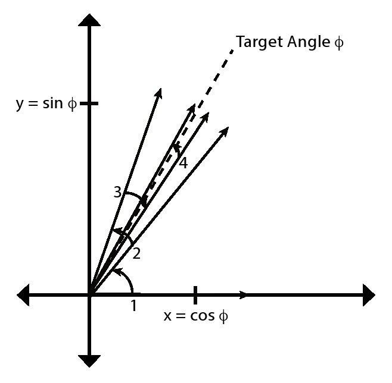
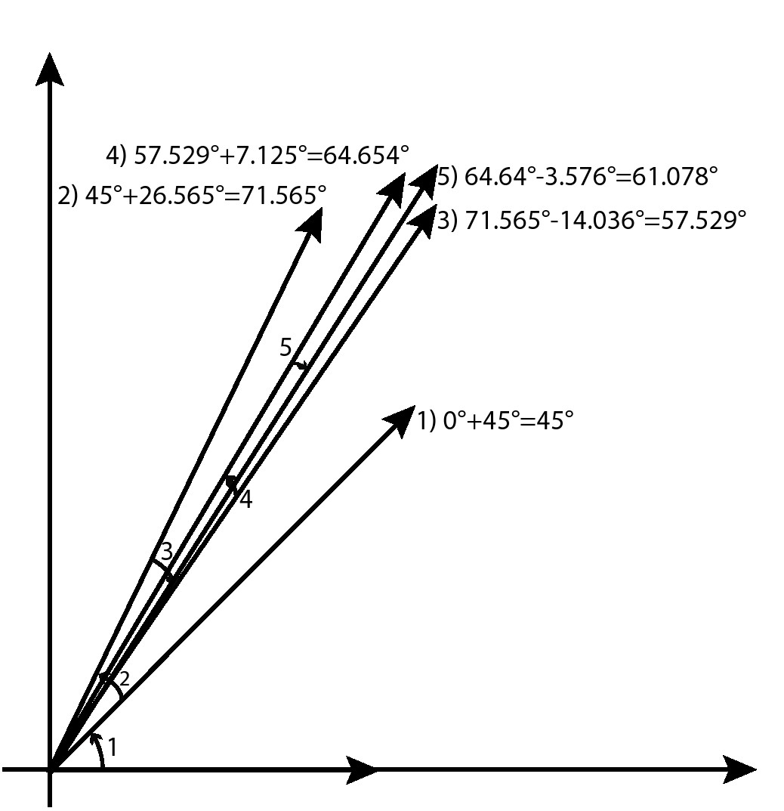
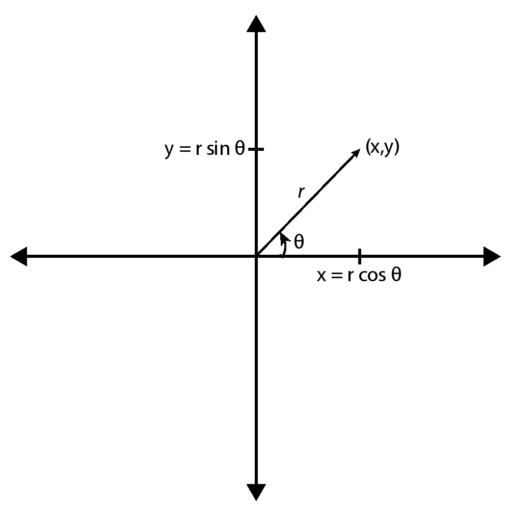
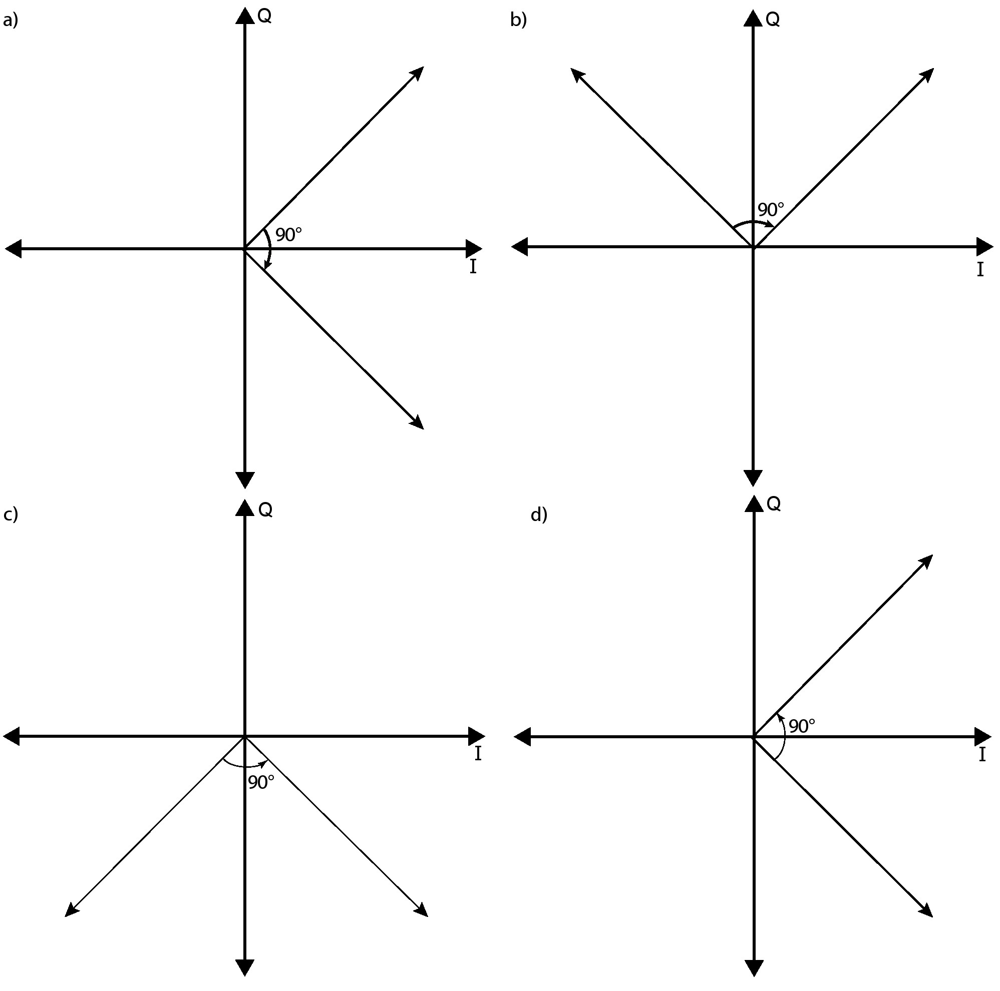
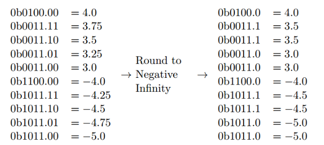
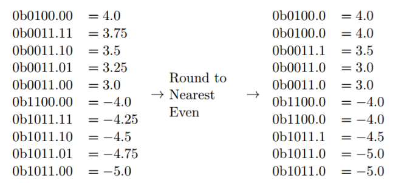

# 第三章 CORDIC

## 3.1 概述

​   CORDIC(坐标旋转数字算法)是一种计算三角、双曲和其他数学函数的有效方法。它是一种数字算法，每次运算均产生一次结果输出。这使我们能够根据应用需求调整算法精度；增加运算迭代次数可以得到更精确的结果。运算精度与运算性能和占用资源并列，是一种通用的设计评估指标。CORDIC是只使用加法、减法、移位和查找表实现的简单算法，这种算法在FPGA中实现效率高，在硬件算法实现中经常用到。



CORDIC算法是1950年由Jack Volder发明，它最开始是作为数字解决方案替代模拟方案应用于B-58轰炸机实时导航上，它的功能是计算旋转角度。在那个时代用硬件实现乘法的成本是相当高的，同时CPUs的计算能力也非常有限。因此这个算法需要有低的运算复杂度和使用简单的运算操作。多年之后，它被应用于数学协处理器[[24](#24)]、线性系统[[3](#3)]、雷达信号处理[[4](#4)]、傅立叶变换[[21](#21)]和其它数字信号处理算法中。现在，它广泛应用于FPGA设计中。Vivado HLS用CODIC进行三角函数计算，同时CORDIC也是现代FPGA IP CORE库中的标准运算模块。



​   本章目标是演示如何使用高级语言创建优化CORDIC算法。随着本书的深入，我们研究设计的硬核复杂性也在逐渐增加。CORDIC算法是一种迭代算法；因此，大多数计算都在一个**for**循环中执行。代码本身并不复杂，但是用来创建最优硬件实现结构是需要设计人员对代码有深入理解的。一个优秀的HLS设计人员如果希望创建最优设计，就必须理解算法。因此，我们在本章前部分给出了CORDIC算法的数学和计算背景。



​   我们在本章强调的HLS主要优化方式是为变量选择正确的数据表示。正如我们在本章后面所讨论的，设计人员必须仔细权衡运算结果精度、性能和设计的资源利用率。数据表示是这种权衡的一个重要因素—“较大”数字（那些大位宽数据)，通常是以增加使用资源(更多的寄存器和逻辑块)和降低处理性能为代价来提供更精确数据。我们将在第3.5.5节中提供了关于数据表示和任意精度数据类型的背景。

​   本章与工程应用相结合，针对运算精度(计算的准确性)、资源占用和处理性能的权衡进行了更深入的实验。本章目的是提供足够的知识经验，以便人们可以在这个项目中进行练习，例如，这一章和那个工程是相互补充的。那个工程的目标是建立一个相位探测器，它使用了一个CORDIC和一个复数匹配滤波器，这个滤波器我们在前一章中已经介绍过它了。

## 3.2 背景

​   CORDIC核心思想是在一个二维平面上高效地执行一组矢量旋转。在这些旋转运算的基础上增加一些简单控制，我们就可以实现各种基础操作，例如，三角函数，双曲函数，对数函数，实乘和复乘，以及矩阵分解和因式分解。CORDIC已经广泛应用于信号处理、机器人技术、通信和许多科学计算领域。由于CORDIC占用资源少，所以常用在FPGA设计中。

​   在下文中，我们将介绍CORDIC如何执行给定输入角θ的正弦和余弦的过程。这是使用一系列矢量旋转来完成的，这些简单的操作在硬件中使用非常有效。在高层次，算法使用一系列旋转来工作，目标是达到目标输入角θ。实现这种效率的关键创新是旋转可以以需要最少计算的方式完成。尤其我们使用乘以2的常数幂来执行旋转。这意味着简单地在硬件中移动位是非常有效的，因为它不需要任何逻辑。
     
​   图3.1提供了用于计算cosφ和sinφ的CORDIC程序的高级概述。在这种情况下，我们在x轴上开始初始旋转矢量，即0°角。然后，我们执行一系列迭代旋转;在这个例子中，我们只执行四次旋转，但通常这是40次旋转。每个后续旋转使用越来越小的角度，这意味着每次迭代都会为输出值增加更多精度。在每次迭代中，我们决定以较小的角度进行正向或负向旋转。我们旋转的角度值是先验固定的;因此，我们可以轻松地将它们的值存储在一个小内存中，并保持我们到目前为止已经旋转的累积角度的运行总和。如果该累积角度大于我们的目标角度φ，则我们执行负旋转。如果它更小，那么旋转就是正的。一旦我们完成了足够数量的旋转，我们就可以通过直接读取最终旋转矢量的x和y值来确定cosφ和sinφ。如果我们的最终向量的幅度为1，则x =cosφ且y =sinφ。

我们从一些术语开始，目的是重新定义你的一些基本的三角函数和矢量概念。 如果熟悉的话就不必看了。 但请记住，创建高效硬件设计最重要的一个方面是真正理解应用程序; 只有这样，设计师才能有效地利用优化指令并执行代码重构，这是获得最有效设计所必需的。

CORDIC算法的基本目标是以有效的方式执行一系列旋转。 让我们首先考虑如何进行旋转。 在二维中，旋转矩阵是：

$$
R(\theta) = \begin{bmatrix}
\cos \theta & -\sin \theta \\
\sin \theta & \cos \theta
\end{bmatrix}
\quad(3.1)
$$

CORDIC使用迭代算法将矢量v旋转到某个角度目标，这取决于CORDIC正在执行的功能。 一次旋转是$$v_{i} = R_{i} * v_{i-1}$$形式的矩阵向量乘法。 因此，在CORDIC的每次迭代中，我们执行以下操作来执行一次旋转，即矩阵向量乘法：
$$
\begin{bmatrix}
\cos \theta & -\sin \theta \\
\sin \theta & \cos \theta
\end{bmatrix}\begin{bmatrix}
x_{i-1} \\
y_{i-1}
\end{bmatrix}
= \begin{bmatrix}
x_i \\
y_i
\end{bmatrix}
\quad(3.2)
$$

写出线性方程，新旋转矢量的坐标是：
$$
x_i = x_{i-1}  \cos \theta - y_{i-1}  \sin \theta \quad(3.3)
$$
和
$$
y_i = x_{i-1} \sin \theta + y_{i-1} \cos \theta \quad(3.4)
$$

这正是我们需要简化的操作。 我们想要执行这些旋转而不执行任何乘法。
首先考虑90°旋转。 在这种情况下，旋转矩阵是：
$$
R(90^\circ) = \begin{bmatrix}
\cos 90^\circ & -\sin 90^\circ \\
\sin 90^\circ & \cos 90^\circ
\end{bmatrix} = \begin{bmatrix}
0 & -1 \\
1 & 0
\end{bmatrix}
\quad(3.5)
$$
因此我们只需要执行操作：
$$
\begin{aligned}
x_i &= x_{i-1}  \cos 90^\circ - y_{i-1} \sin 90^\circ \\
 &= x_{i-1} \cdot 0 - y_{i-1} \cdot 1  \\
 &= -y_{i-1}
\end{aligned}
\quad(3.6)
$$
和
$$
\begin{aligned}
y_i &= x_{i-1} \sin  90^\circ + y_{i-1} \cos 90^\circ  \\
 &= x_{i-1} \cdot 1 + y_{i-1} \cdot 0  \\
 &=  x_{i-1}
\end{aligned}
\quad(3.7)
$$
把这放在一起，我们可以得到
$$
\begin{bmatrix}
0 & -1 \\
1 & 0 \\
\end{bmatrix}\begin{bmatrix}
x \\
y
\end{bmatrix}
= \begin{bmatrix}
-y \\
x
\end{bmatrix}
\quad(3.8)
$$

可以看到这需要的计算非常少;旋转矢量简单地使y值无效，然后交换x和y值。二进制补码需要等效于加法器的硬件。因此，我们实现了有效执行90°旋转的目标。


如果你想在-90°之间旋转怎么办？什么是旋转矩阵R(-90°)？ 旋转需要什么类型的计算？如何设计能够通过-90°执行正负旋转的最有效电路，例如旋转方向是电路的输入？


虽然我们可以旋转±90°，但如果我们希望在旋转到目标角度时都有好的分辨率，我们需要旋转更小的角度。也许我们可能希望旋转的下一个自然角度是±45°。使用公式3.1中的旋转矩阵得到

$$
R(45^\circ) = \begin{bmatrix}
\cos 45^\circ & -\sin 45^\circ \\
\sin 45^\circ & \cos 45^\circ
\end{bmatrix} = \begin{bmatrix}
\sqrt 2/2 & -\sqrt 2/2 \\
\sqrt 2/2 & \sqrt 2/2
\end{bmatrix}
\quad(3.9)
$$

计算旋转操作数值，我们可以得到


$$
x_i = x_{i-1}  \cos 45^\circ - y_{i-1} \sin 45^\circ = x_{i-1} \cdot \sqrt 2/2  - y_{i-1} \cdot \sqrt 2/2  \quad(3.10)
$$

和

$$
y_i = x_{i-1} \sin  45^\circ + y_{i-1} \cos 45^\circ= x_{i-1} \cdot \sqrt 2/2 + y_{i-1} \cdot \sqrt 2/2  \quad(3.11)
$$

 把计算结果代入矩阵向量运算
$$
\begin{bmatrix}
\sqrt 2/2 & -\sqrt 2/2 \\
\sqrt 2/2 & \sqrt 2/2 \\
\end{bmatrix}
\begin{bmatrix}
x \\
y \\
\end{bmatrix}
= \begin{bmatrix}
\sqrt 2/2 x - \sqrt 2/2 y \\
\sqrt 2/2 x + \sqrt 2/2 y \\
\end{bmatrix}
\quad(3.12)
$$

与旋转±90°相比，这肯定不如计算效率高。 ±90°旋转是理想的，因为乘法运算的倍数是非常简单的常数（在这种情况下为0,1和-1）。 CORDIC的关键是以有效的方式进行这些旋转，例如用容易的乘法计算的方式定义旋转矩阵。 也就是说，我们希望更像前一个±90°，而不像我们刚刚描述的±45°旋转那样更难计算。

如果我们“强制”旋转矩阵成为易于乘法的常数怎么办？ 例如，乘以2的任意幂可以转变为移位操作。 如果我们将旋转矩阵中的常量设置为2的幂，我们可以非常容易地执行旋转而不需要乘法。 这是CORDIC背后的关键理念 - 找到非常有效的旋转计算，同时最大限度地减少任何副作用。 我们将更详细地讨论这些“副作用”，但这里有一个工程决策。 为了获得高效的计算，我们必须放弃一些东西; 在这种情况下，我们必须处理这种情况，即旋转也会执行缩放，即它会改变旋转矢量的大小 - 稍后会更多。
为了进一步探索“简单”旋转矩阵，请考虑矩阵

$$
R() = \begin{bmatrix}
1 & -1 \\
1 & 1 \\
\end{bmatrix}
\quad(3.13)
$$
转换成相应的计算形式
$$
x_i = x_{i-1}  - y_{i-1}\quad(3.14)
$$
和

$$
y_i = x_{i-1}  + y_{i-1}\quad(3.15)
$$

​用矩阵向量的形式表示

$$
\begin{bmatrix}1 & -1 \\ 1 & 1 \end{bmatrix}\begin{bmatrix}x \\ y \end{bmatrix}= \begin{bmatrix}x - y \\x + y \end{bmatrix} \quad(3.16)
$$

​   这个很容易计算，而且不需要任何“困难”的乘法。但这次运算结果是什么呢?结果证明这次运算实现了完美的45度旋转；现在，我们得到了一个高效方式来实现一次45度旋转。但是，这个变换也把矢量以$$\sqrt{2}$$进行了量化。这个矩阵行列式的平方根表明变换量化矢量的大小，即，矢量长度是如何变化的。这里矩阵行列式为1 \cdot 1−(−1) \cdot 1 = 2。因此,这个操作实现角度旋转45度和尺度变化$$\sqrt{2}$$倍。这是CORDIC运算进行的折中;我们可以使旋转运算变得容易，但它的副作用是缩放矢量的长度。根据应用场景不同，这不一定是个问题。但是现在，我们暂时不考虑缩放问题，集中讨论如何推广高效旋转操作。

​   现在我们介绍高效矩阵旋转概念，即，只进行加/减和2的幂次乘法运算(即移位操作)。再考虑旋转矩阵

$$
R_{i}(\theta) = \begin{bmatrix} \cos(\theta_{i}) & -\sin(\theta_{i}) \\\sin(\theta_{i}) & \cos(\theta_{i})\end{bmatrix}\quad(3.17)
$$

通过使用下面的三角恒等式

$$
\cos(\theta_{i}) =  {\frac{1}{\sqrt{1 + \tan^2(\theta_{i})}}} \quad(3.18)
$$

$$
\sin(\theta_{i})  =  \frac{\tan(\theta_{i})}{\sqrt{1 +\tan^2(\theta_{i})}} \quad(3.19)
$$

我们可以将旋转矩阵变为

$$
R_i = \frac{1}{\sqrt{1 + \tan^2(\theta_i)}} \begin{bmatrix} 1 & - \tan(\theta_i) \\ \tan(\theta_i) & 1 \end{bmatrix} \quad(3.20)
$$

​   如果我们限制$$tan(\theta_i)$$的值是2的幂次,那么旋转运算可以简化为数据移位（乘法）和加法。具体为,我们设$$tan(\theta_i)= 2^{-i}$$。旋转矩阵就变成了

$$
v_i = K_i \begin{bmatrix} 1 & - 2^{-i} \\  2^{-i} & 1 \end{bmatrix}\begin{bmatrix} x_{i-1} \\ y_{i-1} \end{bmatrix} \quad(3.21)
$$

其中

$$
K_i = \frac{1}{\sqrt{1 + 2^{-2i}}} \quad(3.22)
$$
这里有几点需要注意。$$2^{-i}$$相当于数据向右移动i位，即，等效于2的幂次除法。这基本上可以等效为一个简单的不需要任何资源的结构，即，在硬件实现上，它基本上是“无消耗”的。这是一个巨大的优点，但它也存在一些缺点。首先，我们受限只能旋转角度θ,其中$$tan(\theta_i)= 2^{-i}$$。后续我们将证明这不是什么严重问题。第二，我们只展示了一个方向的旋转；而CORDIC要求能够旋转$$\pm\theta$$。这个可以通过添加σ值（1或−1）来表示正向或者逆向旋转来修正这个错误。我们可能在每次迭代/旋转中有不同的$$\sigma_i$$ 。因此旋转操作可概括为

$$
v_i = K_i \begin{bmatrix} 1 & -\sigma_i 2^{-i} \\ \sigma_i 2^{-i} &1 \end{bmatrix} \begin{bmatrix} x_{i-1} \\ y_{i-1} \end{bmatrix} \quad(3.23)
$$

最后，旋转矩阵需要乘以$$k_i$$，在迭代过程中$$k_i$$通常被省略，然后在一系列旋转完成后进行补偿。比例因子累积为

$$
K(n) = \prod_{i=0}^{n-1} K_i  = \prod_{i=0}^{n-1}\frac {1}{\sqrt{1 + 2^{-2i}}} \quad(3.24)
$$

和

$$
K = \lim_{n \to \infty}K(n) \approx 0.6072529350088812561694 \quad(3.25)
$$

​   不同迭代的比例因子可以预先计算并存储。如果我们总是做固定次数的旋转，这个比例因子就是一个常数。这种修正也可以在旋转之前适当地缩放$$v_o$$来提前进行。有些情况下可以忽略这个比例因子，但这会导致处理增益。

$$
A = \frac{1}{K} = \lim_{n \to \infty} \prod_{i=0}^{n-1} {\sqrt{1 +2^{-2i}}}\approx 1.64676025812107 \quad(3.26)
$$

在每次迭代中,我们需要知道刚刚执行的旋转角$$\theta_i$$。其中$$\theta_i =arctan2^{-i}$$。我们可以提前计算每一个i对应的$$\theta_i$$值，然后把它们存储在片上内存中，之后我们可以像用查找表一样用这些值。此外，我们还有一个决定是顺时针还是逆时针旋转的机制，即，我们必须确定σ的值为1还是−1。这个决定取决于所需CORDIC的模式。例如,计算cosθ和sinθ,我们保存所有旋转角度的累加和。我们比较这个值和目标角θ的大小，如果当前累加和的角度小于θ则执行正向旋转，如果当前累加和大于θ则我们进行逆向旋转。

​   表3.1提供了CORDIC前7次迭代的统计信息。第一行是“零”旋转(即 i = 0),这是一次 45度旋转。它的比例因子为1.41421。第二行旋转因子为$$2^{-1} = 0.5$$。这个结果的旋转角度为$$\theta=arctan(2^{-1}) = 26.565^\circ$$,这个旋转的比例因子为1.11803。CORDIC增益是所有比例因子的积。在这个例子中，它的比例因子是前两个比例因子之积，即，1.58114 = 1.41421*1.11803。这个过程i的数值在增加，而旋转角度和比例因子越来越小。值得注意的是CORDIC比例因子最终趋于稳定≈1.64676025812107 数值正如公式3.26。另外，请注意，当旋转角度变小时，它们对数据精度的影响也逐步减弱。



描述第i次迭代对结果精度的影响?也就是说，它改变了哪几位?更多的迭代运算如何改变最终结果的精度，例如。当CORDIC迭代次数增加时 sinθ和cosθ的值发生怎样的变化?



​   表3.1:CORDIC前7次迭代的旋转角度、比例因子和CORDIC增益。注意，角度每次迭代大约减小一半。比例因子表示在旋转过程中旋转矢量增加的长度。CORDIC增益是所有旋转矢量比例因子的累积，例如，某一次迭代的CORDIC增益是本次迭代和与该次迭代之前所有比例因子累积。

| i    | $$2^{-i}$$ | Rotating Angle   | Scaling Factor | CORDIC Gain |
| ---- | -------- | ---------------- | -------------- | ----------- |
| 0    | 1.0      |$$45.000^\circ$$   | 1.41421        | 1.41421     |
| 1    | 0.5      | $$26.565^{\circ}$$ | 1.11803        | 1.58114     |
| 2    | 0.25     | $$14.036^{\circ}$$ | 1.03078        | 1.62980     |
| 3    | 0.125    | $$7.125^{\circ}$$  | 1.00778        | 1.64248     |
| 4    | 0.0625   | $$3.576^{\circ}$$  | 1.00195        | 1.64569     |
| 5    | 0.03125  | $$1.790^{\circ}$$  | 1.00049        | 1.64649     |
| 6    | 0.015625 | $$0.895^{\circ}$$  | 1.00012        | 1.64669     |

## 3.3 计算正弦和余弦

​   现在我们可以更精确地使用CORDIC计算一些给定角θ的正弦和余弦值。为了计算正弦和余弦值，我们从x轴正方向上的一个矢量开始(例如，初始角度45度)，然后执行一系列旋转直到我们逼近给定角θ。之后，我们可以直接读取旋转矢量的x和y值，这两个值即为对应cosθ和sinθ。这里假设最终矢量幅度等于1，你会看到计算正余弦并不难实现。

​   让我们用一个示例来具体说明：计算 $$sin60^\circ$$ 和 $$cos60^\circ$$ ，即，$$\theta= 60^\circ$$。这个过程如图3.2所示。在这个例子中我们执行了五次旋转得到一个角度近似为$$ 60^\circ $$。我们初始矢量为0度即它从x轴正半轴开始。第一次旋转对应序号i = 0旋转了45度角(见表3.1)。由于我们想要得到$$60^\circ$$,所以我们沿正方向旋转。矢量旋转后得到$$45^\circ$$角;同时还要注意，它的幅度约为1.414。现在，我们继续序号i = 1的旋转。因为我们希望得到$$60^\circ$$角,所以我们沿正方向旋转。矢量旋转之后的结果角度为$$45^\circ+ 26.565^\circ = 71.565^\circ$$,比例因子为1.118;



​   两次旋转得到的比例因子为1.414×1.118 = 1.581，这也是CORDIC增益。继续讨论 i= 2,现在我们得到的角大于 $$60^\circ$$ 的目标角,所以我们要沿负方向旋转，旋转后矢量角度为 $$57.592^\circ$$ 比例因子为1.630。整个过程伴随i值不断增大，同时旋转角度越来越小，最终会近似达到期望角度。同样，请注意随着旋转次数的增加，CORDIC增益逐渐趋于稳定。

​   当我们做了足够多的旋转后，数据精度将会满足我们的要求，最后我们得到一个与期望输入角近似的矢量。这个矢量的x和y值，对应 $$A_{R}$$ $$cos60^\circ$$和 $$A_{R}$$ $$sin60^\circ$$ ,如果$$A_{R}$$ = 1, 那么这个x与y的值正是我们想要得到的。由于我们通常知道将要执行的旋转次数，所以我们可以通过将预设初始矢量的大小为CORDIC增益的倒数来确保$$A_{R}$$ = 1, 在我们的例子中,假设执行了五次旋转,如图3.2,可知需要设置初始矢量的值为$$1.64649^{-1} = 0.60735$$(当i=5时CORDIC增益的倒数;见表3.1)。由此，我们可以直接设置一个初始矢量为(0.60735，0)。



​   如果我们再多做一次旋转，结果会变成怎样?再多做两次旋转(三次，四次，等等)会怎么样?当我们执行更多的旋转，精度会变成多少(例如，与MATLAB运算相比)?在一般情况下，你认为几次旋转是适合的?





​   做更多的旋转有没有可能会使精度变得更差?提供一个发生这种情况的例子。



​   图3.3提供了使用CORDIC算法实现正弦和余弦值计算的代码。它将输入角作为目标角，输出这个角对应的正弦和余弦值。代码使用数组cordic_phase作为查找表，这个查找表存储每次迭代的旋转角度。这个角度对应于表3.1中的“旋转角度”列中的值。我们假设cordic.h文件定义不同的数据类型(例如,COS_SIN_TYPE和THETA_TYPE)并设置NUM_ITERATIONS为某个常数。数据类型可以更改为不同的定点或浮点类型，设置NUM_ITERATIONS值要同时考虑我们期望的精度、资源和吞吐量。



​   注意变量sigma被设置为一个二位宽整数。因为我们知道它的可能取值只有±1，我们可以优化它的数据类型使它比使用int类型有更小的资源占用和更佳的性能。我们稍后将讨论如何在Vivado HLS中指定它们的数据类型。



```c++
//The file cordic.h holds definitions for the data types and constant valuse

#include "cordic.h"

//The cordic_phase array holds the angle for the current rotation
THETA_TYPE cordic_phase[NUM_ITERATIONS] = {
    45, 26.56, 14.036, 7.125
    3.576, 1.790, 0.895, ...    
};

void
cordic(THETA_TYPE theta, COS_SIN_TYPE &s, COS_SIN_TYPE &c)
{
    //Set the initial vector that we will rotate
    //current_cos = I;current = Q
    COS_SIN_TYPE current_cos =0.60735;
    COS_SIN_TYPE current_sin = 0.0;

    //Factor is the 2^(-L) value
    COS_SIN_TYPE factor = 1.0;

    //This loop iteratively rotates the initial vector to find the
    //sine and cosine value corresponding to the input theta angle
    for(int j = 0; j < NUM_ITERATIONS; j++){
        //Determine if we are rotating by a positive or negative angle
        int sigma = (theta < 0) ? -1 : 1;

        //Save the current_cos,so that it can be used in the sine calculation
       COS_SIN_TYPE temp_cos = current_cos;

        //Perform the rotation
        current_cos = current_cos - current_sin * sigma * factor;
        current_sin = temp_cos * sigma * factor + current_sin;

        //Determine the new theta
        theta = theta - sigma * cordic_phase[j];

        //Calculata next 2^(-L) value
        factor = factor >> 1;
    }

    //Set the final sine and cosine values
    s = current_sin;c = current_cos;
}
```

图3.3:CORDIC代码实现计算给定角度的正弦和余弦值。




​   此代码接近于“软件”版本。它有多种方式来提高其性能并减小资源面积。我们将在本章后面讨论如何优化这段代码。

## 3.4 笛卡尔向极坐标转换

​   通过一些修改，CORDIC可以实现其它功能。例如，它可以实现笛卡尔和极坐标系转换；我们将在本节详细地描述这一点。CORDIC还可以做其他很多功能，我们把它留给读者作为练习。

​   一个二维矢量v可以使用笛卡儿坐标系统(x,y)或极坐标系统(r,θ)来表示，对于极坐标系r是半径坐标(矢量的长度)和θ是角度坐标。这两种坐标系都有优缺点。例如，如果我们想做一个旋转，那么极坐标形式更容易实现，而笛卡尔坐标系更适合描述线性变换。

​   两种坐标系之间的转换关系如下式所示：

$$
\begin{aligned}
x = r \cos \theta \quad(3.27) \\
y = r \sin \theta \quad(3.28) \\
r =\sqrt{x^2 + y^2} \quad(3.29) \\
\theta = atan2(y, x) \quad(3.30)
\end{aligned}
$$

atan2在arctan函数中定义为

$$

atan2(y, x) =
\begin{cases}
\arctan(\frac{y}{x})     \quad\quad\quad      {if } x > 0 \\
\arctan(\frac{y}{x}) + \pi   \quad  {if } x < 0 { and } y \ge 0 \\
\arctan(\frac{y}{x}) - \pi   \quad  {if } x < 0 { and } y < 0 \\
\frac{\pi}{2}             \quad \quad\quad    {if } x = 0 { and } y > 0 \\
-\frac{\pi}{2}        \quad\quad\quad         {if } x = 0 { and } y < 0 \\
\text{undefined}      \quad\quad\quad         {if } x = 0 { and } y = 0
\end{cases}

$$

​   这里提供了一种在两个坐标系之间转换的方法。然而，这些操作在硬件中并不容易实现。例如，sine，cosine，平方根和arctan都不是简单操作，它们需要大量的运算资源。但是我们可以使用CORDIC算法通过一系列简单的迭代旋转来实现这些操作。

​   给定一个用笛卡尔坐标系表示的数(x, y)，我们使用CORDIC算法可以计算它的角度和幅度坐标(即，将它转换成极坐标形式)。为实现这一点，我们将给定的笛卡尔坐标系下的数据旋转为0度。一旦这个旋转完成，幅度就是最终旋转矢量的x值。要确定角度坐标，我们只需关注CORDIC执行旋转的累计角度。矢量旋转(i=0第一次旋转、i=1第二次旋转、i=3第三次旋转……)的角度可以存储在查找表中，用来计算sine /cosine。因此，我们只需要通过对这些角进行加减就可以得到总的旋转角度，而这里的加减操作取决于旋转方向。

​   该算法与计算给定角的正弦和余弦相似。我们执行一系列带有递增值i的旋转，使最终的矢量位于(靠近)x的正半轴上（即0度)。这可以用正旋转或负旋转来实现，正负旋转取决于矢量的y值，而这个矢量的幅度和角度值都是我们希望确定的。

​   算法执行第一步旋转得到的初始矢量在象限I或者IV。旋转 $$90^\circ$$ 的正负取决于初始矢量的y值。如果y值是正数，我们可以推算出我们在第I或者第II象限。反向旋转-$$90^\circ$$ 将使我们进入IV或者I象限。一旦我们进入这些象限中,我们可以保证最终能够渐近的接近目标角度0度。如果在象限III或象限IV，初始矢量y值将是负的。我们要做一个 $$90^\circ$$ 正向旋转，让我们进入IV和I象限。回想一下, $$\pm90^\circ$$ 的旋转是通过将矢量的x和y值求反，然后将两个值互换实现。关于旋转 $$\pm90^\circ$$ 的情况在图3.5中说明。

​   这里存在旋转矢量最终径向数值的问题；它的大小与旋转前初始大小不同；它受CORDIC增益的影响。当然，也可以通过乘以对应CORDIC增益的倒数(例如，1/1.647 = 0.607)来精确计算矢量径向值。然而，这违背了设计CORDIC算法避免乘法运算的目的。不幸的是，这种乘法不能简单地使用移位和加法来实现。幸运的是，这个因素通常并不重要。例如，在无线通信中用于调制的调幅键控中，你只需要知道相对幅度。或者在其他应用中，这个振幅增益可以由系统的其他部分来补偿掉。



## 3.5 数字表示

​   cordic函数使用当前常用的变量类型。例如，变量sigma被定义为int类型，其他变量使用自定义数据类型(例如，THETA_TYPE和COS_SIN_TYPE)。在许多情况下，HLS工具能够进一步优化这些值，来实现硬件资源优化。举个例子,在图3.3中,变量sigma的值为1或−1，即使已经将变量声明为至少包含32位位宽的int类型，在不改变程序功能的情况下，可以用更少的位数用来实现。在其它情况下，特别是变量经常出现在函数输入、存储和递归中，HLS工具不能针对变量进行自动优化。在这些情况下，修改代码使用较小的数据类型是避免资源浪费的重要优化手段。


​   虽然减少变量位宽通常是一个好的优化方法，但是这种优化方法可能改变程序的行为。一个小位宽数据类型不能像大位宽数据类型那样表征大量信息，而且无限的二进制数可以表示所有无限精度的实数。幸运的是，作为设计人员，我们可以选择符合特定需求的精度，并且可以在精度、资源占用和性能之间进行权衡。

​   在进一步讨论cordic函数数值表示方法之前，我们首先介绍数值表示的背景知识。我们提供基础知识，因为这在理解Vivado HLS所提供的数据类型进行数值表示时非常重要。下一节将从数值表示的基本背景开始讲解，然后讨论Vivado HLS中可用的任意精度变量。

### 3.5.1 二进制和十六进制数

​   计算机和fpga通常使用二进制来表示数据，这使数据可以由开关信号组成的二进制数字或简单的位来有效地表示。二进制数在大多数情况下都像普通的十进制数一样工作，但是如果你不熟悉它们的工作原理，它们常常会导致混淆错误，在许多嵌入式系统和fpga中尤其如此，在这些系统中，最小化数据位宽可以极大地提高系统总体性能和效率。在本节中，我们将总结二进制算法以及计算机表示数字的基本方法。

​   许多读者可能熟悉这些知识，如果是这样的话，你可以略读这些部分或完全跳过它们。我们建议阅读第3.5.5节，因为那里针对Vivado HLS说明了怎样定义任意的数据类型，这是一个用来进行CORDIC数值优化的重要方法。


​   当我们表示一个普通整数，例如4062，它可以表示成(4 \* 1000)+(0 \* 100)+(6 \* 10)+(2 \* 1) = 4062，或者我们可以按如下方式表示

| $$10^3$$ | $$10^2$$ | $$10^1$$ | $$10^0$$ | unsigned |
| ------ | ------ | ------ | ------ | -------- |
| 4      | 0      | 6      | 2      | = 4062    |

​   二进制数表达方式与这个相似，不过没有用到数字0到9和10的幂。二进制数用0和1以及2的幂来表示数值

| $$2^3$$ | $$2^2$$ | $$2^1$$ | $$2^0$$ | unsigned |
| ----- | ----- | ----- | ----- | -------- |
| 1     | 0     | 1     | 1     | = 11      |

​   因为(1 * 8) + (0 * 4)  + (1 * 2) + (1 * 1) = 11。为了避免歧义，二进制数经常在前边加“0b”，这个使0b1011很明显表示的是十进制11而不是数值1011。二进制数最高位是*最关键*的位置，同时二进制数最低位是*最不重要*的位置。

​   十六进制数用0到15和16的幂次来表示数值

| $$16^3$$ | $$16^2$$ | $$16^1$$ | $$16^0$$ | unsigned |
| ------ | ------ | ------ | ------ | -------- |
| 8      | 0      | 3      | 15     | = 32831   |

​   为了避免歧义，数字10到15表示为字母“A”到“F”，同时十六进制数据前缀“0x”，因此在c语言中上面的数值可表示为0x803F。

​   注意，二进制同样可以表示小数，这种类型数据通常叫做定点数，通过简单的拓展这种形式也可以表示负数。因此"0b1011.01"等效于：

| $$2^3$$ | $$2^2$$ | $$2^1$$ | $$2^0$$ | $$2^{-1}$$ | $$2^-2$$ | unsigned |
| ----- | ----- | ----- | ----- | ------ | ------ | -------- |
| 1     | 0     | 1     | 1     | 0      | 1      | = 11.25   |

​   因为8 + 2 + 1 + 1/4 = 11.25。不幸的是，C标准没有提供二进制表示常数的形式，尽管gcc和一些其他的编译器允许整型常数（没有小数点），这些常量前边会加“0b”。C99标准提供了一种描述浮点常数的方法，这种方法通过十六进制和指数来表示，注意指数是无法省略的，甚至值为0的情况下也不能省略。

```C++
float p1 = 0xB.4p0;//Initialize p1 to "11.25"
float p2 = 0xB4p-4;//Initialize p2 to "11.25"
```

​   一般来说，对于一个无符号数，只需要填写数值中非零的数字，没有显示的数字都可以假设为零。因此，用更多的数字表示相同的值很容易：只要添加尽可能多的零就可以了。这个过程通常称为零扩展。注意，每个附加的数字都增加了可以表示数值的范围。在二进制数中每添加一位，可以使表示的数字范围增加一倍，而在十六进制数字中每增加一位会使可表示的数字范围增加16倍。

| $$2^7$$ | $$2^6$$ | $$2^5$$ | $$2^4$$ | $$2^3$$ | $$2^2$$ | $$2^1$$ | $$2^0$$ | $$2^{-1}$$ | $$2^-2$$ | $$2^-3$$ | $$2^-4$$ | unsigned |
| ----- | ----- | ----- | ----- | ----- | ----- | ----- | ----- | ------ | ------ | ------ | ------ | -------- |
| 0     | 0     | 0     | 0     | 1     | 0     | 1     | 1     | 0      | 1      | 0      | 0      | =11.25   |

 

​   注意，二进制数可以定义为任意位宽，而不仅仅是8、16和32位。例如System C[ [2](#2) ]通过定义一系列模板类，可以实现任意精度整数和定点数（包括 sc_int<>,sc_uint<>,sc_bigint<>,sc_ubigint<>,sc_fixed<>,和sc_ufinxed<>）尽管它们最初是为系统模型定义的，而不是为了综合，但这些类在HLS工具中可以广泛使用。Vivado HLS包含相似的模板类（ap_int<>,ap_uint<>,ap_fixed<>,和ap_ufixed<>）这些类在通常情况下在仿真和综合上都会比SystemC类性能好。





​   通过使用0值，任意精度数被很好的定义(虽然用处不大)。列出所有能用0位数字表示的数字。

 

### 3.5.2 负数

​   负数的表示比正数稍微复杂一些，一定程度上是因为它有不同的表示方法。一种简单的方法是用符号位表示负数，通常称为有符号幅值表示。这种表示只是在数字前面添加了一个额外的位，以表示它是否有符号。有符号幅值表示法的奇怪之处是，有不止一种方法可以表示0。这使得有些简单操作例如 **operator == ()** 实现起来更加复杂。

| +/-  | $$2^1$$ | $$2^0$$ | signed magnitude |
| ---- | ----- | ----- | ---------------- |
| 0    | 1     | 1     | = 3               |
| 0    | 1     | 0     | = 2               |
| 0    | 0     | 1     | = 1               |
| 0    | 0     | 0     | = 0               |
| 1    | 0     | 0     | = -0              |
| 1    | 0     | 1     | = -1              |
| 1    | 1     | 0     | = -2              |
| 1    | 1     | 1     | = -3              |

​   另一种表示负数的方法是用偏移码表示。这种表示方法是增加了一个常量偏移(通常等于最高位数值)，否则视为正数：

| $$2^2$$ | $$2^1$$ | $$2^0$$ | biased |
| ----- | ----- | ----- | ------ |
| 1     | 1     | 1     | = 3     |
| 1     | 1     | 0     | = 2     |
| 1     | 0     | 1     | = 1     |
| 1     | 0     | 0     | = 0     |
| 0     | 1     | 1     | = -1    |
| 0     | 1     | 0     | = -2    |
| 0     | 0     | 1     | = -3    |
| 0     | 0     | 0     | =- 4    |

​   然而，到目前为止，最常用的用于实现负数的技术被称为“二进制补码”。二进制补码中最重要的位表示数值的符号(即数值表示为符号+大小)，二进制补码也表示偏移量是否可以用。理解这种表示方法的思路是将最高位表示成对应位宽的负数。

| -$$2^2$$ | $$2^1$$ | $$2^0$$ | two's complement |
| ------ | ----- | ----- | ---------------- |
| 0      | 1     | 1     | = 3               |
| 0      | 1     | 0     | = 2               |
| 0      | 0     | 1     | = 1               |
| 0      | 0     | 0     | = 0               |
| 1      | 1     | 1     | = -1              |
| 1      | 1     | 0     | = -2              |
| 1      | 0     | 1     | = -3              |
| 1      | 0     | 0     | = -4              |

​

| -$$2^4$$ | $$2^3$$ | $$2^2$$ | $$2^1$$ | $$2^0$$ | two's complement |
| ------ | ----- | ----- | ----- | ----- | ---------------- |
| 0      | 0     | 0     | 1     | 1     | = 3               |
| 0      | 0     | 0     | 1     | 0     | = 2               |
| 0      | 0     | 0     | 0     | 1     | = 1               |
| 0      | 0     | 0     | 0     | 0     | = 0               |
| 1      | 1     | 1     | 1     | 1     | = -1              |
| 1      | 1     | 1     | 1     | 0     | = -2              |
| 1      | 1     | 1     | 0     | 1     | = -3              |
| 1      | 1     | 1     | 0     | 0     | = -4              |

​   无符号数与二进制补码之间的一个重要区别是，我们需要确切地知道数值有多少位来表示，因为最高位与其它位代表不同的意义。此外，当扩展带符号的二进制补码时要复制符号位到所有新增的比特位。这个过程通常称为符号位扩展。在本书的其余部分中，除非另有说明，我们通常假设所有带符号的数字都用二进制补码表示。



​   N位二进制补码能表示的正数最大是多少?最大的负数是多少?





​   给定一个正数x,如何用二进制补码来表示−x?−0的二进制补码是什么?如果x是N位二进制补码所能表示的最大的负数,那么−x是什么?



### 3.5.3 溢出、下溢和舍入

​   当一个数值大于给定位宽所能表示的最大值时，就发生*溢出*(Overflow)。类似地，当一个数值小于可以表示的最小值时，就发生*下溢*(Underflow)。处理溢出或下溢的常见方法是简单地删除原始数字中最重要的位，这个操作通常称为*包装*(Wrapping)。

| $$2^5$$ | $$2^4$$ | $$2^3$$ | $$2^2$$ | $$2^1$$ | $$2^0$$ | $$2^{-1}$$ | $$2^-2$$ | $$2^-3$$ | $$2^-4$$ |        |
| ----- | ----- | ----- | ----- | ----- | ----- | ------ | ------ | ------ | ------ | ------ |
| 0     | 0     | 1     | 0     | 1     | 1     | 0      | 1      | 0      | 0      | =11.25 |
|       | 0     | 1     | 0     | 1     | 1     | 0      | 1      | 0      | 0      | =11.25 |
|       |       | 1     | 0     | 1     | 1     | 0      | 1      | 0      | 0      | =11.25 |
|       |       |       | 0     | 1     | 1     | 0      | 1      | 0      | 0      | =3.25  |

​   通过包装二进制补码的方式解决溢出和下溢的问题可能会导致正数变为负数，负数变为正数。

| $$-2^3$$ | $$2^2$$ | $$2^1$$ | $$2^0$$ | $$2^{-1}$$ | $$2^{-2}$$ | $$2^{-3}$$ | $$2^{-4}$$ | two' complement ||
| ------ | ----- | ----- | ----- | -------- | -------- | -------- | -------- | --------------- |
| 1      | 0     | 1     | 1     | 0        | 1        | 0        | 0        | =-4.75          |

| $$-2^2$$ | $$2^1$$ | $$2^0$$ | $$2^{-1}$$ | $$2^{-2}$$ | $$2^{-3}$$ | $$2^{-4}$$ | two' complement |
| ------ | ----- | ----- | -------- | -------- | -------- | -------- | --------------- |
| 0      | 1     | 1     | 0        | 1        | 0        | 0        | =3.25           |

​   同样，当一个数值不能通过给定小数位数来精确地表示时，需要采用*舍入*来解决这个问题。同样，这有几种常见的方法来对数值进行舍入。最简单的方法就是去掉额外不能表示的小数位数，但这样就会使数值变的更负。这种舍入的方法通常被称为向下舍入或向负无穷舍入。当向下舍入到最近的整数时，它就能与floot()函数对应起来，尽管它也可能舍入到其他小数位。



​   同样，也可以使用类似的方法使舍入后数值变得更大(这种称为向上舍入或向正无穷舍入与ceil()函数相对应),向绝对值较小的方向舍入(称为向零舍入与trunc()函数相对应),或向绝对值更大的值舍入(称为远离零舍入或向无穷舍入和round()函数相对应)。然而，这些操作中没有一个总可以最小化舍入误差。一种更好的方法叫做向最接近偶数舍入、收敛舍入或四舍六入五成双，它在lrint()函数中实现。正如你所期望的，这种舍入方式总是选择最近可表示数字。另外，如果有两个误差相等的数，则取偶数。如果最后一个数值是零，那么任意精度数是一个偶数。这种方法是处理IEEE浮点数舍入的默认方法，因为它不仅可以最小化舍入误差，而且还可以确保计算随机数舍入误差之和趋于零。

### 3.5.4 二进制运算

​   二进制加法与十进制加法相似，可以简单地对齐每位二进制数并进行加法运算，注意正确处理从一列到下一列的进位操作。注意，两个N位数值加或减的结果通常需要N+1位的数值来正确表示才不能溢出。对于小数，总是在符号位进行增加位宽

|      | $$2^3$$ | $$2^2$$ | $$2^1$$ | $$2^0$$ | unsigned |
| ---- | ----- | ----- | ----- | ----- | -------- |
|      |       | 0     | 1     | 1     | =3       |
| +    |       | 0     | 1     | 1     | =3       |
| =    | 0     | 1     | 1     | 0     | =6       |

|      | $$2^3$$ | $$2^2$$ | $$2^1$$ | $$2^0$$ | $$2^{-1}$$ | unsigned |
| ---- | ----- | ----- | ----- | ----- | -------- | -------- |
|      |       | 1     | 1     | 1     | 1        | =7.5     |
| +    |       | 1     | 1     | 1     | 1        | =7.5     |
| =    | 1     | 1     | 1     | 1     | 0        | =15      |

​   注意由于减法结果可能是负数，那个“额外的位数”就成了有符号二进制补码数据的符号位。

|      | $$2^3$$ | $$2^2$$ | $$2^1$$ | $$2^0$$ | unsigned |
| ---- | ----- | ----- | ----- | ----- | -------- |
|      | 0     | 0     | 1     | 1     | =3       |
| -    | 0     | 0     | 1     | 1     | =3       |
| =    | 0     | 0     | 0     | 0     | =0       |

|      | $$2^{-4}$$ | $$2^3$$ | $$2^2$$ | $$2^1$$ | $$2^0$$ | unsigned               |
| ---- | -------- | ----- | ----- | ----- | ----- | ---------------------- |
|      |          | 0     | 0     | 1     | 1     | =3                     |
| +    |          | 1     | 1     | 1     | 1     | =15                    |
| =    | 1        | 1     | 1     | 1     | 0     | =-12(two's complement) |

​   二进制数乘法与十进制数乘法相似。通常说，两个N位数据做乘法，最后结果位宽是2*N

|      | $$2^6$$ | $$2^5$$ | $$2^4$$ | $$2^3$$ | $$2^2$$ | $$2^1$$ | $$2^0$$ | two's complement       |
| ---- | -----| -----| ----- | ----- | ----- | ----- | ----- | ---------------------- |
|      |       |       |       | 1     | 0     | 0     | 1     | =9                     |
| *    |       |       |       | 1     | 0     | 0     | 1     | =9                     |
|      |       |       |       | 1     | 0     | 0     | 1     | =9                     |
|      |       |       | 0     | 0     | 0     | 0     |       | =0                     |
|      |       | 0     | 0     | 0     | 0     |       |       | =0                     |
| +    | 1     | 0     | 0     | 1     |       |       |       | =72                    |
|      | 1     | 0     | 1     | 0     | 0     | 0     | 1     | =81                    |

​   由于对符号位要进行单独处理，所以有符号数的操作更加复杂。然而，对于结果数据位宽的计算方法仍然适用：两个N位数值进行加减法，结果位宽为N+1位，两个N位有符号数据做乘法，结果将有2*N位。



​   关于除法怎么分析呢？这个数值位宽是否可以精确的表示两个N位数值的除法呢？



### 3.5.5 表示C/C++中任意精度整数

​   根据C99语言标准，已经定义了许多标准数据类型精度，例如**int**和**long**。虽然有些程序可以改变这些数据类型的精度来构建代码，但大多数程序是不能这样用的。在C99标准inttypes.h头文件中有一个小的改进，这个头文件中定义了固定位宽的有符号数据类型int8_t、int16_t、int32_t和int64_t，以及相应的无符号类型uint8_t、uint16_t、uint32_t和uint64_t。尽管这些数据类型有明确的位宽定义，但是它们使用起来仍然有些不方便。例如，即便像下面这样简单的代码也会有意外的行为发生。

```c++
#include "inttypes.h"
uint16_t a = 0x4000;
uint16_t b = 0x4000;
//Danger! p depends on sizeof(int)
uint32_t p = a * b;
```

尽管a和b的值可以用16位二进制数表示，而且他们的积(0x10000000)可以精确的用32位二进制数表示，但是依据C99的转换协议在计算开始时会把a和b的值强制转换为**int**类型，然后计算出一个整型的结果，之后再将处理结果拓展到32位。尽管不常见，对于C99编译器来说整数的精度只有16位。更进一步，C99标准对于整数只定义了4位宽度，然而FPGA系统经常应用自定义的位宽来进行算法运算。同时，用printf()函数不支持这类类型的数据打印，要求应用额外的宏定义来编写代码。如果你考虑用定点进行运算，情况会变得更糟。以下代码中，我们考虑a和b为定点数，在相同的结构下运算产生正确结果。

```c++
#include "inttypes.h"
//4.0 represented with 12 fractional bits
uint16_t a = 0x4000;
//4.0 represented with 12 fractional bits
uint16_t b = 0x4000;
//Danger! p depends on sizeof(int)
uint32_t p = (a*b) >> 12;
```

​   在以下两种情况，正确的代码都要求在输入变量相乘之前将变量位宽转换为与结果位宽一致。

```c++
#include "inttypes.h"
uint16_t a = 0x4000;
uint16_t b = 0x4000;
//p is assigned to 0x10000000
uint32_t p = (uint32_t) a*(uint32_t) b;
```

 ```c++
#include "inttypes.h"
//4.0 represented with 12 fractional bits
uint16_t a = 0x4000;
//4.0 represented with 12 fractional bits
uint16_t b = 0x4000;
//Danger! p depends on sizeof(int)
uint32_t p = ((uint32_t) a*(uint32_t) b) >> 12;
 ```



​   当用整数代表定点数值时，定点数的格式是非常重要的，只有这样在做乘法后的归一化操作才能正确。通常定点数用“Q”的形式来给出小数位数。例如“Q15”格式表示有15位小数，而且它经常用来表示16位有符号变量。这样的变量数值区间为[-1,1)。相似的，“Q31”表示有31位小数。



​   由于这些原因，最好使用c++和Vivado HLS模板类ap_int<>, ap_uint<>, ap_ fixed<>, ap_ufixed<>来表示任意精度数据。ap_int<>和ap_uint<>模板类需要整数参数来定义他们的位宽。计算函数通常产生结果的位宽足够宽，可以表示正确结果，参照3.5.4节中的规则。只有当结果分配给较小的位宽时，才会发生溢出或下溢。

```C++
#include "ap_int.h"
ap_uint<15> a = 0x4000;
ap_uint<15> b = 0x4000;
//p is assigned to 0x10000000
ap_uint<30> p = a*b;
```

​   ap_fixed<>和ap_ufixed<>模板类相似，它们都需要两个整数参数来定义位宽（数据所有位数）和数据整数的位宽。

```C++
#include "ap_fixed.h"
//4.0 represented with 12 fractional bits
ap_ufixed<15,12> a = 4.0;
//4.0 represented with 12 fractional bits
ap_ufixed<15,12> b = 4.0;
//p is assigned to 16.0 represented with 12 fractional bits
ap_ufixed<18,12> p = a*b;
```



​   注意ap_fixed<>和ap_ufixed<>模板类位宽数据要为正数，但是数值可以是任意的。特殊情况下，整数的位宽可能是零（暗示这个数是纯小数）或者这个数和数值位宽总数相同（暗示这个数没有小数）。然而，整数的位宽可以是负数或者比总位宽大的数！这些数据格式描述的数值是什么样子的？ap_fixed<8,-3>能表示的最大数和最小数是什么？ap_fixed<8,12>呢？



### 3.5.6 浮点

​   Vivado HLS还可以综合浮点运算。浮点数据提供了很高精度，但这是有代价的；它需要大量的计算资源，这意味着很大的硬件资源开销和多个时钟周期延迟。因此，应该避免应用浮点数，除非应用场景根据精度要求必须要用浮点数。事实上，本章的首要目标是让读者了解在工程中如何有效地从浮点数过渡到定点数。不幸的是，这通常是一项非常重要的任务，并且没有完美的标准方法可以自动执行转换。这个原因一部分是由于转换到定点将降低处理运算精度，所以浮点转换定点的性能资源折中最好留给设计人员决定。

​   用高级语言综合开发应用程序，初始数据类型都是采用浮点类型。这使设计人员专注于一个功能的正确实现。一旦实现了这一点，她就可以优化数据类型，来减少资源使用和/或提高性能。



​   将CORDIC中所有变量从float更改为int，这对资源使用有什么影响?它如何改变延迟?吞吐量如何变化?精度会有变化吗?



## 3.6 进一步优化

​   在本节中，我们将对优化CORDIC函数的方法提出一些简要的想法和建议。在权衡吞吐量、精度和资源的同时，我们关注不同优化方式如何对处理结果精度产生影响。

在实现CORDIC功能时，选择合适的数据类型来表示角度和结果十分重要。尽管源代码在浮点数和定点数下都能运行，CORDIC通常都会使用定点数数据类型使得乘法器数量减少。而当高效的乘法实现可行时，其它计算三角函数的方法就会被采用。回看图3.3中的源代码，包含了几个跟sigma和factor变量有关的乘法器。通过限制代码只工作在定点数下，我们可以用移位和加法操作来替代。代码如图3.6所示。
    
```C++
// The file cordic.h holds definitions for the data types and constant values 
#include ”cordic.h”

// The cordic phase array holds the angle for the current rotation 
// cordic_phase[0] =˜ 0.785 
// cordic_phase[1] =˜ 0.463

void cordic(THETA TYPE theta, COS_SIN_TYPE &s, COS_SIN_TYPE &c) 
{ 
    // Set the initial vector that we will rotate 
    // current cos = I; current sin = Q 
    COS_SIN_TYPE current_cos = 0.60735; 
    COS_SIN_TYPE current_sin = 0.0;
    
    // This loop iteratively rotates the initial vector to find the 
    // sine and cosine values corresponding to the input theta angle 
    for (int j = 0; j < NUM ITERATIONS; j++) { 
        // Multiply previous iteration by 2ˆ(−j). This is equivalent to 
        // a right shift by j on a fixed−point number. 
        COS_SIN_TYPE cos_shift = current_cos >> j; 
        COS_SIN_TYPE sin_shift = current_sin >> j;
        
        // Determine if we are rotating by a positive or negative angle 
        if(theta >= 0) { 
            // Perform the rotation 
            current_cos = current_cos − sin_shift; 
            current_sin = current_sin + cos_shift;
            
            // Determine the new theta theta = theta − cordic_phase[j]; 
        } else { 
            // Perform the rotation 
            current_cos = current_cos + sin_shift; 
            current_sin = current_sin − cos_shift;
            
            // Determine the new theta 
            theta = theta + cordic_phase[j];
        }
    }    
    // Set the final sine and cosine values 
    s = current_sin;
    c = current_cos;
}
```
Figure 3.6 定点数CORDIC代码实现给定角度sin和cos值

​   最后，CORDIC运算得到一个近似值。随着迭代次数的增加，近似值的误差通常会减小。这对应于我们在cordic函数中执行**for**循环的次数，该循环次数由NUM_ITERATION进行设置。即使我们执行了大量迭代，我们仍然可能得到一个近似值。这样做的一个原因是我们可以接近，但从来没有得到完全匹配的目标角度。然而，我们可以通过选择执行更大或更小的迭代角度来调整精度。上述算法中需要更改的地方都可以通过修改NUM_ITERATIONS的值来实现。NUM_ITERATIONS数值依赖于使用这个CORDIC算法应用程序所需精度。



​   随着数据类型的变化，资源、吞吐量、和正余弦结果精度会发生怎样的变化?





​   常量NUM_ITERATIONS如何影响资源、吞吐量和精度?它如何影响current_cos和current_sin的初始值?需要修改cordic_phase矩阵吗?可以根据NUM_ITERATIONS的数值优化数据类型吗?





​   for循环中的计算占用了大部分时间。如何最好地进行代码转换和/或使用编译指令来优化它?





​   在硬件中两输入复用器可以高效实现*sigma*变量。你可以调整代码以便高级语言综合（HLS）工具以这种方式实现它吗?





​   当前代码假设给定的角是在正负90度之间。你能添加代码使其可以处理任何±180◦之间的角度吗?



## 3.7 结论

​   在本章中，我们研究了基于矢量旋转计算三角函数和双曲函数的坐标旋转数字算法(CORDIC)。我们从一个由CORDIC方法实现的计算背景开始。我们特别关注了如何使用CORDIC方法计算给定角度的正弦和余弦值。此外，我们还讨论了如何使用相同的CORDIC方法来计算给定复数的振幅和相位。

​   在此之后，我们将重点放在可以对CORDIC算法进行的优化上。由于它是一种迭代算法，所以在执行迭代次数上和计算结果的精度及准确性之间存在着基本的权衡。我们讨论了如何降低精度/准确性，来节省FPGA资源和提高处理性能。

​   在CORDIC函数中，我们引入了自定义数据类型的概念。这就提供了一种减小中间和最终结果精度来减少延迟、增加吞吐量和减少资源使用的思路。同时，Vivado HLS提供了一种专门生成大值数据类型的方法。我们提供了数值表示的背景，并介绍了这些自定义数据类型。

​   通常，精度、资源利用率和性能之间存在复杂的关系。我们讨论了一些权衡方法，并提供了关于如何更好地优化cordic函数的一些建议。我们把多种优化方式和权衡分析留给读者作为练习。
