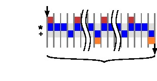

# 第四章 离散傅里叶变换

本章介绍了DFT，并将重点放在了介绍了DPT在FPGA实现中的算法优化。DFT运算的核心是以一组固定系数执行矩阵向量乘法。在4.6章节中，我们首先将DFT运算初始优化集中在将其简化为矩阵 - 向量乘法，随后介绍了DFT使用Vivado HLS代码的完整实现方式。 另外，我们也描述了如何最佳地优化DFT计算以增加吞吐量。第4.5章中，我们将的优化工作集中在阵列分区优化上。

 本章的前两小节有大量的数据计算和推导，这可能看起来有些多余，但是它对于我们充分理解代码重构优化以下一章快速傅里叶变换的对称性计算有着很大作用。但是如果你对HLS 优化内容更感兴趣，可以直接跳至第4.6章开始阅读。

## 4.1  傅里叶级数

 为了解释离散傅里叶变换，我们首先要了解傅里叶级数。傅立叶级数提供了一种可选方法来观察信号从-π到π的一个周期内的连续实值周期信号。Jean Baptiste Joseph Fourier的开创性成果表明，在2π周期内任何连续的周期性信号都可以用周期为2π的余弦和正弦和表示。最终，傅里叶级数的表现形式如下：

$$
\begin{aligned}
f(t)\sim\frac{a_{0}}{2}+a_{1}cos(t)+a_{2}cos(2t)+a_{3}cos(3t)+\cdots \\  b_{1}sin(t)+b_{2}sin(2t)+b_{3}sin(3t)+\cdots \\ \sim\frac{a_{0}}{2}+{\sum_{n=1}^{\infty}}(a_{n}cos(nt)+b_{n}sin(nt)
\end{aligned}
\quad(4.1)
$$

其中参数$a_{0},a_{1},\cdots$和$b_{0},b_{1},\cdots$的计算公式如下：

$$a_{0}=\frac{1}{\pi}\int_{-\pi}^{\pi}f(t)dt$$

$$a_{n}=\frac{1}{\pi}\int_{-\pi}^{\pi}f(t)cos(nt)dt\quad\quad(4.2)$$

$$b_{n}=\frac{1}{\pi}\int_{-\pi}^{\pi}f(t)sin(nt)dt$$

有几个需要注意的点是：首先式4.2中的参数$a_{0},a_{1},\cdots$,$b_{0},b_{1},\cdots$被称作傅里叶参数。其中参数 $a_{0}$ 被称作直流分量（来自于对早期电流分析的参考），其中n=1频率分量称为基波，而其他频率（n≥2）分量统称为高次谐波。基波和高次谐波的概念来自声学和音乐。其次，函数f以及cos()和sin()函数都有2π个周期; 我们很快就会展现如何将这个周期改变为其他值。
直流分量$a_{0}$等同于cos(0·t)=1时的系数，因此使用符号a。因为sin(0·t)=0，所以不需要 $b_{0}$ 的值。最后，在某些情况下，函数f和它的傅里叶级数之间是近似相等的关系，这种不连续的现象我们称之为吉布斯现象。而这是只是一个仅与傅里叶级数有关的小问题，与其他傅立叶变换无关。 因此，今后我们将忽略式[4.1]中的“近似”（〜），直接视为“相等”（=）。

表示除π以外的周期性函数需要对变量进行简单的更改。 假设一个函数的周期范围在[-L,L]而不是[-π,π],则设：

$$t\equiv\frac{\pi t^{'}}{L}\quad(4.3)$$

以及

$$dt\equiv\frac{\pi{d} t^{'}}{L}\quad(4.4)$$

这是一个简单地将周期区间从[-π,π]变换到期望的[-L,L]的一个线性方程，将$t^{'}=\frac{Lt}{\pi}$ 代入到式4.1得：

$$
f(t^{'})=\frac{a_{0}}{2}+{\sum_{n=1}^{\infty}}(a_{n}cos(\frac{n\pi{t^{'}}}{L})+b_{n}sin(\frac{n\pi{t^{'}}}{L}))\quad(4.5)
$$

用同样的方法解得a和b的各项参数可解得：

$$a_{0}=\frac{1}{L}\int_{-L}^{L}f(t^{'})dt^{'}\quad$$

$$a_{n}=\frac{1}{L}\int_{-L}^{L}f(t^{'})cos(\frac{n\pi{t^{'}}}{L})dt^{'}\quad(4.6)$$

$$b_{n}=\frac{1}{L}\int_{-L}^{L}f(t^{'})sin(\frac{n\pi{t^{'}}}{L})dt^{'}\quad\quad$$

我们也可以利用欧拉公式 $e^{jnt}=cos(nt)+jsin(nt)$ 来得出一个更简洁的公式。

$$f(t)=\sum_{n={-\infty}}^{\infty}c_{n}e^{jnt}\quad(4.7)$$

其中，傅里叶参数$c_{n}$ 是一个较为复杂的指数表达式：

$$c_{n}=\frac{1}{2\pi}\int^{\pi}_{-\pi}f\left(t\right)e^{-jnt}dt\quad(4.8)$$

假设f(t)是一个具有2π个周期的周期函数，将这个公式与式4.1等效，傅里叶参数$a_{n},b_{n}, and\,c_{n}$ 之间的数值关系为:

$$a_{n}=c_{n}+c_{-n}forn=0,1,2,\cdots\quad\quad$$

$$b_{n}=j(c_{n}-c_{-n})forn=0,1,2,\cdots\quad\quad$$

$$
C_{n}=\begin{cases}\frac {1}{2}\left( a_{n}-jb_{n}\right) n >0\\ \frac {1}{2}a_{0}\\ \frac {1}{2}\left( a_{-n}+jb_{-n}\right) n <0\end{cases}\quad(4.9)
$$

我们需要注意的是参数$a_{n},b_{n},c_{n}$ 的公式中引入了“负”频率的概念。虽然从物理的角度上看它没有实际意义，但在数学上我们可以将其视为复平面上的“负”旋转。正频率表示复数在复平面上以逆时针方向旋转，负频率表示我们在复平面上以顺时针方向旋转。

余弦，正弦和复指数之间的关系更加证明了上面这个理论，余弦既可以看作复指数的实数部分，也可以推导为一个正频率和一个负频率两个复指数的和，如式4.10所示。

$$cos(x)=Re\left(e^{jx}\right) =\dfrac{e^{ix}+e^{-jx}}{2}$$

正弦和复指数之间的关系如式4.11所示，与余弦的不同点在于这里我们减去负频率并除以2j。

$$sin(x)=Im\left(e^{jx}\right) =\dfrac{e^{ix}-e^{-jx}}{2j}$$

这两种正余弦和复指数之间的关系都可以用复平面矢量图的形式来理解，如下图4.1所示。图4.1中a)部分显示了余弦的推导过程，这里我们添加两个复平面向量$e^{jx}$ and $e^{-jx}$，图中可以看出这两个向量和是一个在实轴上的向量，大小为2cos(x)。所以，当我们将这两个向量的和除以2就到了式4.10中的cos(x)的值。图4.1中b)部分显示了类似的正弦的推导过程，这里我们添加两个复平面向量$e^{jx}$ and $e^{-jx}$，图中可以看出这两个向量差是一个在虚轴上的向量，大小为2sin(x)。所以，当我们将这两个向量的差除以2j就到了式4.11中的sin(x)的值。

## 4.2 DFT背景介绍

上一节我们探究了傅里叶级数的分析数学基础，证明了它对于周期连续性信号的作用，而离散傅里叶变换是针对于离散的周期信号的。DFT可以将有限数量的等间隔样本转换为有限数量的复数正弦曲线。换句话说，它将一个采样函数从一个域（通常是时域）转换到频域。复数正弦曲线的频率取为与输入函数的采样周期相关的频率的基频的整数倍。离散信号和周期信号最重要的关联在于它可以用一组有限的数字表示。因此，可以使用数字系统来实现DFT。


DFT适用于同时包含实数和复数的输入函数。直观上，为了轻松入门，我们暂时忽略复数部分，从实数信号开始了解实际DFT的工作原理。


关于术语的简要说明：我们使用小写函数变量来表示时域中的信号，大写函数变量来表示频域中的信号。我们使用（）表示连续函数，用[ ]表示离散函数。例如，f（）是连续的时域函数，F（）是其连续的频域表示。类似地，g[]是时域中的离散函数，G[]是将该函数转换到频域。


让我们从图4.2开始分析，左图是一个具有N个样本或从0到N-1运行的点的实值时域信号g[]。当我们用DFT分析时域信号时，会得出对应于各个频率的余弦和正弦幅度的频域信号。这些可以看作是余弦幅值对应复数的实数值，而正弦幅值对应复数的虚数的复数，其中包含有有N/2+1个余弦（实数）和N/2+1个正弦（虚数）值。我们称之为复频域函数G []。注意，频域中样本的数量为（N/2+1）是由于我们正在分析一个只包含实数的时域信号，复数时域信号经过DFT后将变为具有N个样本的频域信号。


一个具有N个样本点的DFT可以通过一个N×N矩阵乘以一个大小为N的矢量来确定。G = S·g其中
$$
\begin{bmatrix}
    1 &       1        & 1        &\ldots    &1\\
    1 &       s        &s^{2}     &\ldots    &s^{N-1}\\
    1 &       s^{2}    &s^{4}     &\ldots    &s^{2(N-1)}\\
    1 &       s^{3}    &s^{6}     &\ldots    &s^{3(N-1)}\\
    \vdots&   \vdots   &\vdots    &\ddots    &\vdots\\
    1 &       s^{N-1}  &s^2{N-1}  &\ldots    &s^{(N-1)(N-1)}
\end{bmatrix}\quad(4.12)
$$

和$s=e^{\frac{-i2\pi}{N}}$。 因此，频域中的样本被推导为
$$G[t]=\sum_{n={0}}^{N-1}g[n]s^{kn}\quad for \; k=0,\ldots,N-1\quad(4.13)$$

图4.3提供了8个样本点的DFT操作的系数的可视化分析图。八点频域采样是通过将8个时域采样与S矩阵的对应行相乘而得到的。S矩阵的行0对应于与时域采样的平均值成比例的DC分量。将S矩阵的第1行与g相乘，得出围绕单位圆圈旋转一圈时的余弦和正弦振幅值。由于这是一个8点DFT，这意味着每个相位偏移45°。执行8个45°旋转将围绕单位圆完整旋转一圈。第2行是相似的，唯一不同点是围绕单位圆执行两次旋转，即每次旋转90°。这是一个更高的频率。第3排做三次旋转; 第4排四轮旋转等等。每一个这样的行时间列乘法中都给出了适当的频域样本。

我们可以注意到S矩阵是对角对称矩阵，即$S[i][j]=S[j][i]$。另外，$S[i][j]=s^{i}s^{j}=s^{i+j}$。在第四行周围也会出现有趣的对称性现象。行3和行5中的相量是彼此的共轭复数，即$S[3][j]=S[5][j]^{\ast}$。 类似地，行2和6 $(S[2][j]=S[6][j]^{\ast})$ 以及行1和7 $(S[1][j]=S[7][j]^{\ast})$ 都是彼此的共轭复数。 正是由于这个原因，具有N个采样点的实值输入信号的DFT在频域中仅具有N/2+1个余弦和正弦值。剩余的N/2个频域值提供了冗余信息，因此不需要它们。然而，当输入信号复杂时，情况并非如此。在这种情况下，频域将有N+1个余弦和正弦值。


```c
#define SIZE 8
typedef int BaseType;

void matrix_vector(BaseType M[SIZE][SIZE], BaseType V_In[SIZE], BaseType V_Out[SIZE]) {
	BaseType i, j;
data_loop:
	for (i = 0; i < SIZE; i++) {
		BaseType sum = 0;
	dot_product_loop:
		for (j = 0; j < SIZE; j++) {
			sum += V_In[j] * M[i][j];
		}
		V_Out[i] = sum;
	}
}
```
图4.4 实现矩阵向量乘法的简单代码

## 4.3 矩阵向量乘法的优化

矩阵向量乘法是DFT计算的核心，输入的时域向量将乘以一个固定特殊值的矩阵，输出的结果是与输入时域信号表示相对应的频域矢量。
在本节中，我们讨论如何在硬件中实现矩阵向量乘法。我们把这个问题分解成最基本的形式（见图4.4）。这让我们能够更好地将讨论集中在算法优化上，而不是集中在使用功能正确的DFT代码的所有难点上。在下一节中我们将构建一个DFT内核。

图4.4中的代码提供了将该算法实现到硬件中的原始形式，代码中使用当前被映射为**浮点型**的**BaseType**的自定义数据类型。虽然这在刚开始看起来可能是多余的，但是可以方便我们在将来轻松地将变量（例如，具有不同精度的有符号或无符号的定点）进行不同的数字表示。 **matrix_vector** 功能共有三个参数，我们对前两个参数进行乘法计算，输入矩阵和向量分别是 **BaseType** **M[SIZE][SIZE]** 和 **BaseType V In[SIZE]**。第三个参数 **BaseType V_Out[SIZE]** 是合成向量。我们将M=S和V_in设为采样时域信号，则Vout将包含DFT。SIZE是决定输入信号中样本数量的常数，相应地也决定了DFT的大小。




这个算法本身只是一个嵌套的for循环。内部循环（ **dot_product_loop**）从0至SIZE-1计算DFT的系数。但是，这个相对简单的代码在映射到硬件执行时，就有许多种设计方案可选择。

无论何时执行HLS，你都应该考虑希望合成怎样的结构体系。内存结构的组织在这个过程中显得尤为重要。这个问题可以归结为你将代码中的数据存储到哪里？因为将变量映射到硬件时有许多选项。该变量可能只是一组信号（如果它的值永远不需要在一个周期内保存）、寄存器、RAM或FIFO。但所有这些选项都需要你在速度和面积之间作出折衷的选择。

另一个我们需要考虑的重要因素是代码并行度的可用性。纯粹的顺序代码到硬件上实现相当困难。换句话说，一个具有足够并行可行性的代码，从纯粹顺序执行到完全并行实现有一个可以选择的实现自由度。这样的选择显然会带来不同的面积和速度。我们将研究内存配置和并行性如何影响DFT矩阵向量的硬件实现。

图4.5显示了包含一个乘法和一个加法运算符的矩阵向量乘法的顺序结构。我们创建逻辑以访问存储在BRAM中的V_In和矩阵M。计算V_Out的每个元素并存储到BRAM中。这种体系结构本质上是将图4.4中的代码合成为无指令的结果。它不占用大量面积，但任务延迟和任务间隔相对较大。

## 4.4 流水线和并行运行

在矩阵乘法的例子中，我们可以很大程度地利用并行思想来解决问题。首先关注每次迭代循环执行的内部循环表达式 $sum+= V_in [j] * M [i] [j]$。乘法运行时，计数变量SUM在每次迭代中都被重复利用并赋予新的值。如图4.6所示，这个内部循环可以重新表述，此时变量 **SUM** 已被完全消除，并在较大表达式中替换为多个中间值。

```c
#define SIZE 8
typedef int BaseType;

void matrix_vector(BaseType M[SIZE][SIZE], BaseType V_In[SIZE], BaseType V_Out[SIZE]) {
	BaseType i, j;
data_loop:
	for (i = 0; i < SIZE; i++) {
		BaseType sum = 0;
		V_Out[i] = V_In[0] * M[i][0] + V_In[1] * M[i][1] + V_In[2] * M[i][2] +
							 V_In[3] * M[i][3] + V_In[4] * M[i][4] + V_In[5] * M[i][5] +
							 V_In[6] * M[i][6] + V_In[7] * M[i][7];
	}
}
```
图4.6: 手动展开矩阵向量乘法内部循环实例


循环的展开可以由Vivado HLS在流水线上下文中自动执行,也可以通过使用#pragma HLS展开或者流水线上下文外的等价指令来实现。


我们应该已经发现替换内部循环的新表达式应具有大量的并行性。如此而来每个乘法可以同时执行，并且可以使用加法器树来执行求和。这个计算的数据流图如图4.7所示。

如果我们希望展开内循环的表达式的任务延迟最小，那么所有的八个乘法运算都应该并行执行。假设乘法有3个周期的延迟且加法有1个周期的延迟，则所有$V\_In[j] * M [i][j]$ 操作在第三周期结束时完成。使用加法器树对这八个中间结果进行求和需要$log8 = 3$个周期。因此，对于每次迭代，数据循环主题将共有6个周期的延迟，并且需要8个乘法器和7个加法器，如图4.8左侧所示。需要注意的是，如果在循环4-6中重复使用加法器，这会将加法器的数量减少到4个。但是，在FPGA上加法器通常是无法共享的，因为加法器和多路复用器需要相同数量的FPGA资源（对于2输入运算，大约1个LUT每比特）。

如果我们不愿意使用8个乘法器，则可以增加执行该功能的周期数量来减少资源使用量。例如，使用4个乘法器会使得8个$V\_In [j] * M [i] [j]$ 乘法操作带来6个周期的延迟，那么完成整个数据循环体将会有9个周期的总延迟，如图4.8的右侧所示。为了使用更少的乘法器，我们需要牺牲更多的时间周期来完成内部循环。


从图4.8中我们可以明显看出有很多重要的时间段并没有执行有效的工作，因而降低了设计的总体效率。我们应该尽量缩短这些时间来提高效率。在这种情况下，可以发现data_loop的每次迭代实际上是完全独立的，这意味着它们可以同时执行。正如我们展开dot_product_loop一样，也可以展开数据循环并同时执行所有的乘法运算。但是，这需要大量的FPGA资源。我们还有更好的选择是尽快地启动循环的每次迭代，意味着前一次循环仍在执行。这个过程被称为循环流水线化，我们通过#pragma HLS pipeline在Vivado HLS中实现。 在大多数情况下，循环流水线会减少循环的间隔时间，但不会影响延迟时间。循环流水线的实现如图4.9所示。

截至目前，我们的关注点集中在操作运行的延迟上。功能单元通常也是流水线式的，Vivado HLS中的大多数功能单元都是间隔为1的流水线式的。尽管单次乘法操作可能需要3个周期才能完成，但新的乘法操作可以从流水线乘法器的每个时钟周期开始。通过这种方式，单个功能单元可以同时执行多个乘法操作。例如，有3个周期延迟且间隔为1的乘数可以同时执行三次乘法运算。

充分利用流水线乘法器的优势就在于我们就可以在不添加额外运算符的前提下减少内部循环的延迟。图4.10中左边展示了使用三个流水线乘法器一种可能的实现方式。在这种情况下，乘法操作可以并发执行（因为它们没有数据依赖性），而加法操作只有在第一次乘法完成之后才能开始。在右图中，显示了该设计间隔为3的流水线版本，如果将#pragma HLS pipeline II=3应用于data_loop，则与Vivado R HLS的结果类似。这样不仅个别操作在同一个操作符上并发执行，而且这些操作可能来自于不同data_loop的迭代。


现在你可能已经观察到，我们可以在不同的层次级别上进行流水线操作，包括算法级别，循环级别和功能级别。此外，不同级别的流水线在很大程度上也是独立的！我们可以在顺序循环中使用流水线操作符，或者我们可以使用顺序操作符来构建流水线循环，也可以构建大型功能的流水线实现。这些功能可以像原始运算单元一样在Vivado HLS 中共享。我们实例化了多少运算单元，它们的个体成本以及使用频率如何才是最重要的。

## 4.5 存储权衡和数据分区

到了本小节，我们已经假定数组中的数据 V_In[],M[][]和V_Out[]可以随时访问，但是实际上，数据的放置的位置对整个处理器的性能和资源使用情况有重要影响。在大多数处理器系统中，内存架构是固定的，我们只能调整程序以尝试最大程度地利用可用的内存层次结构，例如注意尽可能减少寄存器溢出和缓存丢失。在HLS设计中，我们还可以利用不同的存储器结构，并尝试找到最适合特定算法的存储器结构。通常，大量数据存储在片外存储器如DRAM、闪存或网络连接的存储器中，但是数据访问时间通常很长，大约为几十到几百（或更多）个周期。由于大量的电流必须流过长电线已访问片外存储器，所以使用片外存储消耗的能量也比较大。相反，片上存储器可以快速访问并且功耗要低得多，只是它可以存储的数据量有限。有一种常见的操作模式类似于通用CPU的内存层次结构中的缓存效果，它是将数据重复地加载到块中的片上存储器上。

当我们选择片上存储器的时候，需要在嵌入式存储器（例如Block RAM）或触发器（FF）之间权衡。基于触发器的存储器允许在一个时钟内对不同地址的数据进行多次读取，也可以在一个时钟周期内读取、修改和写入基于触发器的存储器。然而，即使在资源配置最好的设备中，FF的数量通常也限制在大约10万字节左右。实际上，以便有效地使用其他FPGA资源，大多数基于FF的存储器应该小得多。Block RAM（BRAM）提供更高的容量，拥有Mbytes的存储量，其代价是有限的可访问性。例如，单个BRAM可以存储大于1到4千字节的数据，但是在每个时钟周期只可以对该数据的两个不同的地址进行访问。此外，BRAM需要尽可能减少流水线操作（比如，读操作必须具有至少一个周期的延迟）。因此，我们的基本的权衡点在于工程所需的带宽与容量。

如果说数据的吞吐量我们需要考虑的头号问题，则所有数据都将存储在FF中。这将允许任何元素在每个时钟周期内被访问尽可能多的次数。但是，随着矩阵阵列变大，这种方案也将变得不可行。在矩阵向量乘法的情况下，存储1024位乘以1024位矩阵的32位整数将需要大约4兆字节的存储器。即使使用BRAM来存储，由于每个BRAM存储大约4KBytes，也需要大约1024个BRAM块。另一方面，使用单个大型基于BRAM的内存意味着我们一次只能访问两个元素。这明显降低了性能，如图4.7所示，它需要在每个时钟周期访问多个数组元素（V_In[]的所有8个元素以及M[][]的8个元素）。在实际工程中，大多数设计需要更大的阵列分布存放在更小的BRAM存储器中，这种方法称为阵列分区。较小的数组（通常用于索引较大的数组）可以完全划分为单独的标准变量并映射到FF。匹配流水线选择和数组分区以最大限度地提高运算符使用率和内存使用率是HLS设计探索的一个重要方面。


Vivado HLS 将自动执行一些阵列分区，但由于阵列分区倾向于某些特定设计，因此通常需要我们利用好工具以获得最佳结果。阵列分区的全局配置可在config_array_partiton选项中找到。单个数组可以使用array_patition指令来显示分区，并将指令数组分区完成将数组的每个元素分解到它自己的寄存器中，最终形成基于FF内存。与许多其他基于指令的优化一样，通过手动重写代码也可以实现相同的效果。一般情况下，最好使用工具指令，因为它避免了引入错误并易于代码维护。


回到图4.4中的矩阵向量乘法代码，我们可以通过添加几个指令来实现高度并行，如图4.11所示，最终的体系结构如图4.12所示。请注意，内部j循环由Vivado HLS 自动展开，因此j在每次使用的时候都被替换为常量。此设计演示了阵列分区的最常见用法，其中分区的数组维度（在本例中为V_In[]和第二维的M[][]）都被索引为常量（在本例中为循环索引j来展开循环）。这使得多路复用器可以无需访问分区阵列架构。

我们还可以用更少的乘法器降低性能以实现其他设计。例如，在图4.10中，这些设计只使用三个乘法器，因此我们只需要在每个时钟周期读取三个矩阵M[][]和矢量V_in[]的元素。完全分割这些数组会导致额外的多路复用，如图4.13所示。实际上，阵列只需要分成三个物理存储器。同样，这种分区可以通过重写代码手动实现，也可以使用array_patition循环指令在Vivado HLS中实现。


让我们从包含数据的矩阵X来分析：
$$
\begin{bmatrix}
    1   &2   &3   &4   &5   &6   &7   &8   &9
\end{bmatrix}
$$
数组中指令　array_patition　variable=x factor=2 cycle  将矩阵分为如下两个
$$
\begin{bmatrix}
    1   &3   &5   &7   &9
\end{bmatrix}and \begin{bmatrix}
    2   &4   &6   &8
\end{bmatrix}
$$


```c
#define SIZE 8
typedef int BaseType;

void matrix_vector(BaseType M[SIZE][SIZE], BaseType V_In[SIZE], BaseType V_Out[SIZE]) {
#pragma HLS array_partition variable=M dim=2 complete
#pragma HLS array_partition variable=V_In complete
	BaseType i, j;
data_loop:
	for (i = 0; i < SIZE; i++) {
#pragma HLS pipeline II=1
		BaseType sum = 0;
	dot_product_loop:
		for (j = 0; j < SIZE; j++) {
			sum += V_In[j] * M[i][j];
		}
		V_Out[i] = sum;
	}
}

```
图4.11 选用阵列分割和流水线操作的矩阵向量乘法



相似地，如果我们使用 **array_patition** variable=x factor=2 block 指令可以将它分为两个矩阵向量：
$$
\begin{bmatrix}
    1   &2   &3   &4   &5
\end{bmatrix}and \begin{bmatrix}
    6   &7   &8   &9
\end{bmatrix}
$$



让我们来研究一下变化的流水线II和阵列分区对性能和面积的影响，比较根据每秒的矩阵向量乘法运算（吞吐量）和根据展开阵列分区因子的数量的性能高低，并绘制相同的区域趋势图（如显示LUT，FF，DSP模块，BRAM）。再思考这两种情况的总趋势是什么？你会选择哪种设计？为什么？


通过流水线操作并将部分循环展开应用于 **dot_product_loop**，我们也可以得到类似的结果。图4.14显示了将矩阵向量乘法代码的内部循环展开2倍的结果。你可以发现，循环的边界现在增加到2；每个循环迭代需要2个矩阵M[][]和向量Vin[]每次迭代并执行两次乘法而不是一次。使用这种方式循环展开后，对应于原始循环的两次迭代，Vivado HLS可以并行地在两个表达式中实现这些操作。请注意，如果没有适当的数组分区，展开内部循环可能不会提高性能，因为并发读取操作的数量受到内存端口数量的限制。在这种情况下，我们可以将来自偶数列的数据存储在一个BRAM中，将来自奇数列的数据存储在另一个BRAM中。这是因为展开的循环总是执行一次偶数迭代和一次奇数迭代。

```c
#define SIZE 8
typedef int BaseType;

void matrix_vector(BaseType M[SIZE][SIZE], BaseType V_In[SIZE], BaseType V_Out[SIZE]) {
#pragma HLS array_partition variable=M dim=2 cyclic factor=2
#pragma HLS array_partition variable=V_In cyclic factor=2
	BaseType i, j;
data_loop:
	for (i = 0; i < SIZE; i++) {
		BaseType sum = 0;
	dot_product_loop:
		for (j = 0; j < SIZE; j+=2) {
#pragma HLS pipeline II=1
			sum += V_In[j] * M[i][j];
			sum += V_In[j+1] * M[i][j+1];
		}
		V_Out[i] = sum;
	}
}
```
图4.14 内部循环展开2倍的矩阵向量乘法代码。


HLS工具可以使用 unroll 指令自动展开循环。该指令采用一个因子作为参数，它是一个正整数，表示循环体应该展开的次数。



使用 **array_partition** cyclic factor = 2 指令和将 M[][]和向量 V_in[]手动划分为单独的数组有着相同的效果。考虑一下应该如何修改代码才能更改访问模式呢？ 现在我们手动将循环展开为两倍。原始代码（没有数组分区和不展开），只执行数组分区的代码，同时执行数组分区和循环展开代码之间的性能结果有哪些不同呢？ 最后，使用指令执行数组分割和循环展开的结果与手动执行的结果相比有哪些不同呢？


在这段代码中，我们看到数组分区通常与流水线操作并行执行。通过2倍的数组分割可以使性能提高2倍，我们可以用将内环部分展开2倍或将外环的II减少2倍来实现。提升性能需要相应数量的阵列分区。在矩阵向量乘法中，这种关系相对简单，因为对内部循环中的每个变量只有一次访问权限。在其他代码中，关系可能更复杂。无论如何，设计者的目标应该是确保例化的FPGA资源得到有效利用。一般情况下，将性能提高2倍将使用大约两倍的资源，相反将性能降低2倍可以节约一半的资源。


让我们来研究一下循环展开和阵列分区对性能和面积的影响，比较根据每秒的矩阵向量乘法运算（吞吐量）和根据展开阵列分区因子的数量的性能高低，并绘制相同的区域趋势图（如显示LUT，FF，DSP模块，BRAM）。再思考这两种情况的总趋势是什么？你会选择哪种设计？为什么？


## 4.6 Baseline实现

上一节中我们讨论了执行DFT的核心计算——矩阵向量乘法的一些优化方法。然而将矩阵向量乘法转移到功能完备的DFT进行硬件实现，还会出现其他问题。在本节中，我们将重点转移到DFT，并讨论如何优化以使其执行起来最有效。

处理大量复杂数字的能力是这一节我们需要着重考虑的点之一。如4.2节所述，因为S矩阵的元素是复数，所以实值信号的DFT几乎总是一个复数值信号。执行复数值信号的DFT以产生复数值结果也很常见。此外，我们需要处理分数或可能的浮点数据，而不是整数。这会增加实现的成本，尤其是需要执行浮点操作的时候。另外，浮点运算符（特别是加法运算符）比整数加法具有更大的延迟。这可以使得II = 1的循环更难以实现。第二个变化是我们希望能够将我们的设计容量扩展到一个大输入矢量的大小，比如N = 1024个输入样本。然而如果我们直接使用矩阵向量乘法，那么我们必须存储整个S矩阵。由于这个矩阵是输入大小的平方，因此这么大的一个输入矢量的存储实现起来比家里困难。本章我们将讨论解决这两个复杂问题的技巧。

正如使用HLS创建硬件实现时的典型实例一样，让我们从简单代码的实现开始。这里我们有一个可以保证它具有正确的功能baseline代码。通常，这些代码都以非常连续化的方式运行;它没有高度优化，因此可能无法达到所需的性能指标。但是，这是确保设计人员理解算法功能的必要步骤，并且可以作为未来优化的起点。图4.15显示了DFT的baseline实现。这使用双重嵌套for循环。内部循环将S矩阵的一行与输入信号相乘。该代码不是将S矩阵作为输入读取，而是基于当前循环索引，在内部循环的每次迭代中计算S中的元素。我们使用cos()和sin()函数将该相量转换为具有实部和虚部的笛卡尔坐标。该代码可将相量与适当采样的输入信号相乘并累加结果。经过该内环的N次迭代之后，每个S矩阵的列元素都被计算得出一个频域样本。外循环也迭代了N次，S矩阵的每一行都被迭代一次。最终，代码计算了N次矩阵W的表达式，但是cos()和sin()函数以及复数乘加计算进行了 $n^{2}$ 次。

此代码使用函数调用来计算cos()和sin()值。Vivado HLS能够使用其内置的数学库来实现这样的数学计算。第3章介绍了用于实现三角函数（包括CORDIC）的几种可能的算法[22]。但是，要使这些函数生成精确的结果可能代价比较高。因为输入量不是任意的，取消这些函数调用也有几种方法。我们将在稍后更详细地讨论这些权衡方法。这个代码的顺序执行代码如图4.16所示。

```c
#include <math.h>					//Required for cos and sin functions
typedef double IN_TYPE;		// Data type for the input signal
typedef double TEMP_TYPE; // Data type for the temporary variables
#define N 256							// DFT Size

void dft(IN_TYPE sample_real[N], IN_TYPE sample_imag[N]) {
	int i, j;
	TEMP_TYPE w;
	TEMP_TYPE c, s;

	// Temporary arrays to hold the intermediate frequency domain results
	TEMP_TYPE temp_real[N];
	TEMP_TYPE temp_imag[N];

	// Calculate each frequency domain sample iteratively
	for (i = 0; i < N; i += 1) {
		temp_real[i] = 0;
		temp_imag[i] = 0;

		// (2 * pi * i)/N
		w = (2.0 * 3.141592653589  / N) * (TEMP_TYPE)i;

		// Calculate the jth frequency sample sequentially
		for (j = 0; j < N; j += 1) {
			// Utilize HLS tool to calculate sine and cosine values
			c = cos(j * w);
			s = sin(j * w);

			// Multiply the current phasor with the appropriate input sample and keep
			// running sum
			temp_real[i] += (sample_real[j] * c - sample_imag[j] * s);
			temp_imag[i] += (sample_real[j] * s + sample_imag[j] * c);
		}
	}

	// Perform an inplace DFT, i.e., copy result into the input arrays
	for (i = 0; i < N; i += 1) {
		sample_real[i] = temp_real[i];
		sample_imag[i] = temp_imag[i];
	}
}

```
图4.15：DFT的baseline code


如果你要使用你设计的CORDIC（如从第3章开始），那么此代码需要做什么修改？ 改变CORDIC核心的准确性会使DFT硬件资源使用情况发生变化吗？ 它会如何影响性能？



请使用HLS实现DFT的基线代码，实现后查看报告，与乘法和加法相比，实现三元函数的相对成本是多少？ 对哪些操作尝试优化更有意义？通过流水线操作内循环可以实现什么性能？


## 4.7 DFT 优化

上一节的基线的DFT实现使用了相对较高的 **double** 数据类型。实现浮点运算尤其是双精度浮点运算通常代价很高并且需要很多流水线操作。我们可以从图4.16中看到这显着影响了循环的性能。通过流水线操作，这些高延迟操作的影响不那么重要，因为可以同时执行多个循环执行。此代码中的例外是用于累加结果的变量temp real []和temp imag []。这个累加是一种循环，并在流水线化内循环时限制了可实现的II。该运算符的依赖性如图4.17所示。

一种可能的解决方案是降低计算的精度。这种方法在实际应用时是有价值的，因为它减少了每个操作所需的资源，减少了存储值所需的内存，并且通常也减少了操作的延迟。例如，我们可以使用32位浮点型或16位半型来替代双精度型。许多信号处理系统完全避免了浮点数据类型，并使用定点数据类型3.5。对于常用的整数和定点精度，每个加法可以在一个循环中完成，从而使循环在II = 1处流水线化。

如果将所有数据类型从双精度型更改为浮点型，那么图4.15中的代码综合结果会发生什么变化？还是从一倍到一半？或到一个固定的点值？这是如何改变性能（间隔和延迟）和资源使用情况的？它是否会更改输出频率域采样值？

用浮点累加实现II = 1的普适解决方案是用不同的顺序处理数据。看图4.17，我们看到由于j循环是内部循环，所以重复是存在的（用箭头表示）。如果内循环是i循环，那么在下一次迭代开始之前我们就不需要累加的结果。我们可以通过交换两个循环的顺序来实现这一点。这种优化方式通常被称为循环交换或流水线交织处理[40]。由于外循环i内部的额外代码，我们可能不是很容易地发现可以重新排列循环。由于S矩阵是对角对称的，因此i和j可以在w的计算中交换。

结果是我们现在可以在内部循环中实现1的II。但是我们需要为临时实值和临时图像数组设置额外的存储器，存储计算的中间值一直到再次需要这些数据。



重新排列图4.15中代码的循环，并显示您可以使用1的II来管理内部循环。


根据DFT中S矩阵的结构，我们可以应用其他优化方式来完全消除三角运算。回想一下，S矩阵的每个元素的复矢量是通过单位圆的固定旋转角度来计算的。S矩阵的行S[0][]对应于单位圆周的零旋转，行S[1][]对应于单次旋转，并且随后的行对应于单位圆周更大角度的旋转。我们可以发现，第二行S[1][]相对应的向量覆盖了来自其他行的所有向量，因为8个列向量每个绕单位圆旋转45°，一共则围绕单位圆旋转了一圈。我们可以通过研究图9.11来直观地确认这个现象。这样我们可以只存储第二行这一次旋转中的正弦和余弦值，然后索引到这个存储器中的值以计算相应行的必要值。这只需要2×N=O（N）个存储单元可以有效减少存储器的O（N）的大小。对于1024个点的DFT，存储器的存储需求将减少到1024×2个条目。假设有一个32位的固定值或浮点值，则只需要8KB大小的片上存储器。显然，与明确存储整个S矩阵相比，明显减少了存储容量。我们将矩阵S的这个一维存储表示为$s^{'}$

$$
S^{'}=S[1][.]=\begin{bmatrix}
    1 &       s        &s^{2}        &\ldots    &s^{n-1}\\
\end{bmatrix}
$$


导出一维数组$s^{'}$对应于数组S的行号i和列元素j的输入的访问模式的公式。也就是说，我们如何才能索引到一维S数组以访问元素S（i; j）呢？


为了进一步提高性能，我们可以应用一种与矩阵向量乘法非常相似的技术。之前我们发现了提高矩阵向量乘法的性能需要对M[][]数组进行分区。但是如果用$s^{'}$ 表示S矩阵则意味着不再有一种有效的方法来划分$s^{'}$ 以增加我们在每个时钟上读取的数据量。S的每一个奇数行和列都包括$s^{'}$ 的每个元素。因此，我们无法像对S一样对$s^{'}$ 的值进行分区。这样增加我们从存储$s^{'}$ 的内存中读取数据端口的数量的唯一方法是复制存储。幸运的是，不像与必须读取和写入的内存，复制只读的数组的存储是相对容易的。事实上，Vivado HLS将只对在初始化且从未例化的只读存储器（ROM）自动执行此优化。这种功能的一个优点是我们可以简单地将sin（）和cos（）调用移动到数组初始化中。在大多数情况下，如果此代码位于函数的开头并仅初始化阵列，则Vivado HLS能够完全优化三角函数计算并自动计算ROM的内容。


设计一个利用$s^{'}$——S矩阵的一维版本的体系结构。这种体系结构是如何影响到所需的存储空间的？与使用二维的S矩阵的实现相比，这会改变逻辑利用率吗？


为了有效地优化设计，我们必须考虑代码的每个部分。往往是最薄弱的环节决定了设计的整体性能，这意味着，如果设计有一个瓶颈，将显著影响设计的性能。当前版本的DFT可以对输入和输出数据进行就地操作，即它存储结果相同的数组作为输入数据，输入数组 sample_real 和 sample_imag 都是有效的存储器端口，也就是说，你可以把这些参数的数组存储在相同的存储位置。这样，在任意给定的周期，我们只能获取其中一个阵列的一个数据，这可能会在函数中并行的乘法和加法运算方面产生瓶颈。这就是我们为什么必须将所有的输出结果存储在一个临时数组的原因，然后将所有这些结果复制到函数结尾处的“sample”数组中。如果我们没有执行就地操作，则不需要这样做。


修改DFT函数接口，使输入和输出存储在单独的数组中。这会如何影响你的可以执行优化？它如何改变性能？ 区域结果如何？


## 4.8 结语

在本章中，我们探究了离散傅里叶变换（DFT）的硬件实现和优化方法。DFT是数字信号处理的基本操作，需要采样时域的信号并将其转换到频域。在本章的开头，我们描述了DFT的数学背景。这对于理解下一章（FFT）中所做的优化很重要。本章的其余部分集中介绍了指定和优化DFT以在FPGA上进行高效的实现。

由于DFT的核心是执行矩阵向量乘法，所以我们最初花费了一些时间来描述在执行矩阵向量乘法的简化代码上的指令级优化。这些指令级优化由HLS工具完成。我们用这个机会来阐明HLS工具执行指令优化的过程，希望如上的优化过程能让你直观地了解到工具优化的结果。

本章后节，我们为DFT提供了正确的功能实现方案，讨论了一些可以改善性能的优化，具体来说就是将系数阵列划分为不同存储器以提高吞吐量。阵列的分区优化通常是构建最高性能体系结构的关键方法。
