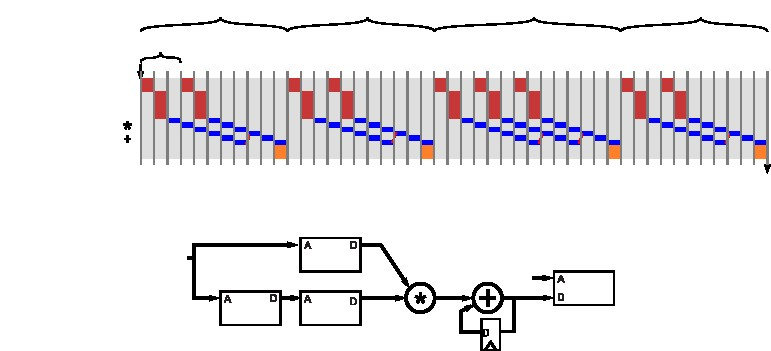
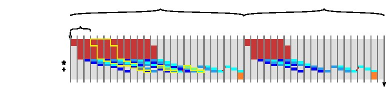

# 第六章 稀疏矩阵向量乘法

稀疏矩阵向量乘（**SpMV**）把一个稀疏矩阵与一个向量相乘。稀疏矩阵是指矩阵中大部分元素为0的矩阵。这里的向量本身也可是稀疏的，但通常情况下是密集的。作为一种通用的运算，在科学应用、经济模型、数据挖掘、信息检索中广泛应用。例如，在利用迭代法求解稀疏线性方程组和特征值的问题。同时，也被应用于网页搜索排名和计算机视觉（图像重构等）。

本章节主会引入几个与HLS相关的新概念，进一步深入之前关于优化的讨论。本章的目标之一是引入一种更复杂的数据结构。我们用压缩行存储（CRS）来保存稀疏矩阵。另一个目标是演示如何进行性能测试。我们编写了简单的激励用来检验设计是否正确。这在硬件设计中十分重要，**Vivado**&reg; **HLS**工具采用HLS C编写激励，并能轻松的对工具生成的RTL代码进行多方面的验证。这是基于HLS设计比基于RTL设计的巨大优势之一。章节中也会讲解如何采用Vivado&reg; HLS工具进行C/RTL联合仿真。不同**SpMV**设计会带来性能上差异，因为执行时间和稀疏矩阵是密切相关的，所以我们必须通过输入数据来确定任务执行之间的间隔以及任务延迟。


## 6.1 背景 ##

图6.1显示了一个4x4的矩阵M表示的2种方式。其中图6.1-a采用通用的二维方式16个元素来表示矩阵，每个元素存储在自己对应的位置上。图**6.1**-b采用**CRS**的方式表示相同的矩阵。**CRS**作为一种数据结构，由3个数组组成。值(**values**)数组保存矩阵中非零元素的值。列索引(**columnIndex**)数组和行指针（**rowPtr**）数组对非零元素的位置信息进行编码。列索引存储每一列的元素，行指针包含每一行第一个元素的值。**CRS**结构避免存储矩阵中的0值，确实在数值数组中确实没有存储0。但是在这个例子中，虽然数值数组不保存0，但是列索引数组和行指针数组作为标记信息，表示了矩阵的形态。**CRS**广泛用于大型的矩阵但是仅仅有少量的非零元素（少于10%或者更低），这样可以简化这类矩阵的存储以及相关的运算。


但是，CRS对矩阵的稀疏性没有要求，可以适用于任何矩阵。作为一种针对矩阵的通用方法，但不见得是最高效的。CRS结构也不见得是表示稀疏矩阵最高效的方式，其他稀疏矩阵表示方法也在被使用。

更准确的讲，CRS作为一种数据结构由3个数组构成：**值**(**values**)、**列索引**(**colIndex**)、**行索引**（**rowPtr**）。值数组和列索引表示稀疏矩阵**M**中的每一个非零元素，这些数组表示矩阵**M**采用行的方式，从左到右，从上到下。矩阵中的数据保存在值数组中，列索引数组保存数据在数组中水平方向的位置，如果 **values[k]** 表示  $M_{ij}$  其中$collndex[k]= j$。数组**rowPtr**用$n+1$的长度来表示n行矩阵。**rowPtr[k]**表示在行k之前，矩阵中所有元素的数目，其中$rowPtr[0]=0 $且最后一个元素**rowPtr[k]**总是表示当前矩阵k行之前所有非零元素的个数$ M_{ij}$ ,其中$rowPtr[i] \leq k  \leq rowPtr[i+1]$。如果行k包含任何非0元素，那么**rowPtr[k]**将包含当前行的第一个元素。注意，如果当前行没有非0元素，那么**rowPtr**数组中的值将会重复出现。

​        从图**6.1** a）中，我们可以行优先的方式遍历矩阵，从而确定值（**values**）数组在**CRS**中的形式。只要发现一个非0元素，它的值会被保存在下一个索引 $i$ 中，同时，它的列号**columnIndex[i]**会被保存在列数组中。另外，在我们访问一个新行的时候，我们保存下一个值的索引 $i$ 在**rowPtr**数组中。所以，**rowPtr**数组的第一个元素总是0。从图**6.1** b)中，我们可以把矩阵转换为二位数组表示的方式。第一步是根据**rowPtr**数组，确定每一行中非0 元素的个数。对行 $i $ 而言，该行中元素的数目为$rowPtr[i]-rowPtr[i+1]$的差值。所以当前行的值可以从**values**数组**values[rowPtr[i]]**开始，通过递归得到。在我们的示例矩阵中，因为前**rowPtr**数组前2个元素是0和2，所以我们知道第一行有2个非0元素，即**value[0]**和**value[1]** 。第一个非0元素在**values**数组中,**value[0]**是3。该值所对应的列号为1，因为$columnIndex[0]=0$。以此类推，矩阵中第二行元素的个数为$k\in[2,4)$,第三行的元素个数为$k \in [4,7)$。最后，共有9个非0元素在矩阵中，所以**rowPtr**最后一个值是9。

```c
#include "spmv.h"

void spmv(int rowPtr[NUM_ROWS+1], int columnIndex[NNZ],
		DTYPE values[NNZ], DTYPE y[SIZE], DTYPE x[SIZE])
{
L1: for (int i = 0; i < NUM_ROWS; i++) {
		DTYPE y0 = 0;
	L2: for (int k = rowPtr[i]; k < rowPtr[i+1]; k++) {
#pragma HLS unroll factor=8
#pragma HLS pipeline
			y0 += values[k] * x[columnIndex[k]];
		}
		y[i] = y0;
	}
}

```

图6.2： 主体代码演示了系数矩阵向量乘（SpMV）$y=M.x$的计算。通过**rowPtr**、**columnIndex**和**value**保存矩阵**M**采用**CRS**的方式。第一个**for**循环通过迭代访问每一行，第二个**for**循环访问每一列，实现矩阵**M**中非0元素和向量中对应的元素相乘并保存值在向量y中。


给定一个二维数组表示一个矩阵，通过C代码实现矩阵CRS格式。编写对应的C代码实现将矩阵从CRS格式转化为二维数组的形式。


结果表明，通过采用**CRS**的方式，我们能高效的实现稀疏矩阵乘法，不需要将矩阵转化为二维形式。实际上， 对于大型的矩阵仅仅只有一小部分非0元素，稀疏矩阵向量乘法会比第四章中讨论的密集矩阵向量乘高效很多。因为我们直接找到非0元素，并执行非0元素对应的运算。


## 6.2 基本实现

图6.2 提供了基本代码对系数矩阵乘法的实现。函数**spmv**函数有5个参数，分别是**rowPtr**、**columnIndex**和**values**对应矩阵**M**的**CRS**格式，这和图6.1中描述的数据结构等价。参数 $y$ 用于保存输出的结果，参数x表示输入的被乘向量$x$。变量**NUM_ROWS**表示矩阵**M**中行号。变量**NNZ**表示矩阵中非0元素的个数。最后，变量SIZE表示数组x和数组y中元素的个数。

外层**for**循环标签为**L1**，对矩阵的行进行遍历。将矩阵当前的行与向量x相乘，得到输出的结果$y$。内层循环标签为**L2**，实现对矩阵**M**中每列元素的遍历。L2循环迭代计算$rowPtr[i+1]-rowPtr[i]$计算每一行非0元素的个数。每次循环计算，能从**value**数组中读取矩阵M的非0元素然后对应的从x数组中取得被乘向量x的值，对应相乘。**cloumnIndex**[k]中的值保存了对应的列号**k**。

```c
#ifndef __SPMV_H__
#define __SPMV_H__

const static int SIZE = 4; // SIZE of square matrix
const static int NNZ = 9; //Number of non-zero elements
const static int NUM_ROWS = 4;// SIZE;
typedef float DTYPE;
void spmv(int rowPtr[NUM_ROWS+1], int columnIndex[NNZ],
		  DTYPE values[NNZ], DTYPE y[SIZE], DTYPE x[SIZE]);

#endif // __MATRIXMUL_H__ not defined
```

​                                                     图6.3： spmv函数和激励的头文件


## 6.3 测试平台

图6.4 展示了一个针对**spmv**函数测试平台。测试平台通过定义**matrixvector**函数，直接实现矩阵向量乘法，它不考虑稀矩阵是稀疏矩阵和矩阵是否采用**CRS**方式表示。我们比较**matrixvector**函数输出和**spmv**函数的输出。



在通常的测试平台中，需要实现的函数都会有个“golden"参考，作为用户期望综合的结果。测试平台会比较golden用例的输出和通过**Vivado**&reg; **HLS**综合的代码执行结果。最好的实践方式是，测试平台既可以用于golden用例，也可用于被综合的代码。这样就保证了两者实现的正确性。



测试平台在主函数**main**中执行。这里我们通过设置**fail**变量初始化为0，当**spmv**函数的输出成结果与**matrixvector**函数输出结果不相同是时，变量置1。定义与矩阵**M**相关的变量、被乘向量$x$ 和输出结果$y$。对于矩阵**M**，即有普通模式，也有**CSR**模式（保存为**values**、**columnIndex**、**rowPtr**）。矩阵**M** 的**value**如图6.1中所示，输出向量$y$有两种，其中y_sw数组保存**matrixvector**函数输出的结果，y数组保存**spmv**函数输出的结果。

在定义好所有的输入变量和输出变量之后，分别调用**spmv**函数和**matrixvector**函数并输入合适的数据。 接下来的**for**循环用于比较y_sw和y中的每一个对应的结果。如果其中一个不相同，则将**fail** 标志置1。最后，程序会打印测试的结果并返回**fail**变量。

```c
#include "spmv.h"
#include <stdio.h>

void matrixvector(DTYPE A[SIZE][SIZE], DTYPE *y, DTYPE *x)
{
	for (int i = 0; i < SIZE; i++) {
		DTYPE y0 = 0;
		for (int j = 0; j < SIZE; j++)
			y0 += A[i][j] * x[j];
		y[i] = y0;
	}
}

int main(){
	int fail = 0;
	DTYPE M[SIZE][SIZE] = {{3,4,0,0},{0,5,9,0},{2,0,3,1},{0,4,0,6}};
	DTYPE x[SIZE] = {1,2,3,4};
	DTYPE y_sw[SIZE];
	DTYPE values[] = {3,4,5,9,2,3,1,4,6};
	int columnIndex[] = {0,1,1,2,0,2,3,1,3};
	int rowPtr[] = {0,2,4,7,9};
	DTYPE y[SIZE];

	spmv(rowPtr, columnIndex, values, y, x);
	matrixvector(M, y_sw, x);

	for(int i = 0; i < SIZE; i++)
		if(y_sw[i] != y[i])
			fail = 1;

	if(fail == 1)
		printf("FAILED\n");
	else
		printf("PASS\n");

	return fail;
}
```
图6.4 ： 一个简单**spmv**函数的简单测试平台。测试平台生成了一个用例，并且计算矩阵的向量乘法通过稀疏矩阵乘法（**spmv**）和非系数矩阵乘法(**matrixvector**)。

这个测试平台相对简单并且可能无法充分验证所有的输入都能正常输出。最主要的原因是，它仅仅只用了一个矩阵作为例子，相反，一个好的激励会测试许多矩阵。通常，会通过随机的方式产生输入的测试用例，并且重点测试边界用例。在这个例子中，我们不仅要保证值正确计算，同时保证通过加速器正确的被执行了，而且编译时间相关的parameter改变会在实现不同加速单元值折中。最关键的是，在相同的parameter上，我们能通过随机产生很多输入数据来进行测试。编译时间相关的参数每次发生变化，都需要我们重新编译代码。



创建一个复杂的激励来，通过随机数方式生成许多组测试数据。稀疏矩阵编译时间参数应该是可以修改的（例如，***SIZE**，**NNZ**等）。创建一个HLS综合脚本，在编译时间参数合理范围改变时，能执行代码很多次。



## 6.4 指定循环的属性

如果直接将上述代码进行综合，我们可以得到函数运行的时钟周期及资源占用率。但是，我们不能得到模块执行所需的时钟周期、任务执行的延迟和任务执行之间的间隔。因为这些都取依赖于输入数据，由**spmv**函数外部因素决定。最主要的因素是，内层循环执行的次数是由矩阵**M**中非0元素个数决定的。非0元素的个数在代码中是由常量**NNZ**决定的，虽然可以调用函数计算不同大小的矩阵，但是实际迭代次数是和输入数据相关的。另外，性能也会因为非0元素的分布、综合优化的约束产生不同。更复杂的是，迭代的次数由输入决定，许多可能的输入并没有被遍历。所以，对于工具而言，不通过复杂的分析和额外的信息，工具是不能知道spmv函数执行需要多少时钟周期。**Vivado**&reg; **HLS**工具也不能进行上述的分析。



spmv函数能正常工作的前提条件是什么？证明给定的前提条件，矩阵中每个非0元素实是不是在对应一次内层循的执行？



有几种方式能帮助工具进行性能的分析，其中一种方式就是想**Vivado**&reg; **HLS**提供循环边界的额外信息。这可以通过使用**loop_tripcount** directive实现，它能让设计者指定最小、最大和平均迭代次数针对特定的循环。通过提供这些值， **Vivado**&reg; HLS 能提供时钟周期级别的评估。



​        使用**loop_tripcount** directive 用变量指定循环的最小，最大和平均迭代次数，这样**Vivado**&reg; HLS 工具能对当前设计时钟周期数目进行估计。这些不影响最后综合的结果，只会影响综合报告。





对spmv函数使用**loop_tripcount** directive，语法格式 # pragma HLS loop_tripcount min=X, max=Y, avg=Z 其中X，Y，Z正的常量。哪个循环需要使用directive?当改变参数（min、max和avg）以后，综合报告有什么不同？这对时钟周期有影响吗？这对资源占用有影响吗？



**loop_tripcount** 引导能帮助设计者对函数的性能有个原始的估计。这样能比较相同的函数通过使用不同的directives或者对代码本身重构。但是，这不能确定**min**、**max**和**avg**参数。这也很难确定边界条件min和max的值。如果有测试平台，就有一种更准确的方式用于计算**spmv**函数执行的时钟周期数，那就是**C**/**RTL**协同仿真。


## 6.5  C/RTL 协同仿真 

**C**/**RTL**协同仿真能自动化测试Vivado&reg; HLS工具生成的RTL代码，只需要在综合的时候提供测试平台。每次执行综合以后的代码和提供的测试平台，记录输入和输出结果。输入的值按照时钟转换成**输入向量**。这里的输入向量用于针对生成的RTL代码进行仿真，同时记录**输出向量**。更新综合后的代码， 再次运行测试平台并保存输入和输出数据。测试平台如果返回值是0，则表示成功；若激励返回非0值，则表示失败。

 **C**/**RTL**协同仿真在流程上，将VIvado&reg; HLS 生成的**RTL**代码，通过C 测试平台，实现时钟周期级别的仿真。这样，就能准确对生成的**RTL**代码进行性能评估，即使性能与输入数据有关。被综合的函数运行周期最小值，最大值，平均值以及间隔在仿真完成以后都能准确的得到。

注意这些和时钟周期相关的参数是通过激励中测试数据得到的。所以，结果的质量和测试平台的质量息息相关。如果测试平台没有很好的对函数执行测试，那么结果将不准确。另外，输入测试向量都是基于理想的时序，不能反映模型实际工作时，外部接口对函数的影响。实际的性能可能会比仿真的要低，如果执行过程中阻塞在输入数据或对外部存储的访问上。不过，对于循环边界调试时变量的情况，设计者可以通过协同仿真的方式确定时钟周期个数。



C/RTL协同仿真能提供循环边界是变量的函数的延迟。它反馈函数运行时延迟的最小值、最大值和平均值以及函数运行间隔。这些延迟和测试平台输入的数据是强相关的。







当采用图6,4提供的测试平台时，函数运行的最小值、最大值和平均值以及函数间隔是多少个时钟周期？



## 6.6 循环的优化与数组的分块

我们可以通过**Vivado**&reg; **HLS**工具得到当前函数的性能和面积的评估结果，然后可以考虑如何对函数进行优化。流水线、循环展开、数组分块是第一类最常用的优化方法。最典型的方式是从最内层的循环，然后根据需要向外层循环进行。

在这个例子中， 对最内层的**L2**循环进行流水线化也许是我们最先和最容易想到的优化方式。这个连续迭代的循环在执行上流水以后，总体运行会加快。如果不采用流水，**L2**循环将按照串行执行。注意，**L1**循环此时还是按照串行的方式执行。

图6.5演示了**spmv**函数在**L2**循环采用流水方式时运行的步骤。每次**L2**的循环都被$II=3$流水化。流水线允许在外层循环执行一次迭代时，内层循环执行多次循环迭代。此时，内内层循环II受限于递归（recurrence ）操作。$II=3$是因为我们认为加法器有3个时钟周期的延迟。外部循环没有采用流水的方式，所以内层的循环必须在下外层L2循环开始执行前，计算完成并输出结果。


对最内层的L2  **for**循环进行流水化，通过在spmv函数中增加流水directive如图6.2所示。II(initiation interval)最后是多少？在你指定II的值以后，最终目标的II值是增大了还是减少了？


观察执行步骤，我们可以发现有几个因素限制了循环执行性能。第一个因素，递归（recurrence ）操作限制了循环的 **II**。第二个因素，外层的循环没有采用流水的方式。一种高效计算稀疏矩阵向量乘法的方式，每个时钟周期把乘法器和加法器使用起来。当前的设计离这个目标还很远。

在章节4.3中，我们探究了几种设计优化技术，其中包括对不同的循环进行流水，循环展开，数组分割。掌握在这些技术之间进行权衡是一项挑战，因为它们之间经常相互依赖。我们通常联合使用这些技术，为了得到好的性能谨慎的选择其中一种而不选择另一种也许结果会更糟糕。例如，在我们使用循环展开是，设计者需要明白它对数据访问的影响。增加了对数据访问的操作但是设计性能又受限于数据访问时，优化毫无益处。同样，如果提供了冗余的存储端口，实际中使用率不高，这样对提高性能毫无帮助反而增加了资源的消耗。

想了一上述优化技术组合后复杂的形式，我们建议你尝试下面的练习：



对spmv设计进行综合，采用表6.1提供的10种directives，每种都有不同的流水，展开和分割针对不同的循环和数组。这些分割在不同的数组（values、columnIndex、x）上使用。你看到结果的趋势是如何的？增加了展开和分割，是有利于还是不利于面积？性能如何？为什么？



​                                            表6.1  稀疏矩阵向量乘法可优化的方式

|        | L1       | L2                         |
| ------ | -------- | -------------------------- |
| case1  | -        | -                          |
| case2  | -        | pipeline                   |
| case3  | pipeline | -                          |
| case4  | unroll=2 | -                          |
| case5  | -        | pipeline,unroll=2          |
| case6  | -        | pipeline,unroll=2,cyclic=2 |
| case7  | -        | pipeline,unroll=4          |
| case8  | -        | pipeline,unroll=4,cyclic=4 |
| case9  | -        | pipeline,unroll=8          |
| case10 | -        | pipeline,unroll=8,cyclic=8 |
| case11 | -        | pipeline,unroll=8,block=8  |


如果你完成了上述练习，你会发现盲目的使用优化directives，可能不会得到你期望的结果。通常在设计时， 在思考下考虑应用的特性，选择针对设计的特定优化方式。当然，这也需要一些直觉能力和一些专用工具投入使用。虽然，搞清楚像**Vivado**&reg;**HLS**这样复杂工具中每一个细节是困难乃至不可能的，但是我们能基于关键的方面建立思考模型。

上面我们在用例3和4中考虑对外层循环**L1**进行流水化操作而不是对内层循环。这种变化针对一个任务，可以提高潜在的并行程度。为了完成优化，**Vivado** **&reg;HLS**工具必须展开代码中所有的内层循环**L2** 。如果循环能全部展开，这样能减少计算循环边界的时间，同时也能消除递归（recurrences）。但是代码中的内层循环Vivado HLS是无法完全展开的，因为循环边界不是常量。


例如在实现上面提到的例子3，在最外层的循环**L1**使用流水化directive。在不设定目标**II**时，**II**值是多少？资源占用率发生了什么变化？增加了**II**后资源占用率结果如何？这与之前采对L2循环进行流水化，结果有什么不同？这和最基本的设计（无 directives）相比有什么不同？当你对外层循环进行展开时，结果到底如何？（提示：检查综合后的日志信息）


另外一种增加并行化的方式是对内层循环进行局部循环展开，就像之前例子5到10。这种变化实现更多的并行化，通过在相同的循环迭代中，执行更多的操作。有些情况，Vivado  HLS 工具在对内层循环进行流水化时，通过实现更多操作来提高性能。但是，这还是很难提高内层循环的II，由于内层循环的递归操作。但是，在II大于1的情况下， 许多操作可以共享同一个计算单元。

图6.6展示了一个局部展开的代码。在这段代码中，**L2**循环被分成2个循环，分别为**L2_1**和**L2_2**。最内层的循环**L2_2**执行的次数由参数**S**确定。内部循环包含了最原始的**L2**循环，其中循环边界是由最原始的**L2**循环确定的。代码中，**L2_1**循环包含了不确定次数的乘法和加法操作，运算次数由参数**S**确定，和一次递归完成累加$y0 += yt$。

注意图**6.6**中的代码和自动循环展开的代码是由一点点区别的。自动循环展开复制计算，但是保留每次计算先后顺序（除了当前的例子）。这就导致了计算顺序由内层循环决定，如图6.7左所示。对计算顺序进行调整后，操作上的依赖关系如图6.7 左边所示。在当前的代码中，最后累加求和是一个递归（recurrence ）。当使用浮点数据类型时，这种调整计算顺序的操作可能对程序产生改变，所以Vivado HLS对这种类型的代码不进行操作顺序自动调整。

这个设计可能会被综合、实现如图**6.8**所示的结果。在这个例子中，$S=3$与$II$最匹配，乘法器的延迟正好是3。所有的运算过程都是在一个乘法器和加法器上执行。比较这个例子与图**6.5**中的例子，我们可以发现一些缺点。最明显的是，内层循环的流水线长度很长，实现的时候需要多个更多的周期刷新流水线的输出，才能执行下一次外层**L1**循环。处理一行中非零元素和执行块**S** 相同。一行有个3个元素和一行有一个元素计算的时间是相同的。剩下的运算也需要在循环流水线中执行，即使他们的结果没有用。为了严格的比较两个设计的特性，我们需要了解设计对矩阵每行非零元素个数的预期。
```c
#include "spmv.h"

const static int S = 7;

void spmv(int rowPtr[NUM_ROWS+1], int columnIndex[NNZ],
          DTYPE values[NNZ], DTYPE y[SIZE], DTYPE x[SIZE])
{
  L1: for (int i = 0; i < NUM_ROWS; i++) {
	  DTYPE y0 = 0;
    L2_1: for (int k = rowPtr[i]; k < rowPtr[i+1]; k += S) {
#pragma HLS pipeline II=S
		  DTYPE yt = values[k] * x[columnIndex[k]];
	  L2_2: for(int j = 1; j < S; j++) {
			  if(k+j < rowPtr[i+1]) {
				  yt += values[k+j] * x[columnIndex[k+j]];
			  }
		  }
		  y0 += yt;
	  }
    y[i] = y0;
  }
}
```
​                                       图6.6  局部展开图6.2中**smpv**函数





如果矩阵每行非零元素很少，则采用第一种实现方式较优；如果矩阵中每行非零元素较多，则第二种实现方式更好。

需要注意，这里存在一个关于先有鸡还是先有蛋的问题。我们需要知道目标器件和时钟周期，这样才能确定流水线中加法器能不能满足时序要求。只有在我们知道流水线的级数之后（也许S=1时，Vivado HLS才能识别到加法递归），我们才能选择合适版本的参数S，来满足$II=1$。一旦我们确定了**S**，我们能通过**C**/**RTL**协同仿真来，通过一组测试数据，确定是不是达到了性能上的要求。因为循环边界是可变的，所以得到的性能参数是依赖于数据的，所以我们需要设定不同的**S**，来找到性能的最大值。改变器件的类型和工作频率会影响之前所有的设计！进款看来去高层次综合（**HLS**）对解决问题提供的帮助不多，相比于RTL开发新版本然后进行验证，它开发起来快（代码编写方便）。

图6.8可以实现时，**S**与加法器流水线等级相同。如果**S**设定较大，结果会怎样？如果**S** 设定较小，结果会怎样？如果目标**II**小于**S**会怎样？如果目标**II**大于**S**会怎样？


##6.7 小节 ##

在本章节中，我们介绍了系数矩阵向量乘法（SpMV），这延续了之前对矩阵运算的研究。SpMV 显得很有乐趣，因为它采用了一种特别的数据结构。为了减少大量的存储，矩阵采用行压缩的方式存储，这样就要求我们以一种非直接的方式对矩阵进行访问。

这一章节首先我们了**Vivado**&reg; **HLS**工具测试和仿真的能力。我们采用一个基于SpMV简单的激励文件，讲解HLS工作流程。另外，我们对**Vivado**&reg; **HLS**工具中**C**/**RTL**协同仿真进行了讲解。这对我们得到设计准确性能结果是十分重要。矩阵越不稀疏，则更多的计算需要执行。在测试平台确定以后，协同仿真可以提供程序运行的精确仿真。这样就可以达到执行周期和性能结果。最后，我们讨论了采用循环优化和数组分块对代码进行优化。


