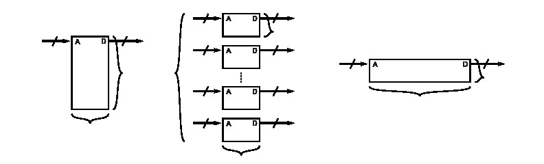
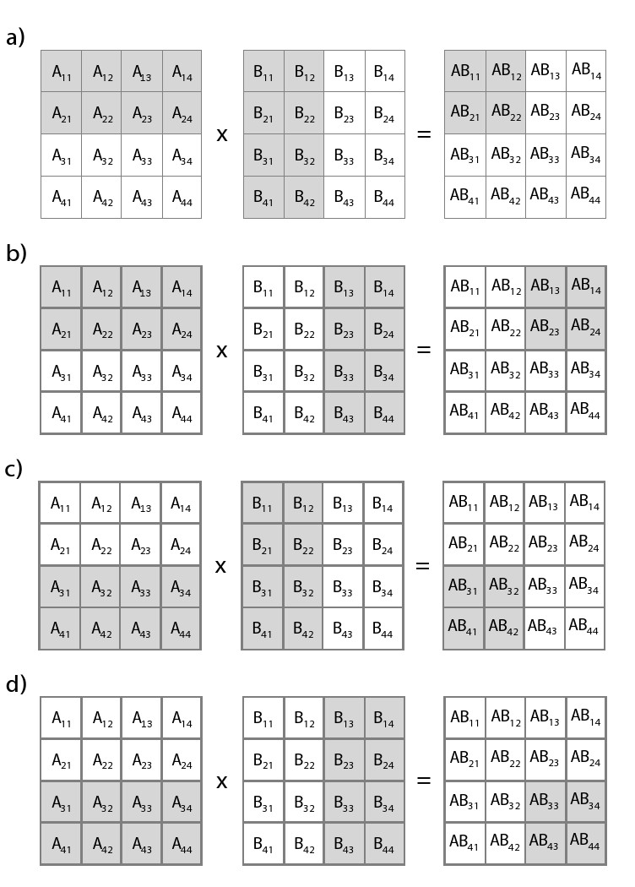

# 第七章 矩阵乘法

本章节将讨论稍复杂的设计—矩阵乘法。我们考虑两种不同的版本。开始，我们用直接的方式实现，将两个矩阵作为输入，输出结果是它们的乘积。我们称这整体矩阵乘法。接下来，我们实现块矩阵乘法。这里，输入到函数的矩阵被分块，函数计算分块的结果。

## 7.1 背景

矩阵乘法是一个二元运算，两个矩阵计算结果为一个新的矩阵。矩阵乘法本身是采用构成矩阵的向量，进行的线性运算。最常见矩阵乘法称为**矩阵积**。当矩阵**A**维度是nxm，矩阵**B**维度是mxp，那么矩阵积**AB**则是一个nxp维的矩阵。

更准确的描述，我们这样定义：

$$
\textbf{A} = \left[
\begin{matrix}
 A_{11}      & A_{12}      & \cdots & A_{1m}      \\
 A_{21}      & A_{22}      & \cdots &A_{2m}      \\
 \vdots & \vdots & \ddots & \vdots \\
 A_{n1}      &A_{n2}      & \cdots & A_{nm}     \\
\end{matrix}
\right]

\textbf{B} = \left[
\begin{matrix}
 B_{11}      & B_{12}      & \cdots &B_{1p}      \\
 B_{21}      & B_{22}      & \cdots &B_{2p}      \\
 \vdots & \vdots & \ddots & \vdots \\
 B_{m1}      &B_{m2}      & \cdots & B_{mp}     \\
\end{matrix}
\right]


\qquad(7.1)
$$

$$
\textbf{AB} = \left[
\begin{matrix}
 \textbf{(AB)}_{11}      &  \textbf{(AB)}_{12}      & \cdots & \textbf{(AB)}_{1p}       \\
 \textbf{(AB)}_{21}      &  \textbf{(AB)}_{22}      & \cdots & \textbf{(AB)}_{2p}   \\
 \vdots & \vdots & \ddots & \vdots \\
 \textbf{(AB)}_{n1}      &  \textbf{(AB)}_{n2}      & \cdots & \textbf{(AB)}_{np}  \\
\end{matrix}
\right]

\qquad(7.2)
$$


其中$$\textbf{AB}_{ij}$$运算定义为：$$\textbf{AB}_{ij} = \sum_{k=1}^mA_{ik} * B_{kj}$$

现在，我们看一个简单的例子：

$$
\textbf{A} = \left[
\begin{matrix}
 A_{11}      & A_{12}     & A_{13}      \\
 A_{21}      & A_{22}      &A_{23}      \\
\end{matrix}
\right]

\textbf{B} = \left[
\begin{matrix}
 B_{11}      & B_{12}      \\
 B_{21}      & B_{22}      \\
 B_{31}      &B_{32}       \\
\end{matrix}
\right]
\qquad(7.3)
$$

这个矩阵乘法积结果是

$$
\textbf{AB} = \left[
\begin{matrix}
 A_{11}B_{11}      & A_{12}B_{21}     & A_{13}B_{31}      \\
 A_{21}B_{21}      & A_{22}B_{22}      &A_{23} B_{23}     \\
\end{matrix}
\right]
\qquad(7.4)
$$


```c
void matrixmul(int A[N][M], int B[M][P], int AB[N][P]) {
  #pragma HLS ARRAY_RESHAPE variable=A complete dim=2
  #pragma HLS ARRAY_RESHAPE variable=B complete dim=1
  /* for each row and column of AB */
  row: for(int i = 0; i < N; ++i) {
    col: for(int j = 0; j < P; ++j) {
      #pragma HLS PIPELINE II=1
      /* compute (AB)i,j */
      int ABij = 0;
    product: for(int k = 0; k < M; ++k) {
        ABij += A[i][k] * B[k][j];
      }
      AB[i][j] = ABij;
    }
  }
}

```


最外层的**for**，标签**row** 和**cols**，通过迭代实现输出矩阵**AB**的行和列的遍历。最内层的循环，标签**product**完成**A**矩阵对应行与矩阵**B**对应列的乘和累加，最后的结果是矩阵**AB**中对应位置的一个元素。

矩阵乘法是数值运算的基础。计算大型矩阵之间的乘积会消耗大量的时间。因此，它在数值计算中一个非常重要的问题。根本上讲， 矩阵运算是向量空间上的线性运算；矩阵乘法提供了一种线性变换的方式。这些应用有线性坐标变换（例如，变换，旋转在图形领域），统计物理中的高维矩阵（例如，矩阵论）和拓扑操作（例如，确定从一个定点到另一个定点，路径是否存在）。所以，它是一个值得被学习的问题，同时，有许多关于他的算法。这些算法目的是为了提高性能，减少算法对存储的需求。

## 7.2 计算矩阵乘法

我们从最常用的方法用于计算矩阵乘法—三层嵌套**for**循环开始，开始计算过程的优化。图7.1所示的代码实现了这种运算。最外层的**for**循环，标签为**rows**和**cols**，通过迭遍历了数据矩阵**AB**的行和列。最内层的**for**循环计算了向量**A**一行与向量**B**一列的点积运算。每个点积运算通过一些列的计算得到的结果只是矩阵**AB**中的一个元素。从概念上说，我们执行了**P**矩阵向量乘法，每个对应矩阵**B**的一列。

在这个例子中，我们对**col**循环采用了**pipeline** directive，并且设定期望人任务间隔是1。这样，最内层的**for**循环的完全展开的，我们期望的电路大概要执行M次乘累加操作并且执行的间隔是NxP 个时钟周期。正如第四章中讨论到的，这是最合理的方式。我们选择在函数不同的地方使用**pipeline** directive来实现在面积和速度之间的平衡。例如，当我们把相同的directive放在函数的最顶层（所有的**for**循环之外），那么所有的循环都会被完全展开，那么会有NxMxP次乘累加运算单元且运行间隔会是1。如果把directive放在内层**row** 循环，那么会有MxP次乘累加单元并且执行间隔是N时钟周期。通过对相应的矩阵进行分块，上述设计要求和可以很容易满足。当然也可对最内层循环实行流水线，那么设计中只有个乘累加单元但是如果要达到 II =1且运行时钟频率很高是不可能的，因为变量AB_{ij} 累加是一个递归。我们也可以对不同的循环进行部分展开，来实现其他的设计要求。最根本的平衡还是在设计结构的复杂度例如乘累加单元的数目和性能例如硬件执行的效率。最理想的方式，当资源翻以后，对应所用的时钟周期减半，尽管这在实际中是很难实现的。


改变**pipeline**directive的位置。位置对资源的使用有什么影响？对性能的改变有什么作用？从函数间隔的角度考虑，那种选择能实现最好的性能？那种能提供最小的资源使用率？你认为在哪里放置directive最佳？如果矩阵的维度发生了变化，是不是你之前的选择也要变化？


每个时钟周期执行大量的运算，就需要为它们提供运算的对象，保存每个运算出处的结果。之前，我们使用了**array_partition**directive来提高在内存上可访问的次数。当数组的分块越来越小，每次存储的访问顺序在编译时就可以确定。所以数组分块是最简单和高效的方法用于提升在单位时间内，对内存的访问。这个directive不仅仅是将存储存储空间的地址分为不同的区间，也可以将多个存储空间合并以一个。这种变化存储空间数据位宽变大用于保存数组，但是不能改变总存储的比特数目。这其中的区别如图7.2所示。

**array_reshape**和**array_partion** 都提高了一个时钟周期内可以读取的数组元素个数。它们支持相同的操作，可以循环和阻塞分块或者根据多维度的数据进行不同维度的分块。在使用**array_reshape** 的时候，所有的元素在变换后的数组中共用同一个地址，但是**array_partition** 变换后数组中地址是不相关的。看起来人们更喜欢使用**array_partition**因为它更灵活，每个独立的小空间更小，可能会导致存储资源使用不充分。**array_reshape** directive 会形成大的存储块，这样可能更容易高效地映射到**FPGA** 的资源上。特别是Xilinx Virtex Ultrascale+器件最小的block RAM（**BRAM**）是18 Kbits，可以支持不同深度和宽度的组合。当数组分块小于18kbits后，那么**BRAM** 就没有被充分使用。如果我们使用最原始的矩阵，4-bit数组，维度是 [1024][4] ,这个数组就可放到一个单独的**BRAM** 中，它配置为4Kbit x 4。对这个数组的第二个维度进行分块，那么将使用4个 1Kbit x 4的存储单元，每个都要比**BRAM**小很多。通过使用**array_reshape** 将数组变为1Kbit x 16，可以被一个**BRAM** 存储。





注意这里的分块是有效的因为分块的维度（**A** 的列和 **B** 的行）是通过常量访问的。另外，不可分块的维度是通过相同变量访问的。当对多维矩阵进行分块是，这是一条很用用的经验用于确定哪个维度可以进行分块。




去掉**array_reshape** directive。这对性能有什么影响？这对资源使用率有什么影响？通过改变**array_reshape**的参数，对这些数组有没有影响？这种情况下，和只使用**array_reshape**有什么区别？


矩阵的形状可能对你进行的优化有潜在的影响。有些应用可能使用很小的矩阵，例如2x2 或 4x4。在这种情况下，可能期望设计实现最高的性能，通过在函数的入口直接使用**pipeline** directive。当矩阵的维度变大，例如32 x 32时，这种方法很显然不可实现因为单个器件上的资源是有限的。也可能没有足够的**DSP**资源在每个时钟周期内完成大量的乘法运算，或者没有足够的外部存储带宽用芯片和外部数据的交互。在系统中许多**FPGA** 设计需要和外部数据速率相匹配，例如模数转换（A/D）或 通信系统中的波特率。在这些设计中， 通常使用**pipeline** directive对嘴内层循环，目的是为了实现计算间隔和系统数据速率匹配。 在这些例子中，我们需要探索不同资源和速率之间的平衡，通过将**pipeline**放到内层循环或对循环部分展开。当处理非常大的矩阵包含成千上万的元素时，我们需要考虑更复杂结构。下一章节我们将讨论在大型设计中对矩阵进行缩放，称之为**blocking** 和**tiling**


去掉**array_reshape** directive。这对性能有什么影响？这对资源使用率有什么影响？通过改变**array_reshape** 的参数，对这些数组有没有影响？这种情况下，和只使用**array_reshape** 有什么区别？


##  7.3 块矩阵乘法

**块矩阵** 是被分割出来子矩阵。直观的理解是，可以通过在水平方向和垂直方向画线对矩阵元素进行分割。得到的块作为原始矩阵的子矩阵。反过来，我们可以认为原始矩阵是块矩阵的集合。这就自然的派生出许多算法在线性代数运算中，例如矩阵的乘法，通过吧大型的矩阵切分成许多小的矩阵，然后基于块进行运算。

例如，当我们讨论等式7.3和7.4 描述的矩阵**A**和矩阵**B**之间的乘法，可以认为矩阵中每一个元素$$\textbf{A}_{11}$$ 或 $$\textbf{B}_{23}$$ 作为一个数或者一个复数。或者，我们也可以把它们当作是原始矩阵的一个块。在这种情况下，如果每个独立的块维度是匹配的，我么你可以对块进行计算而不是对原始矩阵进行运算。例如，我们计算$$\textbf{AB}_{11}$$ ，通过计算两个矩阵积和两个矩阵加得到$$\textbf{A}_{11}\textbf{B}_{11} +\textbf{A}_{12} \textbf{B}_{21}  + \textbf{A}_{13} \textbf{B}_{31} $$

出于许多原因，矩阵分块是一种非常实用的计算方式。其中一个主要的原因是根据块，我们能发下你更多的结果，探索更多的算法。实际上， 之前我们已经采用的优化对循环进行变形，例如循环展开，可以看做是一种形式简单的分块。另外我们采用矩阵分块是基于矩阵天然的形式。如果矩阵有许多的0，那么许多小的乘积就是0。如果在流水线运算中统计这些0会很困难，但是如果跳过一个块0会比较简单。许多矩阵是**block-diagonal**，对角线上的块是非零，块周围的都是0。另外一个原因，分块将结果分解成为许多小问题和少量数据集合的求解。这样就增加了在本地完成数据的计算。在处理器系统中，很常见的看到选择合适的块和处理器存储结构匹配，或者是处理器支持的向量数据类型匹配。同理适用于FPGA，我们选怎合适的块大小与片上的存储资源相匹配，或者与片上乘累加单元数目匹配。

直到现在，我么你都假设加速器总是有可用的数据在执行任务之前。但是，在设计处理大型数据表，例如大型的矩阵，这看起来不是必要的条件。因为让加速器能直接处理所有的数据是不可能的，我们能设计加速器，在他需要数据时才接收输入数据。这样就可以让加速器更高效的使用片上存储资源。我们称这位**流水结构**（streaming architecture），因为每次传输输入数据（也可能是输出数据）按次进行而不是一次处理所有的。

流水结构在应用中非常普遍。在有些设计选择时，我们将大型的计算分解为许多小的计算。例如，我们设计矩阵乘法系统，每次从外部读取和处理一个数据块。在其他的情况中，我们可能处理数据流因为数据是从物理环境中实时采样而来，例如，从A/D转换器。还有其他的例子，我么能处理的数据是来顺序的来自于之前的计算或加速单元。实际上，我们在5.4节已经见过这样的例子了。

流水的方式潜在的好处之一是减少了输入数据和输出数据对存储的需求。这里我们假设的是数据分块，得到分块的结果，完成了数据的处理，并且不需要存储。当下一个数据到达，我么在小的存储空间上对之前旧的数据进行改写。

接下来，我们设计一个流水结果用于计算矩阵乘法。我们将输入的矩阵**A** 和**B** 进行了分块，每个块包含一定的行和列。使用块，我么计算得到矩阵乘积**AB** 部分结果。接下来，我们采用流水的方式得到下一个块，计算**AB** 另外一个部分的结果，知道整个矩阵乘法计算完成。

图7.3提供描述了我们设计的流水结构。我们的结构中有变量**BLOCK_SIZE**用于指示每次执行从矩阵**A**取到的行，从矩阵**B**取到的列，**BLOCK__SIZE*BLOCK_SIZE** 的结果矩阵与**AB**矩阵对应。

图7.3中的例子，设定BLOCK_SIZE = 2。所以每次我们执行时从矩阵**A** 取2行，从矩阵**B**取两列，按照我们设计的流水结构。通过调用**blockmatmul**函数得到的结果针对**AB**的一个2x2的矩阵。

当我们定义4x4的矩阵是，我们需要执行4次完成计算。每次我们得到一组2x2的结果是**AB** 矩阵的一部分。图展示了了我们如何输入行和列数据。在图7.3 a)中，我们先输入矩阵**A**的头2行和矩阵**B** 的头2列，。函数计算一个2x2的矩阵对应结果矩阵**AB**的开始2行和2列的数据。

图7.3 b)中，我们仍然使用矩阵**A**的头2行，但是这次我们输入矩阵**B**最后的2列。我们不需要从矩阵**A**读取新的行，因为它和之前执行的数据是相同的。我们这次得到的2x2矩阵额结果对应的是矩阵**AB** “左上角”的数据。

图7.3 c)中，矩阵**A** 和矩阵**B**都需要输入新的数据。这次我们输入矩阵**A**最后2行的数据和矩阵**B**开始2列的数据。这次计算的结果对应矩阵**AB**“左下角”的值。

最后执行流水块矩阵乘法，如图7.3 d)所示，使用上一次迭代矩阵**A**最后2行的数据。输入矩阵**B**最后两列的数据。得到结果对用的是矩阵**AB**“右下角”的元素。

在展示矩阵分块成分的代码之前，我们定义我们可能用到的数据类型。图7.4展示了工程调用的头文件。我么自定义用户数据类型**DTYPE**，用于指示在矩阵**A** 和**B**相乘过程总用到的数据类型，与**AB**相对应。


使用用户自定义的数据类型是很好的编程实践。在未来的设计迭代中，设计中只用修改一处源文件，这样你能轻松的修改数据类型。根据设计的类型修改数据类型是非常常见的。例如，刚开始设计我们采用的是**flaost**或者**double**类型得到了正确结果。后期你可能使用定点化数据，这样在出错时能提供基本的框架。定点化数据类型减少了资源的使用，提高了性能， 这些是以损失部分数据精度为条件的。你可能会尝试很多种定点类型的数据直到你找到在精度和准确率/错误率、性能和资源占用率之间的平衡。




```c
#ifndef _BLOCK_MM_H_
#define _BLOCK_MM_H_
#include "hls_stream.h"
#include <iostream>
#include <iomanip>
#include <vector>
using namespace std;

typedef int DTYPE;
const int SIZE = 8;
const int BLOCK_SIZE = 4;

typedef struct { DTYPE a[BLOCK_SIZE]; } blockvec;

typedef struct { DTYPE out[BLOCK_SIZE][BLOCK_SIZE]; } blockmat;

void blockmatmul(hls::stream<blockvec> &Arows, hls::stream<blockvec> &Bcols,
								 blockmat & ABpartial, DTYPE iteration);
#endif

```


**SIZE** 确定了每次矩阵相乘的行数和列数。这样就限制了矩阵类型为平方矩阵，但是哦我们可以通过修改代码中不同的地方来处理不同类型的矩阵。我们把这作为一个练习留给读者。

修改代码，实现对各种维度矩阵的支持。


变量**BLOCK_SIZE**定义了每次运算从矩阵**A**取的行数和矩阵**B**取的列数。这也定义了一次流水，函数能处理的数量。我们每次从函数得到的输出数据是矩阵**AB**的一个**BLOCK_SIZE** x **BLOCK_SIZE** 的。

数据类型**blockvec**是用于传递矩阵**A**的**BLOCK_SIZE**行和矩阵**B**的**BLOCK_SIZE**供函数每次执行。数据类型**blockmat**用于保存部分矩阵**AB**的结果。
最后，数据类型**blockmat**是一个**BLOCK_SIZE**x**BLOCK_SIZE** 的数组。它用于保存执行函数**matrmatmul**计算的结果。

函数原型本身的两个输入类型是**hls::stream<blockvec>&** 。它是一串**blockvec**类型的数据。记住，一个**blockvec**是由**BLOCK_SIZE**个元素构成的数组。

在**Vivado®HLS** 中，通过调用类**hls::stream<>** 创建**FIFO**类型的数据结构，可以很好的进行仿真和综合。数据通过**write()** 函数顺序的写入，通过**read()** 函数读出。这个库之所以被创建，是因为流水在硬件设计中，是一种常见的数据传递形式，并且这种操作可以用**C**语言进行多种方式的描述，例如，通过数组。实际上， **Vivado®HLS** 在处理负责的访问或多维数组时，很难推测出流水行为的。内建的流库方便程序员准确的指定流访问的顺序，避免在接口有任何限制。

**hls::stream** 只能通过引用的方式在函数之间进行传递，例如我们在图7.5中在函数**blockmatmul**中用法。


图7.5中的代码展示了通过流水的方式分块矩阵乘法。代码由3部分构成，分别标记为**loadA**、**partialsum** 和**writeoutput**。

代码的第一部分，标签为**loadA**，只要当**it %(SIZE/BLOCK_SIZE) == 0** 程序才会执行。这样可以帮我节约时间，通过复用之前函数运行用到矩阵 **A** 的数据。

记住，每次函数**blockmatmul**执行的时候，我们从矩阵**A**取**BLOCK_SIZE**行，从矩阵**B**取**BLOCK_SIZE**列。矩阵**A**每个**BLOCK_SIZE**行对应多个**BLOCK_SIZE**列。变量**it**记录函数**blockmatmul**被调用的次数。所以，在每次执行函数时，我们可以判是不是需要从矩阵**A**取新行。当不需要输入新行，这样就节省了我们的时间。当需要取新的数据，通过从**Arows**取数据存到一个静态的二维矩阵**A[BLOCK_SIZE]** **[SIZE]** 中。

```c
#include "block_mm.h"
void blockmatmul(hls::stream<blockvec> &Arows, hls::stream<blockvec> &Bcols,
        blockmat &ABpartial, int it) {
  #pragma HLS DATAFLOW
  int counter = it % (SIZE/BLOCK_SIZE);
  static DTYPE A[BLOCK_SIZE][SIZE];
  if(counter == 0){ //only load the A rows when necessary
    loadA: for(int i = 0; i < SIZE; i++) {
      blockvec tempA = Arows.read();
      for(int j = 0; j < BLOCK_SIZE; j++) {
        #pragma HLS PIPELINE II=1
        A[j][i] = tempA.a[j];
      }
    }
  }
  DTYPE AB[BLOCK_SIZE][BLOCK_SIZE] = { 0 };
  partialsum: for(int k=0; k < SIZE; k++) {
    blockvec tempB = Bcols.read();
    for(int i = 0; i < BLOCK_SIZE; i++) {
      for(int j = 0; j < BLOCK_SIZE; j++) {
        AB[i][j] = AB[i][j] +  A[i][k] * tempB.a[j];
      }
    }
  }
  writeoutput: for(int i = 0; i < BLOCK_SIZE; i++) {
    for(int j = 0; j < BLOCK_SIZE; j++) {
      ABpartial.out[i][j] = AB[i][j];
    }
  }
}
```


需要对**stream**类进行一些解释说明才能完全掌握这段代码，并且使用它。**stream** 类型变量**Arows**由许多**blockvec**类型的元素构成。**blockvec** 是一个**BLOCK_SIZE**x**BLOCK_SIZE**的矩阵。每个**Arows**中的元素都是一个数组，用于保存矩阵**A**中**BLOCK_SIZE**行的数据。所以在每次调用**blockmatmul**函数时，**Arow** 流会有**SIZE**个元素，每个用于保存**BLOCK_SIZE**行。语句**tempA = Arows.read()** 从**Arows** 流中取一个元素。然后，将这些对应的元素赋值给局部矩阵**A** 中对应的位置。


**stream** 类对操作符 << 进行了重载，它等价于函数**read()** 。所以，语句** tempA = Arows.read()** 和 ** tempA << Arows** 执行时等价的。

剩余部分的计算式是部分求和。大部分都是在函数**blockmatmul** 中进行。

流类型变流类型量**Bclos**用法和变量 **Arows** 相似。但是，它不是存储矩阵**A**的行，而是存储**B**矩阵参与当前运算的列数据。每次调用**blockmatmul**函数都会从矩阵**B**取到新的列数据。所以我们不需要像矩阵 **A** 那样，每次取数据时进行条件判断。函数本身执行步骤和图7.1中的**matmul**很相似，但是我们只计算**BLOCK_SIZE ** x **BLOCK_SIZE** 的结果与矩阵**AB**对应。因此我们每次通过迭代矩阵**A**中**BLOCK_SIZE**行和矩阵**B**中**BLOCK_SIZE**列。但是每行和每列都有**SIZE**个元素，因此循环的边界在外层**for**循环。

函数最后的部分实现数据到本地矩阵**AB**的赋值，之前矩阵维度是**BLOCK_SIZE**x**BLOCK_SIZE**，对应的是输出矩阵**AB**的部分结果。

程序的三个部分中，中间部分用于计算部分求和，是对运算要求最高的部分。通过观察代码，可以发着这部分嵌套了３层**for**循环，迭代的次数为**SIZE**x**BLOCK_SIZE**x**BLOCK_SIZE**。第一部分迭代的次数为**SIZE**x**BLOCK_SIZE**，最后一部分迭代的次数为**BLOCK_SIZE**x**BLOCK_SIZE**。所以，我们集中对程序中间部分进行优化，例如**分部求和**（partialsum）嵌套的**for**循环。

嵌套循环优化最开始的出发点都是对最内层的**for**循环进行流水化。如果这样操作需要耗费大量的资源，那么设计人员可以把**pipeline**directive放到稍外层的**for**循环。是否导致设计耗费资源是由**BLOCK_SIZE**决定的，如果资源占用率很小，那么把**pipeline**directive放在现在的位置是可行的。甚至把**pipeline**directive放在最外层的**for**循环也是可行的。这样，内层的2层**for**循环都会展开，可能会导致资源使用量大幅上升。但是，这样性能也是有提升的。


改变**BLOCK_SIZE**是如何影响性能和资源占用率的？改变常量**SIZE**影响是什么？移动**pipeline**directive 在**partiaslum**函数的嵌套的三层**for**循环之间，性能和资源占用率会发生什么变化？


函数开始部分的**dataflow**directive 实现函数部分之间的流水线，例如**loadA for**循环，**partialsum** 嵌套的**for**循环、**writeoutput for** 循环。使用这个directive可以减少函数**blockmatmul**运行的间隔。但是，代码三个部分中最大运行间隔是最终的限制条件。也就是说，函数**blockmatmul**运行间隔的最大值，我们称之为interval**(blockmatmul)** 是要大约等于interval**(loadA)** ,interval**(partialsum)** ，interval**(writeoutput)** 中的最大值的。

$$
\begin{aligned}
interval\textbf{(blockmatmul)} \geq \\
 max(interval\textbf{(loadA)},interval\textbf{(partialsum)},  interval\textbf{(writeoutput)})
\end{aligned}
\quad(7.5)
$$

当我们对函数**blockmatmul**进行优化的时候，我们需要牢牢记住等式7.5。例如，假设interval**(partialsum)** 比函数部分中其他两个都大。针对interval **(loadA)** 和interval **(writeoutput)** 的优化都是无用的，因为interval **(blockmatmul)** 不会变小。所以，设计者需要将所有的注意力放在对interval**(partialsum)** 的优化上，目标性能的优化就在嵌套的三层**for**循环上。

在进行性能优化时意识到这一点是非常重要的。开发人员可以对函数中其它两个部分进行资源优化。通常情况下这种减少资源占用率的优化都会提高执行间隔和延迟。在这个例子中，这种增加间隔不会对函数**blockmatmul** 整个性能有影响。实际上最理想的方式，对函数的三个部分同时进行优化，它们有相同的运行间隔，这样我们就可以轻松的在运行间隔和资源占用上实现平衡（实际可能不总是这样）。

函数**blockmatmul**的测试平台如图7.6和7.7。我们将它分成为两个图片，这样可读性更强， 因为这段代码实在太长了。到目前为止，我们都是没有看到测试平台的。我们展示这个测试平台有一下几点原因。首先，它让我们知道函数**blockmatmul** 的工作流程。特别是，它将输入的矩阵进行分块，然后一个块接一个块的输入给函数**blockmatmul**。其次，它演示了如何在复杂的设中使用**stream**模块进行仿真。最后，他给读者一个如何建立合适测试平台的概念。

函数**matmatmul_sw** 通过简单的三层**for** 循环实现了矩阵乘法。它将2个二维的矩阵作为输入，输出是一个二维矩阵。这和我们之前在图7.1中看到的函数**matrixmul**很像。我们用这个函数的结果和硬件版本分块矩阵乘法进行做比较。

让我们先从图7.6开始，观察测试平台的前半部分。开始的代码部分完成对函数其余部分变量的初始化。变量**fail**用于记录矩阵乘法是否计算正确。在函数的后面会检查这个变量。变量**strm_matrix1**和**strm_matrix2**是**hls:stream<>** 类型，分别用于保存矩阵**A**的行和矩阵**B** 的列。这些流类型的变量中每个元素是一个< blockvec >。参考图7.4所示的头文件**block_MM.h**。我们反复调用定义的**blockvec**作为数组数据，我们用**blockvec**保存一行和一列数据。


变量**stream**在**HLS**的命名空间中。所以，我们使用对应的命名空间，并且加载**hls::stream**，或者直接简化用**stream**。但是，实际使用更倾向zai**stream**前保留**hls::** ，可以提箱读者这里的stream是和**Vivado®HLS**相关的而不是来自于其他**C**库函数。同样，这样可以避免潜在与其他新命名空间产生冲突。


接下来在代码开始部分定义的变量是**strm_matix1_element**和**strm_matrix2_element**。这两个变量用来作为每个**blockvec**变量分别写入流变量**strm_matrix1**和**strm_matrix2**的中间过度变量。变量**blockmatmul**用于保存函数**blockmatmul**的输出结果。注意这个变量使用**blockmat**类型，它是一个大小为**BLOCK_SIZE**x**BLOCK_SIZE**的二维矩阵，在头文件**block_mm.h**定义（见图7.4）。最后定义的是矩阵**A**、**B**、**matrix_swout**和**matrix_hwout**。它们都是大小为**SIZE**x**SIZE**的二维矩阵，其中数据类型都是**DTYPE**。


你可以对流使用初始化进行命名。这是一个很好的方式，因为它输出的错误信息更准确。如果没有名字，错误信息只会提供一个通用的参考执行流和对应的数据类型。如果你有多个流，在声明的时候都使用相同的数据类型，那么你很难指出错误信息到底指向那个流。给流变量命名是通过给变量一个名字参数，例如**hls::stream<block>stream_matrix1("strm_matrix1")**


接下来嵌套的**for**循环**initmatrices**设定四个二维矩阵**A**、**B**、**matrix_sout**和**matrix_hout**。变量**A**和**B**是输入矩阵。它们是由在[0,512)之间的随机数构成。我们选择512没有其他的原因，因为9比特可以保存对应所有的值。需要注意的是，**DTYPE** 是作为**int**类型，所以它的范围是明显大于[0,512)，在后面的优化过程中我们通常用范围更小的定点数。矩阵**matrix_swout**和**matrix_hwout**都被初始化为0。他们后续通过调用函数**matmatmul**和**blockmatmul**进行赋值。
第二部分的测试平台如图7.7所示。这是**main**函数中最后的一部分了。

图中的第一部分是一系列复杂的嵌套的**for**循环。所有这些**for**循环的目的是为了实现对输入矩阵**A**、**B** 的处理，使它们能流入到函数**blockmatmul**中。函数**blockmatmul**保存结果在**matrix_hwout**中。

外部的两层**for**循环通过每步执行，实现矩阵以块的形式输入。你可以发现每次迭代都是以**BLOCK_SIZE**作为步进。接下来的两个**for**循环把矩阵**A**的行写到**strm_matrix1_element**，把矩阵**B**的列写到**strm_martix2_element**中。在执行上述步骤时都是一个元素一个元素进行的，通过使用变量**k**访问单个的值从行（列）然后将它们写入到一维数组中。注意，**strm_matrix1_element** 和**strm_martix2_element**都是**blockvec**数据类型，即长度为**BLOCK_SIZE**的一维数组。它们用于保存行或列的**BLOCK_SIZE**个元素。内层循环迭代**BLOCK_SIZE**次。流类型变量**strm_matrix1**和**strm_matrix2**被写入**SIZE**次。换句话说，就是对整行（列）进行缓存，缓存中每个元素保存**BLOCK_SIZE**个值。


类**stream**通过重载**>>** 操作符，它等价于函数 **write（data)** 。这和对 **read()** 函数重载，使其等价于操作符**<<** 。因此，表达式 **strm_matrix1.write(strm_matrix1_element)** 和 **strm_matrix1_element >> strm_matrix1** 执行是相同的。


```c
#include "block_mm.h"
#include <stdlib.h>
using namespace std;

void matmatmul_sw(DTYPE A[SIZE][SIZE], DTYPE B[SIZE][SIZE],
      DTYPE out[SIZE][SIZE]){
 DTYPE sum = 0;
 for(int i = 0; i < SIZE; i++){
  for(int j = 0;j<SIZE; j++){
   sum = 0;
   for(int k = 0; k < SIZE; k++){
    sum = sum + A[i][k] * B[k][j];
   }
   out[i][j] = sum;
  }
 }
}

int main() {
 int fail = 0;
 hls::stream<blockvec> strm_matrix1("strm_matrix1");
 hls::stream<blockvec> strm_matrix2("strm_matrix2");
 blockvec strm_matrix1_element, strm_matrix2_element;
 blockmat block_out;
 DTYPE A[SIZE][SIZE], B[SIZE][SIZE];
 DTYPE matrix_swout[SIZE][SIZE], matrix_hwout[SIZE][SIZE];

 initmatrices: for(int i = 0; i < SIZE; i++){
  for(int j = 0; j < SIZE; j++){
   A[i][j] = rand() % 512;
   B[i][j] = rand() % 512;
   matrix_swout[i][j] = 0;
   matrix_hwout[i][j] = 0;
  }
 }
}
 //the remainder of this testbench is displayed in the next figure
```


```c
// The beginning of the testbench is shown in the previous figure
int main() {
  int row, col, it = 0;
  for(int it1 = 0; it1 < SIZE; it1 = it1 + BLOCK_SIZE) {
    for(int it2 = 0; it2 < SIZE; it2 = it2 + BLOCK_SIZE) {
      row = it1; //row + BLOCK_SIZE * factor_row;
      col = it2; //col + BLOCK_SIZE * factor_col;

      for(int k = 0; k < SIZE; k++) {
        for(int i = 0; i < BLOCK_SIZE; i++) {
          if(it % (SIZE/BLOCK_SIZE) == 0) strm_matrix1_element.a[i] = A[row+i][k];
          strm_matrix2_element.a[i] = B[k][col+i];
        }
        if(it % (SIZE/BLOCK_SIZE) == 0) strm_matrix1.write(strm_matrix1_element);
        strm_matrix2.write(strm_matrix2_element);
      }
      blockmatmul(strm_matrix1, strm_matrix2, block_out, it);

      for(int i = 0; i < BLOCK_SIZE; i++)
        for(int j = 0; j < BLOCK_SIZE; j++)
          matrix_hwout[row+i][col+j] = block_out.out[i][j];
      it = it + 1;
    }
  }

  matmatmul_sw(A, B, matrix_swout);

  for(int i = 0; i<SIZE; i++)
    for(int j = 0; j<SIZE; j++)
      if(matrix_swout[i][j] != matrix_hwout[i][j]) { fail=1; }

  if(fail==1) cout << "failed" << endl;
  else cout << "passed" << endl;

  return 0;
}

```


这段代码最后一部分从高亮的**if**语句开始。这和矩阵**A**的值相关。本质上，这里是为了我们不用经常向**strm_matrix1**中写入相同的值。矩阵**A**的值可以对应多次**blockmatmul**函数的调用。图7.3是关于这的讨论。这里的**if**语句高亮是为了强调，不能在这里一次次写入相同值。因为函数**blockmatmul**只在有必要的时候读这些数据。所以当我们连续写数据，代码执行不正常，因为流写入的数据是多于读出的数据。

在测试平台中调用**blockmatmul**函数输入数据。在函数调用以后，它收到部分计算结果**block_out**。接下来的两层**for**循环把这些结果填入到数组**matrix_hwour**正确的位置。

在执行一些列复杂的**for**循环之后，分块矩阵乘法实现了。测试平台用于保证代码写入是正确的。它通过比较调用函数**blockmatmul**计算的输出结果和调用**matmatmul_sw**计算的输出结果。在函数调用以后，测试平台迭代遍历二维矩阵**matrix_hwout**和**matrix_swout**，保证每个元素都是相等的。如果其中一个或多个元素不相同，它会置**fail**为1。测试平台结束时会打印输出**failed**或**passed**。


需要注意的是，你不能直接比较函数**blockmatmul**用于实现矩阵乘法的性能，与图7.1中的代码。因为它调用了函数**blockmatmul**函数很多次用于实现整个矩阵乘法。比较需要在相同类型之间进行



为了实现完整的矩阵乘法，一个函数需要用来确定**blockmatmul**被调用多少次。这个函数应该是通用的，它应该不需要制定特殊的值如**BLOCK_SIZE**或矩阵的大小（例如，**SIZE**）。



比较分块矩阵乘法和矩阵乘法之间的资源占用率。当增大矩阵的大小，占用率是如何变化的？块大小是不是在资源占用率中起到了重要作用？通常的趋势是怎样的？



比较分块矩阵乘法和矩阵乘法之间的性能。当增大矩阵的大小，性能是如何把变化的？块大小是不是在性能中起到了重要作用？选择两种架构，且有相同的资源占用率。两种架构之间性能差异有多大？


## 7.4 总结 ##

矩阵乘法提供了一种不同的方式来实现矩阵乘法。函数通过流的方式输入矩阵的部分，然后计算矩阵部分的结果。函数通过多次计算，完成对整个矩阵乘法的计算。
