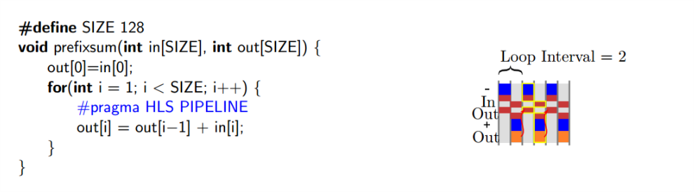
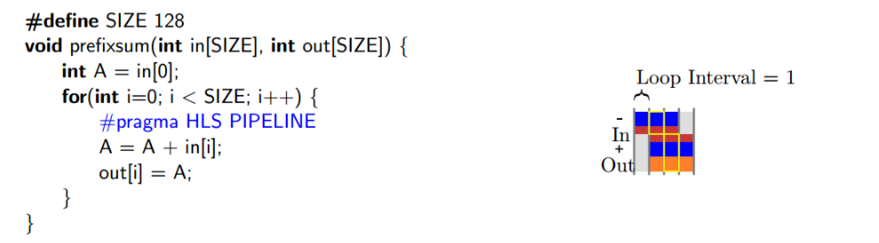
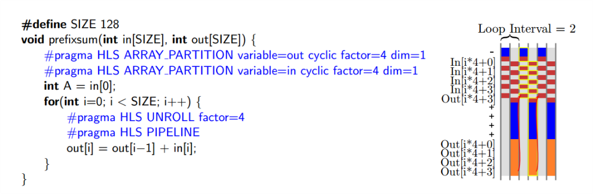
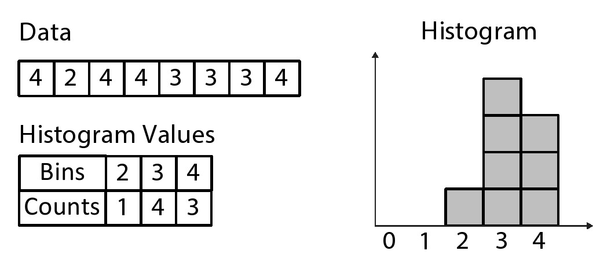
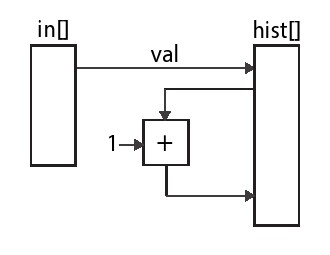
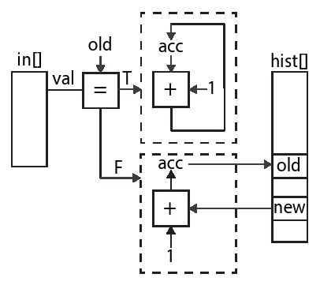
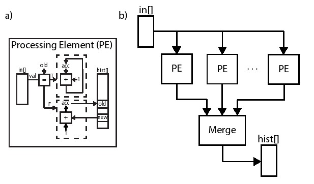

# 第八章 前缀和与直方图

## 8.1 前缀和

​前缀和是许多应用中经常使用的运算算子，可以应用在递推关系、压缩问题、字符串比较、多项式评估、直方图、基数排序和快速排序中[[11](./BIBLIOGRAPHY.md#11)] 。为了创建高效的FPGA设计，下面我们对前缀和运算进行重新设计。

​前缀和本来是一序列数字的累加和。若给定一序列输入中$$i{n_n}$$,前缀和中第n项的值是输入前n项的累加和$$ou{t_n}$$，即$$ou{t_n} = i{n_0} + i{n_1} + i{n_2} +  \cdots  + i{n_{n - 1}} + i{n_n}$$。以下展示的是前四个输出元素的计算过程。

$$
\begin{aligned}
ou{t_0} &= i{n_0} \\
ou{t_1} &= i{n_0} + i{n_1} \\
ou{t_2} &= i{n_0} + i{n_1} + i{n_2} \\
ou{t_3} &= i{n_0} + i{n_1} + i{n_2} + i{n_3} \\
&\cdots
\end{aligned}
$$

​当然，在实际应用中，我们不希望存储和重新计算以前所有输入的累加和，因此我们使用递推方程式表示：

​$$
\begin{aligned}
ou{t_n} = ou{t_{n - 1}} + i{n_n} \\
&\cdots
\end{aligned}
$$

​递推方程的劣势是在计算$$ou{t_n}$$之前必须先计算出$$ou{t_{n-1}}$$,这从根本上限制了计算时的并行性的扩展和吞吐量的提高。相反，计算前缀和的原始方程由于计算每个输出都可以独立计算，所以很明显可以并行执行，但是代价是进行一系列的冗余计算。使用C语言实现的递推方程如图8.1所示。理想情况下，我们期望代码中循环的II (Initiation interval)= 1，但即使对于这样简单的代码，也是具有挑战性的。在Vivado@HLS中进行综合这段代码运行结果如图8.1所示。

​这段代码的编写方式是将每个输出数值都写入输出寄存器out[]中，然后在下一次迭代中再次从寄存器中读出上一次输出的数值。由于读取寄存器的延迟是1个时钟周期，因此从寄存器中读取的数据只有在下一个时钟周期才能被处理。结果是，这样的代码设计只能实现II (Initiation interval)=2 的循环设计。在这种情况下，有一种简单的改良此代码的方法：我们可以使用一个单独的局部变量来进行累加操作，而不是像以前一样从数组中读回前一次累加的数值。在CPU处理器代码设计中，避免使用额外的外部存储器来替代寄存器作为数据访问的方式更有优势，同样在HLS设计中这样的数据访问方式更重要，因为其他的处理操作很少能成为系统的性能瓶颈。该操作方式代码如图8.2所示。






​你可能会问，为什么编译器无法自动优化内存负载和存储以改进II的设计。事实证明，Vivado@hls能够优化加载和数组存储，但仅适用于单个基本块范围内的读取和写入。如果我们展开循环，你可能看到如图8.3所示。注意，我们也通过添加约束**array_partition**的方式来达到在接口处可以同时读取和写入多个数值。在这种情况下，Vivado@HLS能够消除循环体内大部分out[]数组的读操作，但我们仍然只能实现循环间隔II=2的设计。在这种情况下，循环中第一次加载读数仍然存在。但是我们可以通过修改代码使用局部变量来替代从out[]数组中读取数据。

​理想情况下，当我们展开内部循环时，则在每个时钟中就可以执行更多的操作和减少函数运算的时间间隔。如果我们将展开因子设置2，则性能提升一倍。如果展开因子系数设置为4，则性能提升4倍，即循环在展开时，系统性能以线性方式变化。虽然大部分情况是这样，但是当我们展开内部嵌套循环时，设计中的某些方面是不会变化的。在大多数情况下，例如当循环的迭代间隔是执行很长时间时，展开内部循环对于整个函数性能的提升没有显著影响。但是，对着循环迭代次数的减少，展开循环会产生更大的影响。循环流水线设计中最大成分是流水线自身深度。由Vivado@HLS为流水线循环生成的组合逻辑要求在循环执行后刷新流水线。



![图8.4 a)部分展示了与图8.1中代码相对应的体系结构。对out[]数组的依赖限制了循环II =1设计的实现。如图8.2中代码所示，使用局部变量计算循环能够减少循环中的延迟并实现II = 1的设计](images/architectures_prefixsum.jpg)

通过设置不同的展开因子来将对应的图8.2中前缀和代码中**for**循环展开，并结合数组分割来达到使循环ii = 1。前缀和函数延迟如何变化？资源利用率如何变化？你为什么认为是这样变化的？当循环完全展开时会发生什么？ 

​图8.4中展示了图8.1和图8.2中的代码综合产生的硬件架构。在a)部分中，我们可以看到流程中的‘loop’包含存储out[]数组的输出存储部分，而在b)部分，流程中的循环部分仅包含一个存储累加值的寄存器和只写的输出存储器。简化重复并消除不必要的内存访问是优化HLS代码的常见做法。

​本节的目标是表明即使代码中的小改动有时也会对硬件设计产生重大的影响。有些变化可能不一定直观，但可以通过开发工具的反馈来识别。



```c
void histogram(int in[INPUT_SIZE], int hist[VALUE_SIZE]) {
	int val;
	for(int i = 0; i < INPUT_SIZE; i++) {
		#pragma HLS PIPELINE
		val = in[i];
		hist[val] = hist[val] + 1;
	}
}
```


## 8.2 直方图

​直方图表示离散信号的概率分布。当给定一系列离散输入值时，直方图计算每个值在序列中出现的次数。当通过除以输入总数进行标准化处理时，直方图就变成序列的概率分布函数。直方图常应用于图像处理、信号处理、数据库处理以及许多其他领域。在许多情况下，将高精度的输入数据量化处理成更小的数量间隔是直方图中一种常见处理。在本节的内容中，我们将略过数据实际处理过程，而重点关注数据分块操作。

​图8.5中是一个直方图应用的简单例子。该数据集由一系列[0,4]中整数表示。下面显示了相应的直方图，在直方图中显示了每个数据块区间的计数，其中每个数据块区间的高度对应每个单独值的在数据集中的个数。图8.6中显示了直方图函数的计算代码。



​代码最后看起来与前一小节中的前缀和计算代码非常相似。不同之处在于，前缀和基本上只执行一次累加，而在直方图函数中我们为每个分块均计算一次累加。另一个区别是，在前缀和运算中，我们每次都加上一个新的输入值，而在直方图运算中，我们只加1。当使用**pipeline**指令对函数内部循环进行约束时，会遇到和图8.1中代码同样问题，由于内存的重复读写，系统只能实现II =2的循环。这是因为在每次迭代循环中我们均需要从hist[]数组中读取数据和写入数据。图8.7中显示了图8.6中代码的硬件体系结构。从图中可以看到针对hist[]数组进行了读取和写入操作。其中，val变量用作hist[]数组的索引，并且该索引变量读取,递增并写回到同一个位置。

## 8.3 直方图优化和错误依赖


​让我们更深入的观察上面的处理过程。在循环的第一次迭代中，我们读取位置x0处的hist数组值并将其写回到相同的位置x0处hist数组中。由于读操作需要一个时钟延迟，所以写入数组操作必须在下一个时钟周期发生。然后在下一次迭代循环中，我们读取另一个hist数组中另一个位置x1中数组。x0和x1都取决于输入值，并可以取任何值。因此我们考虑到综合成电路时最坏的情况，如果x0 = x1,则在前一个写入完成前，位置x1处的读取无法开始。因此，我们必须在读写之间进行切换。

​事实证明，只要x0和x1是独立的，我们就必须在读写之间进行切换。如果它们实际上不是独立的呢？例如，我们可能知道数据源实际不会连续产生两个完全相同的数据。那我们现在该怎么做呢？如果我们可以将x0和x1是不同的地址额外信息提供给HLS工具，那么它就能够同时在位置x1处读取，而在位置x0处写入数据了。在Vivado@HLS中，可以通过设置**dependence**指令来完成。

​修改后的代码如图8.8所示。上面我们明确表示该函数使用需要一些前提条件。在代码中，我们使用assert断言来完成对第二个前提条件的检查。在Vivado@HLS中，这个断言在仿真过程中被启用，以确保仿真测试过程中向量满足所需的前提条件。软件提供的**dependence**指令可以避免前提条件对综合电路的影响。也就是说，它向Vivado@HLS软件工具指示使用特定的方式读取和写入hist数组。在这种情况下，迭代循环之间读操作和写操作间距离是2。在这种情况下，距离为n将表明在迭代次数i+n中的读操作仅依赖于迭代次数i中的写操作。因此，断言in[i+1] != in[i]，但可能出现in[i +2] == in[i]，所以正确距离是2。

```c
#include <assert.h>
#include ”histogram.h”
// Precondition: hist[] is initialized with zeros.
// Precondition: for all x, in[x] != in[x+1]
void histogram(int in[INPUT SIZE], int hist[VALUE SIZE]) {
	#pragma HLS DEPENDENCE variable=hist inter RAW distance=2
	int val;
    int old = −1;
    for(int i = 0; i < INPUT SIZE; i++) {
        #pragma HLS PIPELINE
        val = in[i];
        assert(old != val);
        hist[val] = hist[val] + 1;
        old = val;
	}
}
```


在图8.8中，我们向代码添加了一个前提条件，使用一个断言对其进行了检查，并且使用**dependence**指令指示工具对于前提条件的约束。如果你的测试文件不满足这个先决条件会发生什么？如果删除assert()会发生什么？Vivado@HLS是否仍检查前提条件？如果前提条件与**dependence**指令不一致，会发生什么？ 

​不幸的是，如果我们不愿意接受附加的先决条件，那么**dependence**指令就不能真正帮助我们。同样清楚的是，因为我们可能需要使用存储在hist数组中的所有值，所以我们不能直接应用于前缀函数相同的优化。另一种方法是使用不同的技术实现hist数组，例如我们可以完全划分hist数组，从而使用触发器（FF）资源实现数组。由于在一个时钟周期内写入FF的数据在下一个时钟周期可立即使用，这解决了重复问题并且在涉及少量分块时这也是一个不错的解决方案。图8.9显示了这种设计的结构。然而，当需要大量分块时，这往往是一个糟糕的解决方案。通常的直方图是用成百上千个分块进行构建并且对于大数据集可能需要许多位精度来计算所有输入。这导致大量FF资源和大型多路复用器，其中多路复用器也需要逻辑资源。通常在块RAM（BRAM）中存储较大的直方图是一个更好的解决方案。

​回到图8.6中的代码，我们看到，架构必须能够处理两种不同的情况。一种情况是输入包含连续的同一个分块中的值。在这种情况下，我们希望使用一个简单的寄存器以最小的延迟执行累加。第二种情况是当输入中不包含连续的同一个分块中的值，在这种情况下，我们需要读取，修改并将结果写回到内存，并且可以保证hist数组的读操作不会受到前一个写操作的影响。我们已经看到，这两种情况都可以单独实施，也许我们可以将他们组合成单一设计。图8.10中所示了完成此操作的代码。该代码使用一个本地变量old来存储上一次迭代分块的结果，同时使用另一个本地变量accu存储此次迭代分块的计数。每次迭代循环时，我们都会检查当前分块是否与上次迭代分块值相同。如果是这样，那么我们可以简单地增加accu。如果不是，那么我们需要将数值存储在hist数组中，然后在hist数组中使用当前值更替。无论哪种情况，我们都会使用当前的值更新old和accu值。该代码对应的体系结构如图8.11所示。


​在这段代码中，我们仍然需要一个**dependence**指令，就像图8.8中那样，但是形式略有不同。在这种情况下，在同一个迭代循环中，读取和写入访问是在不同地址中进行的。这两个地址都依赖于输入数据，因此可以指向hist数组中的任何单独像素。因此，Vivado@HLS假定这两种访问都可以访问相同的位置，并以交替的周期顺序对数组进行读取和写入操作，则循环的II =2。但是，通过查看代码，我们可以很容易地看到hist[old]和hist[val]永远不会访问相同的位置，因为他们位于条件**if**(old = val )的**else**分支中。在一次迭代（内部依赖）内，写入操作（RAW）之后的读取操作永远不会发生，因此这是错误的依赖关系。在这种情况下，我们不使用**dependence**指令来通知工具关于函数的先决条件，而是关于代码本身的属性。

综合图8.6和图8.10中的代码。这两种情况下启动间隔（II）是多少？当你从图8.10中的代码中删除**dependence**指令时会发生什么？在这两种情况下，循环间隔怎么变化？资源使用情况如何？ 

对于图8.10中的代码，你可能会问为什么像Vivado@HLS这样的工具无法确定性能。事实上，虽然在这样的一些简单情况下，更好的代码分析可以将if条件属性传播到每个分支，但我们必须接受存在一些代码段，其中内存访问的性能是不可判定的。在这种情况下最高的性能只能通过添加用户信息的静态进程来实现。最近的一些研究工作通过引入一些研究来寻求改进设计中的动态控制逻辑[[60](./BIBLIOGRAPHY.md#60), [40](./BIBLIOGRAPHY.md#40),[19](./BIBLIOGRAPHY.md#19)]。 

```c
#include ”histogram.h”
    void histogram(int in[INPUT_SIZE], int hist[VALUE_SIZE]) {
    int acc = 0;
    int i, val;
    int old = in[0];
    #pragma HLS DEPENDENCE variable=hist intra RAW false
    for(i = 0; i < INPUT_SIZE; i++) {
      #pragma HLS PIPELINE II=1
      val = in[i];
      if(old == val) {
      acc = acc + 1;
      } else {
        hist[old] = acc;
        acc = hist[val] + 1;
	}
		old = val;
	}
	hist[old] = acc;
}		
```


​图8.11展示的是图8.10中代码重构后的图形化描述。图中并非所有的操作都在这里显示，但实现功能的主要思想都显示出来。你可以看到两个单独的**if**和**else**区域（用虚线表示）。图中将Acc变量复制了两次目的是让图形更容易理解；在实际设计中只有一个寄存器用于该变量。该图显示了对应于计算的**if**子句和对应于数据读写的**else**子句的两个分离的数据路径。

## 8.4 提高直方图性能

​通过一些努力，我们已经实现了II =1 的设计。以前我们已经看到通过部分展开内部循环方式可以进一步减少设计的执行时间。但是对于直方图函数是有点困难的，有几个原因如下。第一个原因是顺序循环执行，即下次循环执行必须在这次循环计算完成的前提下才能开始，除非我们能够以某种方式分解输入数据。第二个原因是在回路II = 1的情况下，电路需要在在个时钟周期内同时执行读取和写入hist数组，这样就需要占用FPGA中BRAM资源的两个端口。之前我们已经考虑过数组分区方法来增加存储数组内存端口的数量，但是由于访问顺序输入数据，所以没有特别好的方式来分割hist数组。



​不过，并不是没有指望了。因为我们可以通过将直方图计算分解为两个阶段来达到更多的并行性。在第一阶段，我们将输入数据分成若干独立的分块。每个分块的直方图可以使用我们之前的直方图解决方案独立计算。第二阶段，将各个直方图组合起来生成完整数据集的直方图。这种分块（或映射）和合并（或还原）过程与MapReduce框架[[20](./BIBLIOGRAPHY.md#20)]采用的过程非常相似，并且是并行计算的常见模式。Map-reduce模式适用于包含交换和关联操作的循环，例如这种情况下的加法。完整方案如图8.12所示。

​图8.13中式实现这种架构的代码。直方图函数实现了Map-reduce模式的’map’部分，并且会多次实例化。该代码与图8.10中的代码非常相似。主要的区别在于我们添加了额外的代码来初始化hist数组。**Histogram_map** 函数输入数组是hist数组中一个分区数据。**Histogram_reduce** 函数实现了模式中的“还原”部分。它将分区数据的直方图作为输入，并通过将每个直方图的计数相加，将它们组合成完整的直方图。在我们的图8.13的代码示例中，我们只有两个处理对象，因此将两个输入数组hist1和hist2合并。这可以很容易的扩展以处理更多的元素。



​新的直方图函数将输入数据分成两个分区，分别存储在**inputA**和**inputB**数组中。它使用**histogram_map**函数计算每个分区的直方图，然后将其存储在**hist1**和**hist2**数组中。这两个数组被输入到**histogram_reduce**函数中。该函数将它们合并后并将结果存储在hist数组中，其中合并的hist数组是顶层直方图函数的最终输出。

修改图8.13中的代码包含支持可参数化改变**PE**个数的变量**NUM_PE**？提示：你需要根据数组分块数量**NUM_PE**以及循环将数组合并成一个数组。当你改变PE的数量时，吞吐量和任务间隔会发生什么变化？

​我们在**histogram**函数中使用**dataflow**指令来达到任务级流水线设计。在这种情况下有三个处理过程：两个**partial_histogram**函数处理实例和两个**histogram_reduce**函数处理实例。在一个任务中，因为两个**partial_histogram**处理的数据相互独立，所以可以同时执行。**Histogram_reduce** 函数处理过程必须在 **partial_histogram** 处理完成后才开始。因此，**dataflow** 指令本质上是创建了一个两阶段的任务管道。第一阶段执行**partial_histogram**函数，而第二阶段执行**histogram_reduce**函数。与任何数据流设计一样，整个histogram函数的间隔取决于两个阶段的最大启动间隔。第一个阶段的两个**partial_histogram**函数时相同的，并且具有相同的间隔（$$I{I_{histogram\_map}}$$）。**Histogram_reduce** 函数将由另一个间隔（$$I{I_{histogram\_reduce}}$$）。顶层 **histogram** 函数的启动间隔$$I{I_{histogram}}$$是max($$I{I_{histogram\_map}}$$ ,$$I{I_{histogram\_reduce}}$$ ).

```c
#include ”histogram parallel.h”
void histogram_map(int in[INPUT_SIZE/2], int hist[VALUE_SIZE]) {
	#pragma HLS DEPENDENCE variable=hist intra RAW false
	for(int i = 0; i < VALUE_SIZE; i++) {
		#pragma HLS PIPELINE II=1
		hist[i] = 0;
    }
    int old = in[0];
    int acc = 0;
    for(int i = 0; i < INPUT_SIZE/2; i++) {
        #pragma HLS PIPELINE II=1
        int val = in[i];
        if(old == val) {
       		 acc = acc + 1;
        } else {
          hist[old] = acc;
          acc = hist[val] + 1;
		}
		old = val;
	}
	hist[old] = acc;
}
void histogram_reduce(int hist1[VALUE_SIZE], int hist2[VALUE_SIZE], int output[VALUE_SIZE]) {
	for(int i = 0; i < VALUE_SIZE; i++) {
		#pragma HLS PIPELINE II=1
		output[i] = hist1[i] + hist2[i];
	}
}
//Top level function
void histogram(int inputA[INPUT_SIZE/2], int inputB[INPUT_SIZE/2], int hist[VALUE_SIZE]){
    #pragma HLS DATAFLOW
    int hist1[VALUE_SIZE];
    int hist2[VALUE_SIZE];

    histogram_map(inputA, hist1);
    histogram_map(inputB, hist2);
    histogram_reduce(hist1, hist2, hist);
}
```


当你添加或更改 **pipeline** 指令时，会发生什么？比如，在histogram_reduce函数中为 **for** 循环添加 **pipeline** 指令是否有益？将**pipeline**指令移动到直方图映射函数中，也即将它拉到当前所在 **for** 循环的外部，那么结果是什么？

​本节目标是学习直方图计算的优化算法，而这也是许多应用程序中另外一个小但重要的核心。关键是因为对于我们的程序，工具可以理解的东西通常是有限制的。在某些情况下，我们必须注意如何写代码，而在其他情况下，实际上我们必须提供给工具更多关于代码或代码执行环境的信息。特别的，内存访问形式的性能通常会严重影响HLS生成正确且高效的硬件。在Vivado@HLS中，可以使用 **dependence** 指令表示这些性能。有些时候这些优化或许与直觉相反，比如在8.10中添加的 **if/else** 结构。一些情况下优化或许要求一些创造性，就像分布式计算在图8.12和8.13的应用。

## 8.5 结论

​本节我们学习了前缀和与直方图内核。尽管这些方法看起来不同，但他们都包含重复的内存访问。如果内存访问不是流水线的，这些重复访问就会限制吞吐量。这两种情况，我们可以通过重构代码来去除重复。前缀和会非常容易，因为它的访问模式就是确定的。直方图情况下，我们必须重新写代码以解决重复访问的问题，或者确保实践中不会发生重复。无论是这两种的哪种情况，我们都需要一种方法来向Vivado®HLS描述一些信息，关于环境或者工具自身无法确定的代码部分。这些信息会在 **dependece** 指令中被捕获。最后，我们研究了两种算法的并行化方法，以便他们可以在每个时钟周期处理大量数据样本。
