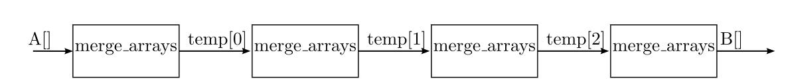

# 第十章 排序算法

## 10.1 简介

排序是许多系统中最常见的一个通用算法。它的核心算法是在处理大量排序数据时，用二叉树检索法进行高效处理，其时间复杂度仅为$$O(logN)$$。比如，数序序列

$$
A = {1, 4, 17, 23, 31, 45, 74, 76}
$$

从这个序列中判断是否存在一个数，不需要将它与所有8个元素进行比较，仅仅需要从排序序列中间元素选取并检查需要判断的数字是否大于或小于元素。如果检索元素45，第一步，可以从比较`A(4)＝31`来开始，从45到31我们可以消除`A(0...4)`只考虑`A(5...7)`，即

$$
A = {\underline{1, 4, 17, 23, 31},45,74,76}
$$  

下一步，如果与`A(6)＝74`比较，可以得到`45＜74`，可以消除除`A(5)`以外的所有情况，此时

$$
A = {\underline{1, 4, 17, 23, 31}, 45, \underline{74, 76}}
$$

最终确认A(5)确实包含在序列中。


 在上面的例子中，序列A可以代表各种不同的概念。A可以代表一个数学集合，可以搜索元素是否在集合内。在集合中，A也可以表示数据中的一部分，通常称为关键字，用于索引其余信息。关键字可以是一个人的名字，基于关键字的搜索，可以获取该人的其余数据信息，比如他们的出生日期等等。在有些场合下，关键字还可能是更抽象的对象，比如一些数据或密钥的加密散列。在这种情况下，数据存储顺序可能是随机的，但只要获得正确的密码散列，仍然可以搜索它。不管何种情况，排序和搜索所需的基本操作类似，都要需要比较两个不同的值，在这一章中将忽略这些问题。

在通用处理器系统中，有各种各样的排序算法应用，参考[[36](./BIBLIOGRAPHY.md#36)]。它们在空间复杂度和时间复杂度方面有所不同，但绝大数都需要$$O(NlogN)$$次比较才能对$$N$$个元素进行排序。对一个排序序列使用二叉树插入1个新元素时，搜索$$O(logN)$$次即能找到新值的正确位置；当需要插入$$N$$个元素时，这个过程需要重复$$N$$次。

在实际应用场景下，插入元素的成本可能非常大，这取决于排序的数据结构 。在通用处理器系统中，有各种各样的因素影响综合性能，比如处理大数据集或多核之间并行化计算时的局部存储问题。 HLS中也有类似的考虑，通常以增加资源开销为代价，来降低计算处理的时间。在很多实际案例中，要取得最佳设计往往要从算法和实现技术方式两个方面来综合考虑。算法和实现技术的权衡目前是一个新兴的研究领域，参考[[45](./BIBLIOGRAPHY.md#45),[54](./BIBLIOGRAPHY.md#45),[49](./BIBLIOGRAPHY.md#49)]。

性能外的特性也影响排序算法的选择。例如：

- 稳定： 如果输入数据有两个字段具有相同的键值，它们以相同的顺序输出，那么排序是稳定的。例如，对一组记录进行排序，使用年龄作为排序主键，包含人名和年龄。在输入数据中，两人都是25岁，John排在Jane前面。一个稳定的排序需要确保John和Jane的位置跟输入数据保持一致。
- 在线：算法允许数据在接收时进行排序。在数据排序时不可以访问，或者必须从外部存储器顺序读取等情况，在线是非常有必要的措施。
- 原位： 一个包含$$N$$个元素的数组可以使用$$N$$个元素存储空间进行排序，也有一些算法在排序过程中需要额外的存储。
- 适应：对于已经排序的数据来说是有效的。如果数据已经排序，一些算法可能会运行得更快，即只需要$$O(N)$$的时间复杂度。

## 10.2 插入排序

插入排序是一种基本的排序算法，其核心思想是将一个新的元素插入到一个有序数组中，并继续保持有序。每步将一个待排序的记录，按其关键码值的大小插入前面已经排序的文件中适当位置上，直到全部插入完为止。

例如有一个长度为$$N$$的无序数组，进行$$N-1$$次的插入即能完成排序；第一次，数组第1个数认为是有序的数组，将数组第二个元素插入仅有1个有序的数组中；第二次，数组前两个元素组成有序的数组，将数组第三个元素插入由两个元素构成的有序数组中......第$$N-1$$次，数组前`N-1`个元素组成有序的数组，将数组的第N个元素插入由N-1个元素构成的有序数组中，则完成了整个插入排序 。

例如对输入数组A进行排序，先考虑数组第1个数$$A[0]$$ 视为元素个数为1的有序序列；下一步考虑数组的第二个元素$$A[1]$$ 插入这个有序序列中；然后依次把数组A中的每个元素$$A[i]$$ 插入到这个有序序列中，因此，需要一个外部循环，扫描数组A的每一个元素。在每一次插入过程中，假设这是要将$$A[i]$$ 插入到前面的有序序列中，需要将$$A[i]$$ 和$$A[0...i-1]$$ 进行比较，确定要插入的合适位置，这就需要一个内部循环。图10.1 展示一个数组插入排序的单步视图。第一趟第1个元素值3是有序的，因为任何只带有一个元素的数组都是按顺序排列的。第二趟插入数组元素值2，与第一个元素值3比较后，被放置到有序数组中的第一个元素，将之前有序数组中的元素值3移到右边。第三趟插入数组的第三个元素$$A[2]= 5$$，由于其已经位于正确的位置，因此无需做任何移动操作。第四趟把数组元素4插入到有序数组中元素5前面即可。最后一趟插入数组元素值1时，元素1需要插入到有序数组中的第一个元素位置，前面的有序数组元素全部右移一个位置。


插入排序是一种稳定、在线、原位、自适应的排序算法。插入排序通常用在处理小批量数组。例如，复杂算法产生的大量数据可以分解为若干个组小批量的数组，然后利用插入排序处理这些小批量的数组，最终结果通过组合排序数组形成。

### 10.2.1 插入排序的基本实现

```c
#include "insertion_sort.h"
void insertion_sort(DTYPE A[SIZE]) {
	L1:
	for(int i = 1; i < SIZE; i++) {
		DTYPE item = A[i];
		int j = i;
    DTYPE t = A[j-1];
		L2:
		while(j > 0 && A[j−1] > item ) {
			#pragma HLS pipeline II=1
			A[j] = A[j−1];
			j−−;
		}
		A[j] = item;
	}
}
```


图10.2是插入排序的C参考代码。外部循环标记为L1，由于单个元素$$A[0]$$已经排序，这里仅需要从元素$$A[1]$$ 迭代到元素$$A[SIZE-1]$$，其中$$SIZE$$ 表示数组元素的长度。LI的每次循环首先拷贝当前要插入有序序列中的元素$$A[i]$$，然后再执行内部L2循环寻找该值索引的合适位置。内部循环的判断条件是还没有循环到数组末尾(即条件为$$j>0$$)，并且数组元素是大于即将要插入的元素(即条件$$A[j-1]>item$$)。只要该判断条件满足，排序子数组的元素右移(操作$$A[j]=A[j-1]$$)；当判断条件不满足时，即已经查询到要插入元素的坐标位置；此时退出循环，找到索引的正确位置直接插入元素。当第​$$i$$次迭代完成后，从​$$A[0]$$到​$$A[i]$$的元素按排序顺序排列。


图10.2中的插入排序代码是一个简单的实现，没有做任何优化。这里可以使用Vivado HLS不同的优化指令 ，如**pipeline**, **unroll** 和**array_paration**等进行优化。最简单的优化策略即是使用**pipeline**指令，使得内部循环L2支持流水功能。对于插入排序算法，内部循环访问不同的数组元素时，没有数据相关性，因此设置期望的流水线启动间隔为1（即II=1）。生成的加速器平均需要 $$N^2/4$$次数据比较，由于每个时钟周期都需要比较一次，因此流水线的处理延迟大概需要 $$N^2/4$$个时钟周期, 参考[[58](./BIBLIOGRAPHY.md#58)]。实际上，外部循环的顺序执行的计算延迟稍高。为了获取更好的性能，可以尝试将**pipeline**指定应用到外部循环L或者函数本身，或者还可以使用部分循环展开组合。插入排序的一些优化选项可以参考表10.1。

表10.1：图10.2中插入排序的C代码实现可以尝试的优化选项

|      | 指令（Directives)                          | 启动间隔（II） | 周期（period) | 逻辑资源Slices |
| :--: | ------------------------------------------ | :------------: | :-----------: | :------------: |
|  1   | L2: pipeline II=1                          |       ?        |       ?       |       ?        |
|  2   | L2: pipeline II=1                          |       ?        |       ?       |       ?        |
|      | L2: unroll factor=2                        |                |               |                |
|      | array partition variable=A cyclic factor=2 |                |               |                |
|  3   | L1: pipeline II=1                          |       ?        |       ?       |       ?        |
|  4   | L1: pipeline II=1                          |       ?        |       ?       |       ?        |
|      | L1: unroll factor=2                        |                |               |                |
|      | array partition variable=A complete        |                |               |                |
|  5   | function pipeline II=1                     |       ?        |       ?       |       ?        |
|      | array partition variable=A complete        |                |               |                |


探索一下表10.1中的优化选项，分别综合这些优化设计并确定启动间隔(II)、时钟周期和所需要的逻辑资源，分析综合报告，获取哪些优化选项在改进延迟和吞吐量方面效果最明显。如果合并这些优化选型到插入排序算法设计里面会发生什么?


图10.2所示的插入排序代码与前面几章的其他嵌套循环程序比较类似，但是有一些方面确实很难优化。优化选项1尝试的流水线启动间隔也无法达到1，虽然数据通路上并没有重要的相关性，但是在控制通路上循环是否能够执行的判断影响了其流水线性能。在这种情况下，必须读取$$A[i-1]$$来确定循环是否能够执行，而该循环检查并不能在读取数据A的第一级流水线完成。这是典型的递归例子，其包含了HLS生成的循环控制逻辑。如果碰到类似的递归逻辑，Vivado HLS报告中会指出循环退出条件不能在第一个启动间隔的时钟周期中去调度；当然也有可能会发生退出或者保持当前控制逻辑的状态。一种解决方案是增加一条读取$$A[i-1]$$的操作，才能保证循环退出检查在1个启动间隔周期内调度，其代码如图10.3所示。

```c
#include "insertion_sort.h"
void insertion_sort(DTYPE A[SIZE]) {
	L1:
	for(i = 1; i < SIZE; i++) {
		DTYPE item = A[i];
		j = i;
		DTYPE t = A[j−1];
		L2:
		while(j > 0 && t > item) {
			#pragma HLS pipeline II=1
			A[j] = t;
			t = A[j−2];
			j−−;
		}
		A[j] = item;
	}
}
```


表中的优化选项2是以factor因数为2展开内部循环，即在每一个时钟周期内完成两个移位操作，可能会降低插入排序的延迟。由于每次存储访问不能分配到不同的存储区域，因此即使添加数组分区指令优化，Vivado HLS也不能达到启动间隔为1的循环。


在Vivado HLS中，数组分区array_partition优化指令是用来实现多组独立的存储块区域。例如优化指令（array_partition variable=A cyclic factor=4)表示划分数组A中为4个独立的子存储块，通常这个指令使得每个时钟周期内存储访问速度是未优化前的4倍，但是其限制是一个时钟周期内的每次存储访问必须对应其中的一块子存储块。数组元素A[i]可以存放在任意一个分区，而数组元素A[4*i+2]仅可以访问第3个子模块；需要额外的交叉逻辑来解决同一个周期内同时访问A[i]、A[i+1]、A[i+6]和A[i+7]。在编译时只能保证静态偏移量下的访问可以抵达不同的存储块，但是实际的存储块直到运行时才能确定。当然在访问不同存储块区域时，还可以使用缓冲逻辑保证那些不能在一个周期内抵达的访问。要是访问同一存储块区域，缓冲逻辑可以延迟几个周期直到有所有访问完成。多端口的架构设计通过一个或两个物理端口获取数据副本，保证在每个时钟周期中有一定数量的访问可以完成，参考参考[[62](./BIBLIOGRAPHY.md#62),[1](./BIBLIOGRAPHY.md#1),[37](./BIBLIOGRAPHY.md#37)]。


表中的优化选项3也未能实现显著的改进，主要原因是内部循环L2没有静态可计算的环路，Vivado HLS无法重构外部循环L1的流水线。这里主要关注插入算法在指令优化上的设计空间，好的替代方案还需要进队代码重构。要设计出最佳的代码重构不仅需要理解算法，还需要理解HLS的综合的体系结构，参考参考[[28](./BIBLIOGRAPHY.md#28),[48](./BIBLIOGRAPHY.md#48)]。接下来的小节会主要对插入排序的代码进行重构，其代码结构与图10.2中的有很大差异。

设计一个最佳基于HLS的算法加速需要考虑下面几个方面。首先，编写高效的高层综合语言需要工程师是必须理解硬件设计，比如循环展开和存储划分等一些基本思路。其次，工程师需要对应用程序和硬件实现都有足够的理解，才能正确评估任何吞吐量问题。第三，也是最重要的，为了达到最佳的设计结果，即高性能和资源的低开销，通常需要重构代码才能创建一个高效的硬件结构。这些与软件设计有很大的差异。

### 10.2.2 并行化插入排序

为了提高插入排序的性能，优化目标是每个时钟周期插入一个新元素。当最后一个元素插入到排序列表中时，可能会需要改变数组中的所有元素。对于图10.2中的代码，意味着内部循环L2实际上顺序扫描比较了数组中的所有元素。要想在每个时钟周期中插入一个新元素，首先需要足够的硬件操作资源，才可以对数组中的每个元素进行比较。为了保证外部循环的流水线，优化内部循环的变量边界为常量边界，才可以使得内部循环体展开并集成到外部循环体中，参考代码如图10.4所示。

```c
#include "insertion_sort_parallel.h"
#include "assert.h"
void insertion_sort_parallel(DTYPE A[SIZE], DTYPE B[SIZE]) {
	#pragma HLS array_partition variable=B complete
	L1:
	for(int i = 0; i < SIZE; i++) {
		#pragma HLS pipeline II=1
		DTYPE item = A[i];
		L2:
		for(int j = SIZE−1; j >= 0; j−−) {
			DTYPE t;
			if(j > i) {
				t = B[j];
			} else if(j > 0 && B[j−1] > item) {
				t = B[j−1];
			} else {
				t = item;
				if (j > 0)
					item = B[j−1];
			}
			B[j] = t;
		}
	}
}
```


重构图10.2中的内部循环体的实现代码，把退出条件优化为if条件，放在新的内部循环体L2中；增加其他分支判断条件，扩大内部循环的次数；增加的分支判断条件在原始循环时不执行任何操作，也不会被执行；数组的赋值在循环体L2内部执行，而不是在L2循环体外部执行。内部循环展开时，$$j$$ 都成为常量，数组B的每次读写都将在常量索引下执行。另一方面，$$item$$变量是分配给内部循环的一份元素拷贝；在编译期间Vivado HLS会创建一个独立的寄存器用来实现电路上的多路复用。


将单个变量转换为多个副本是编译器里常用的内部转换优化机制，这种中间表示形式即是静态单一赋值（SSA）。要合并来自代码中不同点的值，SSA中间表示形式包括φ函数都是由希腊字母φ表示。这些φ函数在Vivado HLS产生的电路中生成多路复用器，如果您仔细查看，你可能会发现工具中相关的资源报告。


图10.4中的并行插入排序本质上生成了多组内部循环体，这个内部循环体的结构主要是由几个多路复用器、一个决定谁最小的比较器和1个存储数组元素的寄存器等组成。当然，每个阶段还可能包括缓冲寄存器，以确保生成的电路逻辑在一个有效的时钟频率。若把内部循环体L2看为排序单元，那么插入排序函数即是由一个一维数组的排序单元和一些在输入输出接口层的额外逻辑组成，在这种情况下， 外部迭代体仅需要$$SIZE$$个时钟周期就可以处理完。这个排序单元的主要特性是每个排序单元只与相邻的排序单元通信，而不是所有的单元。像这样的设计被称为脉动阵列，是一种常见的并行算法优化的技术。在很多情况下，只要在不同的循环之间的通信是有限的，当展开内部循环的优化，包括排序和脉动阵列的实现，都可以称为隐式脉动阵列。

### 10.2.3 显式脉动阵列插入排序

脉动阵列已经有了很好的研究，许多并行算法都采用了脉动阵列的技术，特别是使用线性排序单元阵列来实现插入排序，参考参考[[59](./BIBLIOGRAPHY.md#4=59),[9](./BIBLIOGRAPHY.md#9),[45](./BIBLIOGRAPHY.md#45),[5](./BIBLIOGRAPHY.md#5)]。脉动阵列本身的核心概念就是让数据在运算单元的阵列中进行流水，减少访存的次数，并且使得结构更加规整，布线更加统一，提高频率。 这里描述一种显式的数据流编码风格，通过**dataflow**优化指令就可以实现脉动阵列的直观方法。

图10.5展示了插入排序的脉动阵列的实现方式。每个单元都是相同的，每个单元的输入端口$$in$$用来接收当前寄存器中的值，较小的值发送到输出端口$$out$$, 而较大的值存放在本地寄存器$$local$$中, 其实每个单元的功能也就是$$out=min(in, local)$$。第$$i$$号单元的输出结果传递给线性阵列的下一个（即第$$i+1$$号）单元的输入，当新的输入到来时，会与存储在阵列中的本数组进行比较，直到找到正确的位置。如果新的输入大于阵列中的所有值，排序后的值将向右移动一个单元阵列；如果新的输入小于阵列中的所有值，此值会在阵列中传输，最终会被存放在最右边的阵列单元中。当所有的数据都处理完时，最小的元素存放在第$$N-1$$个阵列单元，直接从输出读出即可。


一个插入单元的核心代码如图10.6所示。输入和输出变量都声明为HLS的数据流类型。DTYPE是一个类型参数，允许对不同类型进行操作。本地变量存放阵列中的某一个元素，添加了**static**关键字是为了在多个函数调用中保存它的值。这里需要注意的是使用相同的函数，复制单元功能$$N$$次；每个单元必须有一个单独的单元静态变量，一个静态变量不能跨$$N$$个函数共享。

```c
void cell0(hls::stream<DTYPE> & in, hls::stream<DTYPE> & out)
{
	static DTYPE local = 0;
	DTYPE in copy = in.read();
	if(in copy > local) {
		out.write(local);
		local = in.copy;
	}
	else
	{
		out.write(in copy);
	}
}
```


图10.7展示了8个元素进行排序的代码，实现的主要功能即是将8个插入单元连接在一起。若需要扩展更多的元素，只需要复制更多的单元函数即可。HLS定义并实例化了单元之间的数据流变量类型，并以合适的方式连接每个单元的输入和输出接口。

```c
void insertion_cell_sort(hls::stream<DTYPE> &in, hls::stream<DTYPE> &out)
{
	#pragma HLS DATAFLOW
	hls::stream<DTYPE> out0(”out0 stream”);
	hls::stream<DTYPE> out1(”out1 stream”);
	hls::stream<DTYPE> out2(”out2 stream”);
	hls::stream<DTYPE> out3(”out3 stream”);
	hls::stream<DTYPE> out4(”out4 stream”);
	hls::stream<DTYPE> out5(”out5 stream”);
	hls::stream<DTYPE> out6(”out6 stream”);
	// Function calls;
	cell0(in, out0);
	cell1(out0, out1);
	cell2(out1, out2);
	cell3(out2, out3);
	cell4(out3, out4);
	cell5(out4, out5);
	cell6(out5, out6);
	cell7(out6, out);
}
```



上面insertion_cell_sort函数是从最小值开始输出数据，后面的输出越来越大的元素。如果要首先输出最大的元素，后面的输出越来越小，需要做哪些改进，才可能反转这个输出顺序？


为了对整个元素进行排序，需要多次调用insertion_cell_sort 子函数。每一个插入单元排序的调用都提供了一个数据元素进行排序；第一次调用时，这些数据元素将存放在哪里呢？这个问题的解决方法是把输入数据在初始化成局部变量0，这个在所有的单元函数中完成的。


将静态变量local初始化为0是对数据类型的假设。这种假设的成立条件是什么?换句话说，范围是多少才能被正确处理输入数据的值?如果输入数据在insertion_cell_sort函数这个范围之外?有没有更好的方法去初始化局部变量?


在调用了插入单元排序函数8次后，所有的数据都存放在每个单元格函数的8个局部变量中。


要得到第一个排序元素，需要调用insertion_cell_sort函数多少次?对于所有元素数据的排序，需要调用多少次？如果把数组拆成N个单元，又需要多少次调用insertion_cell_sort函数才能完成整个排序？


指令dataflow的作用是实现了8个插入单元函数组成的任务流水线结构。在顶层函数的每个执行过程中都流水地处理一个新的输入示例，流水线的每个阶段都去调用单元函数。当调用单元函数8次时，即只能对序列排序8个值；在单元函数之间不包含递归，因此在资源足够的情况下可以任意扩展和调用单元函数。


整个数组的插入排序需要多少个周期?所有排序的数据都是从插入单元函数中的参数输出的吗？如果删除dataflow优化指令，循环计数将如何变化？如何改进资源利用率？


图10.8所示的是testbench的参考代码，testbench生成要排序的随机数据存放在input数组中，多次调用insertion_cell_sort函数进行排序，处理结果存放在cell_output数据中。接下来，使用同样的输入数据，插入排序处理过程采用图10.2所示的insertion_sort函数。最后，testbench比较这两种不同实现方式的结果，如果两钟不同实现方式的排序结构相同，则testbench通过。

```c
#include "insertion_cell_sort.h"
#include <iostream>
#include <stdlib.h>

const static int DEBUG=1;
const static int MAX_NUMBER=1000;
int main () {
	int fail = 0;
	DTYPE input[SIZE];
	DTYPE cell_output[SIZE] = {0};
	hls::stream<DTYPE> in, out;

	//generate random data to sort
	if(DEBUG) std::cout << "Random Input Data\n";
	srand(20); //change me if you want different numbers
	for(int i = 0; i < SIZE; i++) {
		input[i] = rand() % MAX_NUMBER + 1;
		if(DEBUG) std::cout << input[i] << "\t";
	}

	//process the data through the insertion_cell_sort function
	for(int i = 0; i < SIZE*2; i++) {
		if(i < SIZE) {
			//feed in the SIZE elements to be sorted
			in.write(input[i]);
			insertion_cell_sort(in, out);
			cell_output[i] = out.read();
		} else {
			//then send in dummy data to flush pipeline
			in.write(MAX_NUMBER);
			insertion_cell_sort(in, out);
			cell_output[i-SIZE] = out.read();
		}
	}

	//sort the data using the insertion_sort function
	insertion_sort(input);

	//compare the results of insertion_sort to insertion_cell_sort; fail if they differ
	if(DEBUG) std::cout << "\nSorted Output\n";
	for(int i = 0; i < SIZE; i++) {
		if(DEBUG) std::cout << cell_output[i] << "\t";
	}
	for(int i = 0; i < SIZE; i++) {
		if(input[i] != cell_output[i]) {
			fail = 1;
			std::cout << "golden=" << input[i] << "hw=" << cell_output[i] << "\n";
		}
	}

	if(fail == 0) std::cout << "PASS\n";
	else std::cout << "FAIL\n";
	return fail;
}

```


在testbench中，常量$$SIZE$$的值表示要排序元素的数量，在本节的运行示例中即为8。常量DEBUG是用来提供testbench中的一些输出详细说明；设置成非0表示打开debug信息，设置成0表示关闭debug信息。输入数组Input中的数据是由rand函数随机产生的；如果需要更新产生的数据，可以调用带参数信息的srand函数。

值得注意的是，testbench中一共调用了$$SIZE*2$$次insertion_cell_sort函数。前面SIZE次调用都会向insertion_cell_sort函数中输入一个元素，但不会产生有效的结果输出；后面SIZE次的调用提供虚拟无效的输入数据，并产生一个已经排序的元素，从最小的元素开始输出。


在排序操作开始进行时，图10.6中的代码是在不同的状态下的本地局部变量，这意味着只能对一个数组进行排序。在大多数实际场景中，不仅需要对多个数组进行排序，还希望在不存在气泡的情况下，对每个数组进行反向处理。推荐大家改进代码和testbench，实现对多个数组的排序。


## 10.3 归并排序

归并操作是 John von Neumann在1945年发明的一种稳定的分治算法，参考[36](./BIBLIOGRAPHY.md#36)。 归并排序算法的基本思想是将两个有序序列合并成一个较大的有序序列，可以在$$O(N)$$时间内完成。从概念上讲,将已有序的子序列合并，得到完全有序的序列；即先使每个子序列有序，再使子序列段间有序 ，组成最终有序序列。

分治操作是归并排序中最核心的算法，不需要算术或者数据移动，只需要考虑每个元素的输入数组是否一个排序的子数组；所有的操作都是需要将两个已经有序的子数组合并成一个大的有序数组  ，其排序的过程如图10.9所示。


将两个排序数组组合成一个较大的排序数组的过程通常称为two-finger算法。图10.10展示了两个已经排序的输入数组in1和in2合并到一个大的输出数组out中。two-finger操作初始化时指向每个数组第一个元素（数值in1中的元素3和数组in2中的元素1），在算法执行的过程中，两个指针会指向数组中的不同元素。


图10.10的第一步是初始化状态，输入的两个数组各有四个元素，输出数组是空的。第二步，比较两个数组中的第一个元素，并且把最小的元素写入输出数组中（即比较3和1中小元素1并排序到数组out中）；此时数组in2的指针指向下一个元素。第三步，继续比较两个数组中当前指针所指向元素的大小，并把小的元素排序到输出数组中（即比较3和2中的小元素2并排序到数组out中）。继续类似的操作，直到其中一个数组元素移空；最后只需要拷贝未处理完的数组中剩下的元素到输出数组out中。

归并排序算法是递归函数调用的典型示例 。大多数的高层综合语言不支持递归，或者以有边界的方式支持递归。这里我们关注归并排序算法的非递归实现方式，代码看起来与通常CPU架构下的完全不同，但是算法的核心思想是完全相同的。

### 10.3.1 归并排序的基本操作

图10.11展示了非递归方式实现的归并排序的基本代码，处理数组排序大概需要$$N log N$$ 次比较，并且需要额外的临时存储空间。代码里首先考虑数组中的每个元素作为一个排序子数组，外部循环的每次迭代都将排序子数组合并成较大的排序子数组。第一次迭代，对最大$$SIZE$$为2的子数组进行排序；第二次迭代，对最大$$SIZE$$为4的子数组进行排序；然后是8，以此类推。需要注意的是，这里的输入数组的长度并不是2的幂次方，也可能有一些子数组小于最大尺寸。

```c
#include "merge_sort.h"
#include "assert.h"

// subarray1 is in[i1..i2-1], subarray2 is in[i2..i3-1], result is in out[i1..i3-1]
void merge(DTYPE in[SIZE], int i1, int i2, int i3, DTYPE out[SIZE]) {
    int f1 = i1, f2 = i2;
    // Foreach element that needs to be sorted...
    for(int index = i1; index < i3; index++) {
        // Select the smallest available element.
        if((f1 < i2 && in[f1] <= in[f2]) || f2 == i3) {
            out[index] = in[f1];
            f1++;
        } else {
            assert(f2 < i3);
            out[index] = in[f2];
            f2++;
        }
    }
}

void merge_sort(DTYPE A[SIZE]) {
    DTYPE temp[SIZE];
    // Each time through the loop, we try to merge sorted subarrays of width elements
    // into a sorted subarray of 2*width elements.
 stage:
    for (int width = 1; width < SIZE; width = 2 * width) {
    merge_arrays:
        for (int i1 = 0; i1 < SIZE; i1 = i1 + 2 * width) {
            // Try to merge two sorted subarrays:
            // A[i1..i1+width-1] and A[i1+width..i1+2*width-1] to temp[i1..2*width-1]
            int i2 = i1 + width;
            int i3 = i1 + 2*width;
            if(i2 >= SIZE) i2 = SIZE;
            if(i3 >= SIZE) i3 = SIZE;
            merge(A, i1, i2, i3, temp);
        }

        // Copy temp[] back to A[] for next iteration
    copy:
        for(int i = 0; i < SIZE; i++) {
            A[i] = temp[i];
        }
    }
}

```


归并排序算法的主入口函数为merge_sort，函数的数组为A，需要内部存储存放数组temp；参数SIZE决定两个数组的大小，参数DTYPE决定数据的排序类型。merge_sort函数主要有两个嵌套的for循环构成，外部循环体主要跟踪每个排序子数组中的元素数量；初始化时将每个元素作为单独的子数组，因此width宽度初始化为1。每次循环都会生成较大的排序子数组，这些新的子数组绝大多数情况下都是两倍的元素。但宽度大于或者等于参数SIZE的值时，循环终止，此时所有的元素都在一个有序数组中。

内部循环体merge_arrays的主要功能时归并两个有序数组 ，这些有序数组最多有width个元素，从索引i1和i2开始。然后调用merge函数将有序子数组合并并复制到内部存储temp数组中。这里需要处理循环末尾的边界情况，若参数SIZE不是2的幂次方，子数组可能包含小于宽度的元素。在完成子数组的归并到temp数组后，需要把当前temp数组中的元素按顺序存放在数组A中，以便开展下一轮的循环迭代。


通过不断调整SIZE的值，获取那些值比较合适？当调用merge函数是，i1、i2和i3之间的可能关系有哪些？如果限定参数SIZE，HLS产生的电路又有什么影响？


merge函数对数组in中的两个子数组采用了two-finger算法。数组in作为函数的输入数组，数组out作为函数的输出数组；而且还需要输入变量i1、i2和i3，来描述需要合并的两个子数组的边界范围。一个子数组从第i1坐标索引开始，到第i2个坐标索引之前截止；还有一个子数组从第i2个坐标索引开始，到第i3个坐标索引截止；合并后输出子数组将存储在数组out的坐标索引i1到i3之间。

merge函数包含一个遍历数组排序输出的循环；每一个循环迭代都将一个元素放在输出数组out中的正确排序的位置。函数中的变量f1和f2对应每个子数组的坐标索引。if条件里面的主要功能即是选择in[f1]和in[f2]中相对小的元素，并拷贝到输出数组out下一个排序的位置中。而if条件里面还需要处理几种特殊的情况；一种情况是f1等于 i2，此时in[f1]已经超过子数组的边界，需要在in[f2]里面选择最小的元素；同样地。如果f2等于i3，此时in[f2]已经超过子数组的边界，需要在in[f1]里面选择最小的元素。


在处理过程中数组in会发生什么变化？在外部循环的每次迭代之后数组in的元素排序会是什么？当merge_sort函数返回时，数组in的元素排序会是什么？



综合后的性能报告可能无法确定归并排序的延迟和间隔，为什么会出现这种情况？如何评估loop tripcount指令值，哪一个才是合适的最小值、最大值和平均值？


图10.11中的代码并没有使用Vivado HLS的一些特定优化指令。对多层嵌套for循环的优化，通常先从内部循环优化开始，然后再进行外部循环的优化。常用的循环优化指令有流水线指令pipeline和展开指令unroll。


使用pipeline指令设置不同的优化参数，还可以使用unroll指令展开for循环，哪一种方式提供了最好性能？性能和资源利用率之间的最佳权衡又是什么？代码方面的设计缺陷阻碍了更高的性能？这些方面都是算法设计考虑的因素，不能仅关注代码实现层面。


pipeline和unroll往往会受到资源上面的限制，因此需要考虑数组输入输出的端口数量。图10.11中的数组都是一维的，此时设计者还需要仔细考虑数组的访问模式，以确保性能优化与资源限制匹配。


建议使用array_partition、pipeline和unroll指令来优化循环，探索出最佳的策略。只考虑性能方面，最佳的设计是什么？在考虑资源利用率和性能之间的权衡后，最佳的设计是什么？


最佳设计往往只有通过重构代码才能实现。虽然Vivado HLS提供了许多指令来启动一个常规的公共代码优化，但是为每一个优化提供一个指令的做法是不切实际的。在下一节中，将描述一种方法重构归并排序的代码，以增加排序的吞吐量。

### 10.3.2 重构归并排序

图10.11实现的内部循环merge函数要取得1个时钟周期的循环启动间隔是非常有挑战的。一方面数组in有四次读操作，且有两个不同的读操作基地址。HLS综合工具需要分析出其中有些读取操作是冗余的，但是FPGA的片上BRAM资源只能支持每个时钟周期的两个访问，再加上这些读操作在不同的基本块中，编译器更难消除冗余负载。 通过重构代码来消除冗余读取，编译器只需要更少的优化来实现1个时钟周期的循环启动间隔，重构后的代码如图10.12所示。另外一方面，在变量f1和f2有递归关系，这些变量在if条件内部递增，并且确定了下一次循环时数组in中的需要比较元素的位置信息。这种动态浮动的比较方式也会影响时钟频率和循环的启动间隔。

```c
#include "merge_sort.h"
#include "assert.h"

// subarray1 is in[ii..i2-1]; subarray2 is in[i2..i3-1]
// sorted merge is stored in out[i1..i3-1]
void merge(DTYPE in[SIZE], int i1, int i2, int i3, DTYPE out[SIZE]) {
    int f1 = i1, f2 = i2;
    // Foreach element that needs to be sorted...
    for(int index = i1; index < i3; index++) {
#pragma HLS pipeline II=1
        DTYPE t1 = in[f1];
        DTYPE t2 = in[f2];
        // Select the smallest available element.
        if((f1 < i2 && t1 <= t2) || f2 == i3) {
            out[index] = t1;
            f1++;
        } else {
            assert(f2 < i3);
            out[index] = t2;
            f2++;
        }
    }
}
```


图10.13描述了重构代码的行为结构，虽然内部循环实现了1个时钟周期的启动间隔，但是在内部循环结束时，在下一个阶段的流水线执行之前，中间的缓冲数据必须先清空。一旦循环的次数增加，中间的气泡问题还是影响流水线性能的关键因素。由于循环静态分析的局限性，影响性能的代码部分很难可视化，而且内部循环的次数是有变量参数决定的。


常见的方法是将多层循环嵌套优化成一个单一循环，减少流水线中循环退出时的刷新次数，Vivado HLS工具也支持了多层循环嵌套的自动优化。然而，图10.11中的代码实现并不是一个完美的循环嵌套，需要重构merge函数以支持循环嵌套的完美合并，重构后的代码如图10.14所示。其最大的变化就是merge_arrays函数循环次数也是确定的，使得编译器更好地理解实现。

```c
#include "merge_sort.h"
#include "assert.h"

void merge_sort(DTYPE A[SIZE]) {
    DTYPE temp[SIZE];
 stage:
    for (int width = 1; width < SIZE; width = 2 * width) {
        int f1 = 0;
        int f2 = width;
        int i2 = width;
        int i3 = 2*width;
        if(i2 >= SIZE) i2 = SIZE;
        if(i3 >= SIZE) i3 = SIZE;
    merge_arrays:
        for (int i = 0; i < SIZE; i++) {
#pragma HLS pipeline II=1
            DTYPE t1 = A[f1];
            DTYPE t2 = A[f2];
            if((f1 < i2 && t1 <= t2) || f2 == i3) {
                temp[i] = t1;
                f1++;
            } else {
                assert(f2 < i3);
                temp[i] = t2;
                f2++;
            }
            if(f1 == i2 && f2 == i3) {
                f1 = i3;
                i2 += 2*width;
                i3 += 2*width;
                if(i2 >= SIZE) i2 = SIZE;
                if(i3 >= SIZE) i3 = SIZE;
                f2 = i2;
            }
        }

    copy:
        for(int i = 0; i < SIZE; i++) {
#pragma HLS pipeline II=1
            A[i] = temp[i];
        }
    }
}
```



评估图10.14中代码的性能，即使内部循环已经实现了1个时钟周期的启动间隔，该设计是否有效合理地利用了硬件加速？有没有进一步改进merge_sort函数延迟的方法，使得整个延迟在大约在NlogN个时钟周期？


前面重点介绍了如何优化merge_sort函数，在不大幅增加资源利用率的情况下，降低计算处理的延迟，提高了加速器的计算效率。提高加速器并行计算能力的方法主要是进一步降低延迟或者提高吞吐量。前面介绍的内部循环的展开优化和数组分区优化可以在每一个时钟周期内同时执行更多的任务。还有一种提高并行计算能力的方法是寻找粗粒度的任务级流水线。这里可以把归并排序的内部迭代体merge_arrarys创建多份硬件资源，以达到粗粒度的任务级流水。如图10.15所示，通过展开连续的内部循环体merge_arrays，可以同时处理不同的数据集，以提高整个加速器的计算性能。




图10.16是加入任务级流水和数据流优化后的代码实现。虽然有很多方面都与原始代码类似，但是有几个重要的区别。第一个区别是merge_arrays 函数的循环都提取到一个函数中，方便了顶层函数的代码重构；第二个区别是merge_sort_parallel函数的输入和输出分别在一个独立的数组中，通过Vivado HLS的dataflow指令就能够构建一个数据流水线的体系结构；第三，temp数组用在merge_arrays函数之间的乒乓操作数据流中，减少中间缓存的不必要的拷贝信息；同时重构为一个二维数组，使得通道数的表示参数化。

```c
#include "merge_sort_parallel.h"
#include "assert.h"

void merge_arrays(DTYPE in[SIZE], int width, DTYPE out[SIZE]) {
  int f1 = 0;
  int f2 = width;
  int i2 = width;
  int i3 = 2*width;
  if(i2 >= SIZE) i2 = SIZE;
  if(i3 >= SIZE) i3 = SIZE;
 merge_arrays:
  for (int i = 0; i < SIZE; i++) {
#pragma HLS pipeline II=1
      DTYPE t1 = in[f1];
      DTYPE t2 = in[f2];
	if((f1 < i2 && t1 <= t2) || f2 == i3) {
	  out[i] = t1;
	  f1++;
	} else {
	  assert(f2 < i3);
	  out[i] = t2;
	  f2++;
	}
	if(f1 == i2 && f2 == i3) {
      f1 = i3;
	  i2 += 2*width;
	  i3 += 2*width;
	  if(i2 >= SIZE) i2 = SIZE;
	  if(i3 >= SIZE) i3 = SIZE;
      f2 = i2;
 	}
  }
}

void merge_sort_parallel(DTYPE A[SIZE], DTYPE B[SIZE]) {
#pragma HLS dataflow

	DTYPE temp[STAGES-1][SIZE];
#pragma HLS array_partition variable=temp complete dim=1
	int width = 1;

	merge_arrays(A, width, temp[0]);
	width * = 2;

	for (int stage = 1; stage < STAGES-1; stage++) {
#pragma HLS unroll
		merge_arrays(temp[stage-1], width, temp[stage]);
		width * = 2;
	}

	merge_arrays(temp[STAGES-2], width, B);
}
```


merge_sort_parallel函数里面包含多个阶段的merge_arrays函数调用；第一次调用时从输入端读取数据，并把处理完的结果写入temp数组中；在循环执行过程中，多次调用merge_arrays，并写入temp数组的其他分区；最后一个调用时写入排序后的结果到数组B中。在资源足够的情况下，参数SIZE和STAGES可以支持更大的吞吐。


评估图10.16中重构后的代码性能,分析其实现的延迟和启动间隔，大概需要多大的片上存储？


## 10.4 总结

本章介绍了一些基本的排序算法。插入排序操作平均需要$$N^2/4$$次数据比较，极端下需要$$N^2$$次比较，但是仅需要少量的存储资源；展示了插入排序中的几种提升性能的不同方式；由于流水线的气泡问题，N个比较器大约需要N个时钟周期的间隔才能完成插入排序。归并排序的比较次数相对插入排序较少，大约仅需要$$N log N$$ 次比较，但是需要额外的片上存储开销存储中间缓存。一种高效的设计方案是通过重构优化代码，取得在1个比较器的情况下，归并排序大概仅需$$N log N$$ 个时钟周期即可完成。另外一种高效的设计方案是采用任务级流水线，每一个时钟周期有$$ log N$$ 个比较，N个时钟周期的间隔才能完成归并排序。与插入排序相比，同样的计算处理周期，归并排序需要较少的比较器，但是带来的代价是额外的存储资源开销。归并排序如果需要更多的片上存储，其整体的延迟也会变大。

在实际系统中，基于FPGA的排序设计方案都必须解决资源和时间性能之间的权衡问题。还有一种使用不同折中方案的排序算法叫基数排序，与本章的排序算法不太一样，其更关注数据的有效范围作为元素之间的比较项。基数排序的一部分实现在下一章的Huffman编码会有更详细的介绍。

排序算法的并行结构通常被描述为排序网络，排序网络有时可以是脉动阵列或者流水线。通过研究这些现有的并行结构来获得HLS的设计灵感，然后通过C代码来实现它。在Vivado HLS中，可以使用任意一种方法来描述这些循环流水线、数据流水线或者两者的组合。
