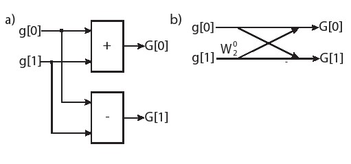

# 翻译规范

## 输入公式
在`http://chart.googleapis.com/chart?cht=tx&chl=\Large%20`后面直接加上latex公式即可生成对应公式的图片。注意`[]`中写的是公式的编号，请确保下面的链接可以在浏览器中直接访问。
Latex常用公式命令可以[参考这里](https://github.com/Khan/KaTeX/wiki/Function-Support-in-KaTeX)
```markdown

```


```
http://chart.googleapis.com/chart?cht=tx&chl=\Large%20
```
```
x=\frac{-b\pm\sqrt{b^2-4ac}}{2a}
```
## 引用代码
只要将代码用```包住，代码块就会被识别为代码

```c
#include "huffman.h"
// Postcondition: out[x].frequency > 0
void filter(
            /* input  */ Symbol in[INPUT_SYMBOL_SIZE],
            /* output */ Symbol out[INPUT_SYMBOL_SIZE],
            /* output */ int *n) {
#pragma HLS INLINE off
    ap_uint<SYMBOL_BITS> j = 0;
    for(int i = 0; i < INPUT_SYMBOL_SIZE; i++) {
#pragma HLS pipeline II=1
        if(in[i].frequency != 0) {
            out[j].frequency = in[i].frequency;
            out[j].value = in[i].value;
            j++;
        }
    }
    *n = j;
}
```

## 引用图片
在行文中使用下述格式引用图片，将图片下方的备注写在`[]`之间
```markdown

```


## 引用术语
在行文中使用下述格式引用GLOSSARY中的术语即可
```
[bitstream](./GLOSSARY.md#bitstream)
```
[bitstream](./GLOSSARY.md#bitstream)

## 引用参考文献
在行文中使用下述格式引用参考文献即可
```
[[45](./BIBLIOGRAPHY.md#45), [55](./BIBLIOGRAPHY.md#55)]
```
[[45](./BIBLIOGRAPHY.md#45), [55](./BIBLIOGRAPHY.md#55)]
